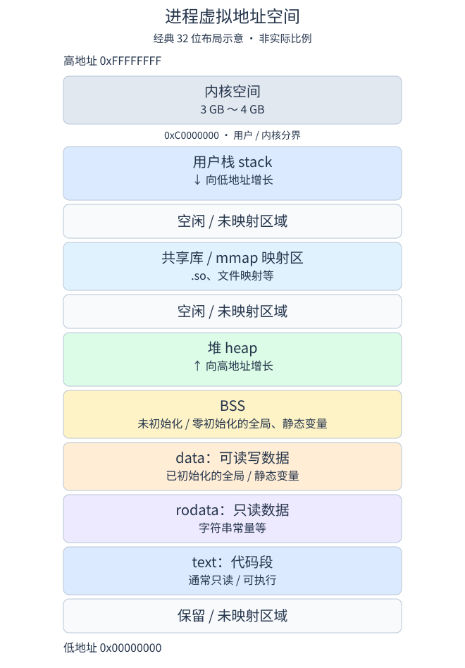
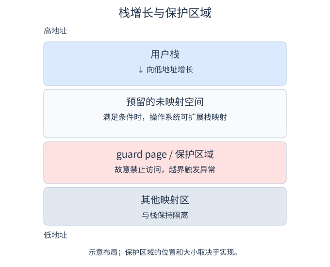
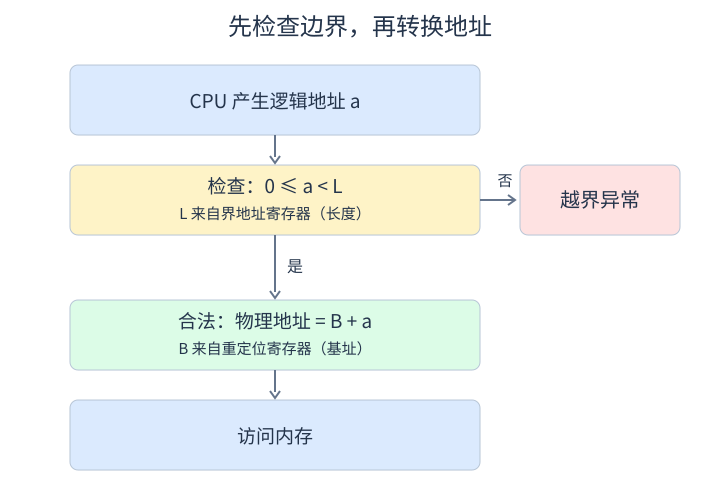

# 3.1 内存管理概述

## 3.1.1 内存管理的基本原理和要求

**内存管理**：操作系统对内存空间的组织、分配、回收及地址映射。

- **分配与回收**：记录内存使用情况，为进程分配空间，结束后回收。
- **地址转换**：将逻辑地址转换为物理地址；OS 维护映射，MMU 完成运行时转换。
- **空间扩充**：利用虚拟存储技术，提供大于物理内存容量的地址空间。
- **内存共享**：多个进程安全访问同一物理区域，用于共享库、进程间通信等。
- **存储保护**：限制进程只访问授权区域，防止相互干扰或破坏系统。

### 一、程序的编译、链接与装入

1. **编译**：源代码 → 目标模块。
2. **链接**：合并目标模块及所需库函数 → 装入模块。
3. **装入**：载入内存，完成运行准备。

动态链接可将部分链接工作推迟到装入时或运行时；请求分页不要求运行前装入全部程序。

### 二、逻辑地址与物理地址

- **逻辑地址（虚拟地址）**：程序使用的地址。教材中目标模块通常从 0 编址，链接后统一为一个逻辑地址空间。
- **物理地址**：主存存储单元的实际地址；其集合为物理地址空间。
- **地址重定位**：逻辑地址 → 物理地址，可在装入时或运行时完成。
- **页表**：记录虚拟页到物理页框的映射及控制信息，不保存代码、数据本身。

#### 1. 进程虚拟地址空间

经典 32 位 Linux 的 **3 GB 用户空间 / 1 GB 内核空间**示意；不是物理内存布局，也不适用于所有系统。

- 典型布局中，栈向低地址增长，传统堆向高地址增长。
- BSS 保存未初始化或零初始化的全局 / 静态变量，运行时占内存。
- 图中空闲区域指未使用的虚拟地址范围，不代表已分配物理内存。
- 用户态不能直接访问受保护的内核空间。

#### 2. 栈增长与保护页

- **未映射空间**：满足栈增长条件、未超限且不冲突时，OS 才可能扩展映射。
- **保护页 / 保护间隔**：禁止访问，防止栈越界侵入其他区域；访问时触发异常。
- 保护区域的具体布局依实现而异；扩展栈地址范围与已有栈页面的按需装入不同。

#### 3. 从程序运行到访问内存

1. 可执行文件保存在外存；启动时建立进程、PCB、虚拟地址空间及页表。
2. 页表存放在 RAM，各进程有自己的映射；代码和数据的物理页可分散存放。
3. CPU 产生虚拟地址，拆为“虚拟页号 + 页内偏移”。MMU 先查 TLB，未命中再查页表。
4. 页面在内存且访问合法：取得物理页框号，页内偏移不变。
5. 合法页面不在内存：触发缺页异常，OS 调入或分配页面、更新映射，再重新执行指令。

$$
\text{物理地址}=\text{物理页框号}\times\text{页大小}+\text{页内偏移}
$$

页表项通常含物理页框号、存在位、脏位、访问位、权限位等。**TLB 未命中不等于缺页；非法地址或权限错误不能靠普通调页解决。**

### 三、程序的链接方式

#### 1. 静态链接

运行前合并目标模块及库函数，形成完整装入模块。

- **地址调整**：按模块位置修正需重定位的地址引用。
- **外部符号解析**：找到外部函数、变量的定义，确定地址并修正引用。
- 模块更新后通常需重新链接；各程序通常保留所需库代码的副本。

#### 2. 装入时动态链接

**边装入边链接**，装入时查找依赖模块并完成符号解析。

- **便于更新**：接口兼容时，可替换模块，无须重新链接整个程序。
- **便于共享**：多个进程可共享同一模块的只读代码页。

#### 3. 运行时动态链接

**执行中需要某模块时，才加载并链接**；未使用的模块可不装入。

优点：加快装入、节省内存；首次调用有加载和链接开销。

### 四、程序的装入

#### 1. 绝对装入

编译或汇编时确定绝对地址，装入时直接按地址存放，无须重定位。位置固定、灵活性差，教材对应单道程序环境。

#### 2. 可重定位装入（静态重定位）

**装入时一次性转换地址**，将需重定位的地址引用改为物理地址。

- 需要一次性分配全部连续空间。
- 装入后不能直接移动，难以动态扩充。

#### 3. 动态运行时装入（动态重定位）

程序保留逻辑地址，**运行时由硬件完成转换**。连续分配模型中：

$$
\text{物理地址}=\text{逻辑地址}+\text{重定位寄存器的值}
$$

重定位寄存器保存起始物理地址。移动程序后更新基址即可，便于紧凑和调整内存；分页系统则通过页表转换。

记忆：**绝对装入——编译时确定；静态重定位——装入时转换；动态重定位——运行时转换。**

### 五、内存保护

#### 1. 上、下限寄存器

保存允许访问的物理地址范围，硬件每次访存时检查越界。以上限为结束地址的下一地址时：

$$
\text{下限}\le\text{物理地址}<\text{上限}
$$

#### 2. 重定位寄存器与界地址寄存器

- **重定位寄存器（基址）**：保存起始物理地址 $B$，用于“加”。
- **界地址寄存器（限长）**：保存地址空间长度 $L$，用于“比”。

对逻辑地址 $a$，**先检查，再转换**：

$$
\begin{cases}
\text{物理地址}=B+a,&0\le a<L\\
\text{越界异常},&\text{其他情况}
\end{cases}
$$

**界地址保存长度，不是最高物理地址。** 保护寄存器只能由 OS 通过特权操作设置。

### 六、内存共享

- **可重入代码（纯代码）**：执行时不修改自身，可供多个进程共享一份物理副本；各进程保留私有数据。
- **分页共享**：不同进程的页表项指向同一组物理页框。
- **分段共享**：不同进程的段表项指向同一物理段。
- 可写数据也能共享，但通常需要同步与互斥；共享内存、内存映射文件均可用于进程间共享。

### 七、内存分配与回收

基本演进：单一连续分配 → 固定分区 → 动态分区 → 离散分配。分页按固定大小划分，分段按程序逻辑结构划分。

## 3.1.2 连续分配管理方式

**连续分配**：为一个用户程序分配一块连续的物理内存空间。

### 一、单一连续分配

内存分为系统区和用户区；系统区通常位于低地址，用户区由一道程序独占。

- **优点**：简单，无外部碎片。
- **缺点**：只支持单用户、单任务；有内部浪费，内存利用率低。
- 无多个用户进程之间的隔离需求，但保护操作系统仍需限制用户访问。

### 二、固定分区分配

**预先划分固定大小的分区，每区最多一道作业。** 支持多道程序。

- **大小相等**：适合作业大小相近的场景。
- **大小不等**：适应不同大小的作业。
- **管理**：分区使用表记录分区号、大小、起始地址和状态；分配、回收时更新状态。
- **缺点**：作业大于最大分区时无法装入；小作业仍独占整个分区。
- **碎片**：有内部碎片，无外部碎片。

### 三、动态分区分配

#### 1. 基本原理

又称**可变分区分配**：按进程实际需求分配连续空间，分区数量和大小动态变化。

- 反复分配、回收会产生**外部碎片**：空闲总量足够，但没有足够大的连续块。
- **紧凑（紧缩）**：移动进程，合并分散空闲区；需要动态重定位，开销较大。

#### 2. 分配与回收

维护空闲分区表或链，记录**起始地址、大小**。

**分配**：选择足够大的空闲块并切分；余块过小时可整块分配，此时产生少量内部浪费。

**回收**：检查物理地址是否相邻，分四种情况：

1. 仅邻前块：合并，增大前块。
2. 仅邻后块：合并，修改后块起始地址和大小。
3. 前后都相邻：三块合并，删除多余表项。
4. 均不相邻：新建空闲表项。

相邻条件：**前块起始地址 + 前块大小 = 后块起始地址**。

#### 3. 顺序搜索算法

- **首次适应（FF）**：按地址递增，从头找第一个足够大的块。保留高地址大块，但低地址易积累碎片、重复扫描。
- **邻近适应（NF）**：按地址递增，从上次结束处循环查找。减少重复扫描，但不利于保留大块。
- **最佳适应（BF）**：按容量递增，选能满足需求的最小块。保留大块，但易产生极小碎片。
- **最坏适应（WF）**：按容量递减，选最大块。余块通常较大，但容易耗尽大块。

首次适应通常较均衡；**“最佳适应”不代表整体性能最好**。

#### 4. 索引搜索算法

按空闲块大小分类建链，通过索引快速定位。

- **快速适应（Quick Fit）**：按常用大小设链表，查找快、通常无须临时切分；合并回收较复杂，可能有内部浪费。
- **哈希算法**：以分区大小为关键字，定位对应空闲链；无合适块时需另找更大类别。

##### 伙伴系统（Buddy System）

按 $2^k$ 大小维护空闲链，申请 $n$ 时取能容纳它的最小块：

$$
2^{k-1}<n\le2^k
$$

- **分配**：本级无空闲块时，找更大块并反复二等分。
- **回收**：伙伴也空闲则合并，逐级向上检查。
- **伙伴**：同一父块二等分得到的一对；仅大小相等、地址相邻不够。
- **特点**：分裂、合并方便；向上取整会产生内部碎片。

### 四、碎片与离散分配

- **内部碎片**：已分配区域内的浪费；常见于固定分区、伙伴系统。紧凑不能解决。
- **外部碎片**：已分配区域之间的零散空闲块；常见于动态分区。可用紧凑缓解。
- **离散分配**：将进程分成多个单元分散存放，需维护地址映射。
- **分页**：固定大小；无页框分配意义上的外部碎片，末页可能有内部碎片。
- **分段**：按逻辑结构划分，各段仍需连续；可能有外部碎片。
- **基本分页 / 分段**要求运行前全部装入；**请求分页 / 分段**支持按需调入。

## 3.1.3 基本分页存储管理

### 一、页面、页框与地址结构

**分页**：将进程的逻辑地址空间划分为大小相等的**页（页面）**，将物理内存划分为同样大小的**页框（页帧、物理块）**，以页框为单位分配内存。

- **页是逻辑空间的单位，页框是物理空间的单位**；页号、页框号均从 0 开始。
- 逻辑上相邻的页可以放在不相邻的页框中；每一页内部连续存放。
- 无页框分配意义上的外部碎片；进程末页可能产生内部碎片，通常按平均半页估算。
- **页面过小**：页数增多、页表变大，管理与页面换入 / 换出开销增大。
- **页面过大**：页内碎片增多，内存利用率降低。

逻辑地址由**页号 $P$ + 页内偏移量 $W$**组成。设逻辑地址为 $A$，页面大小为 $L$：

$$
P=\left\lfloor\frac{A}{L}\right\rfloor,\qquad W=A\bmod L
$$

按字节编址，若页面大小为 $2^k$ B，则低 $k$ 位为页内偏移，高位为页号。

例：32 位逻辑地址、页面大小 4 KB，地址结构为 **20 位页号 + 12 位页内偏移**，逻辑地址空间最多包含 $2^{20}$ 页。

### 二、页表

**每个进程有自己的页表，用于建立“页号 → 物理页框号”的映射。**

- 页表项按页号顺序排列，长度固定；**页号是隐含索引，无须单独存储**。
- 页表项保存物理页框号及相关控制信息，不存放页面中的代码、数据。
- **页表项**是一条映射记录；**页表**由多个页表项组成，可能占多个页框。

#### 页表项大小与页表大小

按字节编址，物理内存容量为 $C$ B、页面大小为 $L$ B，则页框数为 $C/L$，表示页框号至少需要：

$$
\left\lceil\log_2\frac{C}{L}\right\rceil\text{ 位}
$$

还需考虑控制位、按整字节存储及对齐要求。**页表项大小不等于页号位数，也不等于页面大小。**

**为什么页表项理论上 3 B 足够，却常取 4 B？**

- **表示范围**：4 GB 物理内存、4 KB 页面，共有 $2^{20}$ 个页框，页框号需 20 位；仅存页框号至少需要 3 B。
- **取 3 B**：若规定页表项不能跨页框存放，每个 4 KB 页框只能装 $\lfloor4096/3\rfloor=1365$ 项，剩余 1 B；定位后续表项时需额外考虑这些间隙。
- **取 4 B**：每个页框恰好装 $4096/4=1024$ 项，既便于对齐、预留控制位，也便于按固定步长查表。在页表物理连续存放时，第 $P$ 项地址直接为 $F+4P$。

**总结：能表示页框号决定最低位数，控制信息和对齐要求决定实际表项大小；通常让一页恰好容纳整数个页表项，以简化存储和查找。** 3 B 表项产生页末空隙的前提是不允许表项跨页框；若紧密连续存放并允许跨界，仍可用 $F+3P$ 定位。

$$
\text{页表大小}=\text{页表项数}\times\text{页表项大小}
$$

### 三、基本地址变换机制

**页表寄存器 PTR** 保存当前进程的**页表始址 $F$**和**页表长度 $M$**。进程未运行时，相关信息保存在 PCB 中；调度运行时装入寄存器。

设页表项大小为 $d$，页面大小为 $L$：

1. **拆地址**：计算页号 $P$ 和页内偏移 $W$。
2. **查越界**：若 $P\ge M$，产生越界异常；合法页号范围为 $0\sim M-1$。
3. **查页表**：访问地址 $F+P\times d$，取出对应页框号 $b$。
4. **求物理地址并访存**：$E=bL+W$。

$$
\boxed{E=\text{页框号}\times\text{页面大小}+\text{页内偏移}}
$$

例：$L=1$ KB，$A=2500$，查表得第 2 页位于第 8 号页框：

$$
P=2,\quad W=452,\quad E=8\times1024+452=8644
$$

**偏移不变，只把页号换为页框号。** 页面大小为 2 的整数次幂时，可直接拼接页框号与页内偏移的二进制位。

基本模型中，页表驻留内存、无快表时，完成一次数据访问需 **2 次访存：查页表 + 访问目标单元**。

### 四、具有快表的地址变换机制

**快表（TLB）**：缓存近期使用的部分页表项的高速相联存储器；主存中的页表又称慢表。其有效性依赖程序的**局部性**。

1. 提取页号，查 TLB，并进行必要的合法性检查。
2. **命中**：直接取得页框号，与页内偏移形成物理地址，访问目标单元。
3. **未命中**：查内存页表，取得页框号后访存，并将该映射加入 TLB；TLB 满时替换旧表项。

- 单级页表且页面已在内存时：**命中需 1 次主存访问，未命中需 2 次**。
- **TLB 缓存地址映射，Cache 缓存指令或数据**，二者作用不同。
- **TLB 未命中不等于缺页**：前者是快表没有该映射，后者是所需页面不在内存。

设 TLB 命中率为 $\alpha$，查 TLB 时间为 $t$，一次主存访问时间为 $m$。在**先查 TLB、未命中再查单级页表**，且不考虑缺页和其他开销时：

$$
T=\alpha(t+m)+(1-\alpha)(t+2m)=t+(2-\alpha)m
$$

题目若规定 TLB 与页表并行查询，应按其时序计算，不能直接套上述公式。

### 五、两级页表与多级页表

#### 1. 为什么需要多级页表

单级页表的两个问题：**页表过大，占用内存多；连续存放时需要较大的连续空间。**

例：32 位逻辑地址、4 KB 页面、4 B 页表项，若覆盖整个逻辑地址空间：

$$
\text{页表项数}=\frac{2^{32}}{2^{12}}=2^{20}
$$

$$
\text{页表大小}=2^{20}\times4\text{ B}=4\text{ MB}=1024\text{ 页}
$$

**解决思路：将页表也分页，再为这些页表页建立索引。**

- 各页表页可以离散存放，无须整个页表连续。
- 对未使用的地址范围，可不建立对应下级页表；结合虚拟内存，还可按需调入部分页表页。
- **多级页表的节省来自按需分配下级页表**；若全部建立，反而会增加上级页表的开销。

#### 2. 两级页表的地址结构

沿用上述条件，每个页表页可容纳 $4\text{ KB}/4\text{ B}=1024=2^{10}$ 个页表项。因此，将 20 位页号拆成两部分：

| 一级页号（页目录号） | 二级页号（页表内索引） | 页内偏移 |
| --- | --- | --- |
| 10 位 | 10 位 | 12 位 |

- **外层页表（页目录）表项**：指向对应二级页表所在的物理页框。
- **二级页表项**：指向目标数据页所在的物理页框。
- 一级页号、二级页号都是索引，不是物理页框号。

#### 3. 地址变换与访存次数

**一级页号查页目录 → 二级页号查对应页表 → 页框号与页内偏移形成物理地址。**

无 TLB 命中、各级页表和目标页面均在内存，且不考虑其他缓存时：

$$
\text{$n$ 级页表的一次数据访问}=n+1\text{ 次主存访问}
$$

两级页表为 **3 次**；TLB 若直接命中最终页号到页框号的映射，则只需 **1 次主存访问**。

若逻辑地址为 $v$ 位、页内偏移为 $k$ 位，每个页表页容纳 $2^r$ 项，且各级页表均限制在一页内，则至少需要：

$$
\text{页表级数}=\left\lceil\frac{v-k}{r}\right\rceil
$$

例：64 位逻辑地址、4 KB 页面、每页表页 1024 项，覆盖完整地址空间需 $\lceil52/10\rceil=6$ 级；最高一级可少用一些索引位。

## 3.1.4 基本分段存储管理

### 一、分段与逻辑地址

**分段**：按程序的逻辑结构，将地址空间划分为主程序段、子程序段、数据段、栈段等。

- 每段从 0 开始编址，大小由其逻辑内容决定，各段长度可以不同。
- **段内连续，段间可以不连续**；基本分段中，一个段占一块连续物理空间。
- 便于按逻辑单位进行共享、保护、独立增长和动态链接。
- 按需分配段空间，通常无内部碎片，但会产生**外部碎片**。

逻辑地址为**段号 $S$ + 段内偏移 $W$**。分段地址空间是**二维**的：需要分别指定段及段内位置。

例：段号 16 位、段内偏移 16 位，可区分 $2^{16}$ 个段，每段可寻址范围为 64 KB。

### 二、段表

**每个进程一张段表，每个段对应一个段表项**，记录：

- **段基址 $b$**：该段在物理内存中的起始地址。
- **段长 $C$**：该段的长度，用于段内越界检查。
- 还可包含访问权限等控制信息。

段表项长度固定、按段号连续排列，**段号作为隐含索引，无须单独存储**。

设段表始址为 $F$，段表项大小为 $d$：

$$
\text{第 $S$ 个段表项地址}=F+S\times d
$$

注意：**段表长度是段表项数，段长是某个段的长度，二者不同。**

### 三、地址变换与保护

段表寄存器保存**段表始址 $F$**和**段表长度 $M$**。

1. 从逻辑地址取出段号 $S$、段内偏移 $W$。
2. **检查段号**：若 $S\ge M$，产生段号越界异常。
3. 查地址 $F+S\times d$ 处的段表项，取得段基址 $b$ 和段长 $C$。
4. **检查段内偏移**：若 $W\ge C$，产生段内越界异常。
5. 检查访问权限，合法时形成物理地址 $E=b+W$，访问目标单元。

$$
\boxed{S<M,\quad W<C,\quad E=b+W}
$$

**分段是“基址 + 偏移”，不能把段号与偏移直接拼成物理地址。** 无快表且段表在内存时，通常需 **2 次访存：查段表 + 访问目标单元**。

**分段也可引入快表**，缓存近期访问的段表项。命中时直接取得段基址、段长及权限等信息，通过检查后访问目标单元，可省去查内存段表的开销，只需 **1 次主存访问**。

### 四、分页与分段的对比

| 对比项 | 分页 | 分段 |
| --- | --- | --- |
| 划分依据 | 系统按固定大小划分 | 按程序逻辑结构划分 |
| 管理单位 | 页，教材称“信息的物理单位” | 段，信息的逻辑单位 |
| 主要目的 | 实现离散分配，提高内存利用率 | 满足程序逻辑需求，便于共享与保护 |
| 大小 | 固定，由系统决定 | 不固定，由程序逻辑内容决定 |
| 对程序员 | 透明 | 可见 |
| 地址空间 | 一维，线性地址可自动拆分页号和偏移 | 二维，需指定段号和段内偏移 |
| 物理存放 | 页内连续，页间可离散 | 段内连续，段间可离散 |
| 碎片 | 末页可能有内部碎片，无外部碎片 | 通常无内部碎片，有外部碎片 |
| 地址转换 | 页框号 × 页大小 + 页内偏移 | 段基址 + 段内偏移 |
| 无快表的一次数据访问 | 单级页表：查页表 + 访问目标，共 2 次访存 | 查段表 + 访问目标，共 2 次访存 |

这里“页是信息的物理单位”强调它服务于系统的内存分配管理，**不代表页就是物理页框**；段通常对应一个有完整逻辑意义的模块。分页由系统自动完成，分段则在程序层面区分段名（段号）与段内地址，段名到段号的转换可由编译等环节完成。

**“地址有几个字段”不等于“地址空间是几维”。** 分页的页号、偏移由一个线性地址自动拆出，仍是一维。

记忆：**页定长、系统分、一维透明；段变长、按逻辑分、二维可见。** 两者都能共享和保护，但分段按完整逻辑模块设置共享范围和权限更方便。

### 五、段的共享与保护

- **共享**：多个进程的段表项指向同一物理段；同一共享段在不同进程中的段号可以不同。
- **方便性**：共享代码若占 $N$ 页，分页通常需为每个进程建立 $N$ 个映射；分段只需一个段表项指向整个共享段。
- **回收**：可用共享段表及引用计数管理；无进程再使用时，才回收共享段空间。
- **可重入代码（纯代码）**：执行时不修改自身，通常放入只读段；各进程保留私有局部数据。
- **保护**：段号、段内偏移的两次越界检查，加上读 / 写 / 执行等权限检查。

**纯代码可被多个进程同时执行，无须为读取或执行代码本身互斥**；若操作共享可写数据，仍需按访问规则同步。可修改代码不能直接按纯代码的方式安全共享，不能将此概括为“所有可写内容都不能共享”。

## 3.1.5 段页式存储管理

### 一、基本思想与结构

**先分段，段内再分页**：按逻辑结构组织程序，以固定大小的页框分配物理内存，结合分段与分页的优点。

- **每个进程一张段表，每个段一张页表**，因此一个进程可以有多张页表。
- 段表项保存该段的**页表始址、页表长度**等信息。
- 页表项保存该页对应的**物理页框号**等信息。
- **同一段的各页可以离散存放**，不再要求整个段物理连续。
- 无页框分配意义上的外部碎片；**每个段的末页**都可能产生内部碎片。

逻辑地址由三部分组成：

| 段号 $S$ | 段内页号 $P$ | 页内偏移 $W$ |
| --- | --- | --- |
| 索引段表 | 索引该段的页表 | 定位页内单元 |

**对用户仍是二维地址空间**：用户按“段号 + 段内地址”使用，系统再将段内地址拆成页号和页内偏移。

### 二、地址变换

设段表始址为 $F$、段表长度为 $M$，段表项大小为 $d_s$，页表项大小为 $d_p$，页面大小为 $L$：

1. **检查段号**：若 $S\ge M$，产生越界异常。
2. **查段表**：访问 $F+S\times d_s$，取得该段页表始址 $D$、页表长度 $C$。
3. **检查页号**：若 $P\ge C$，产生越界异常。
4. **查页表**：访问 $D+P\times d_p$，取得物理页框号 $b$。
5. 在访问权限等检查通过后，形成物理地址 $E=bL+W$，访问目标单元。

**段表找页表，页表找页框，偏移找单元。**

无快表且相关表和页面均在内存时，一次数据访问需 **3 次访存：查段表 + 查页表 + 访问目标单元**。

引入 TLB 后，可用 **（段号，页号）**作为查询关键字，缓存对应的页框号及保护信息；命中并通过检查时，只需一次主存访问。

## 3.1.6 本节小结

| 管理方式 | 分配特点 | 主要碎片 |
| --- | --- | --- |
| 单一连续分配 | 用户区由一道程序独占 | 用户区内部浪费 |
| 固定分区 | 预先划分，每区一道作业 | 内部碎片 |
| 动态分区 | 按需分配连续空间 | 外部碎片 |
| 基本分页 | 固定大小，页间可离散 | 进程末页的内部碎片 |
| 基本分段 | 按逻辑划分，段内连续 | 外部碎片 |
| 段页式 | 先分段，段内分页 | 各段末页的内部碎片 |

**常考易混点：**

- 页号、段号从 0 开始，**索引等于表长即越界**；段内偏移等于段长也越界。
- **查表地址** = 表始址 + 索引 × 表项大小；不要漏乘表项大小。
- **分页**：页框号 × 页大小 + 偏移；**分段**：段基址 + 偏移。
- 单级分页、基本分段无快表时通常访存 **2 次**；两级分页、段页式通常 **3 次**。均假设表和目标页面已在内存，不考虑其他缓存。
- **多级页表是对页表再分页；段页式是对程序先分段再分页。**
- 分页是一维，分段、段页式是二维；不能按地址字段数量判断。
- 基本分页与请求分页都采用分页映射；**是否允许运行时按需调入页面**是关键区别。
