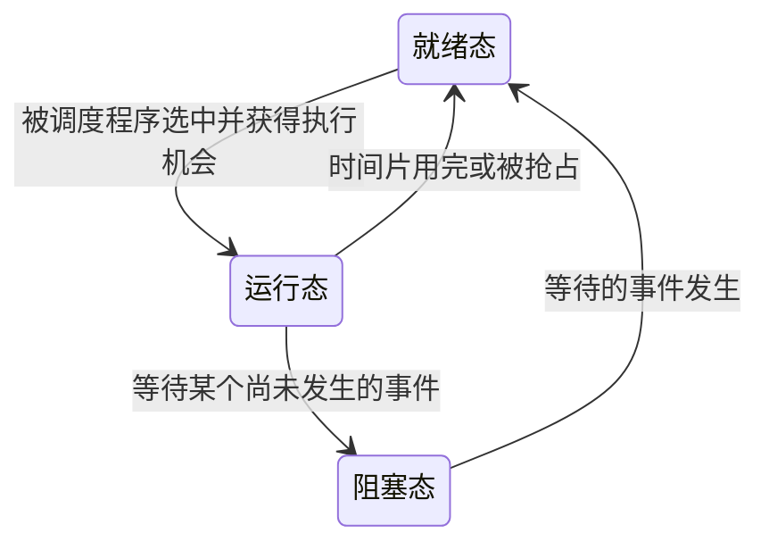

# 2.1 进程与线程的简介

## 2.1.1 进程的概念和特征

### 一、程序

**程序是静态的，是一组有序的指令集合。**

- 可以用存放在磁盘上的可执行文件来理解程序。
- 程序描述“要做什么、怎样做”，本身不代表正在执行。

### 二、进程

**进程是动态的，是程序的一次执行过程。**

- 进程具有创建、运行和终止的生命周期。
- 运行过程中需要使用处理机、内存、文件和设备等资源。
- 同一个程序可以执行多次，形成多个不同的进程。

例如：磁盘中的某个可执行文件是**程序**；将它独立启动两次，可以形成两个**进程**。

| 比较项   | 程序                     | 进程                       |
| -------- | ------------------------ | -------------------------- |
| 性质     | 静态                     | 动态                       |
| 含义     | 一组有序的指令集合       | 程序的一次执行过程         |
| 关注点   | 保存的指令               | 执行状态及使用的资源       |
| 相互关系 | 一个程序可以对应多个进程 | 不同进程可以执行同一个程序 |

### 三、进程的定义

**进程是进程实体的运行过程，是系统进行资源分配和调度的一个独立单位。**

- **运行过程**：强调进程的动态性。
- **资源分配的独立单位**：操作系统以进程为单位分配和管理内存、文件等资源。
- **调度的独立单位**：在未引入线程的系统中，操作系统以进程为单位进行处理机调度。

> **引入线程后，进程仍是资源分配的基本单位，线程成为处理机调度的基本单位。**

**PCB 是进程存在的唯一标志**，操作系统通过 PCB 感知进程的存在，并对其进行管理和控制。

### 四、进程的特征

进程具有**动态性、并发性、独立性、异步性、结构性**五个特性，其中**动态性是进程最基本的特征**。

#### 1. 动态性

**进程是程序的一次执行过程，是动态地产生、变化和消亡的。**

- 进程通过创建而产生，在执行过程中不断改变状态，最终终止并被撤销。
- 动态性是进程与静态程序的重要区别，也是**进程最基本的特征**。

#### 2. 并发性

**内存中存在多个进程实体，各进程可以并发执行。**

- 多个进程的执行过程可以在同一时间间隔内重叠。
- 单核处理机上可以交替执行，多核处理机上还可以并行执行。

#### 3. 独立性

**进程是能独立运行、独立获得资源、独立接受调度的基本单位。**

- 每个进程都有自己的 PCB，操作系统可以对其独立管理。
- 独立性不意味着进程之间不能通信或共享资源。

> 这里的调度单位针对未引入线程的系统；引入线程后，线程成为处理机调度的基本单位。

#### 4. 异步性

**各进程按各自独立的、不可预知的速度向前推进。**

- 由于资源竞争、调度和等待事件等原因，进程的执行可能走走停停。
- 各进程的相对执行速度和先后次序不能预先确定。
- 当进程之间存在协作或执行顺序要求时，操作系统需要提供**进程同步机制**，协调它们的执行，保证结果正确。

> 同步机制用于约束必要的执行顺序，不是让所有进程以相同速度运行，也不是消除异步性本身。

#### 5. 结构性

**每个进程都会配置一个 PCB。从结构上看，进程实体由程序段、数据段和 PCB 组成。**

| 特性   | 记忆要点                               |
| ------ | -------------------------------------- |
| 动态性 | 动态地产生、变化和消亡，是最基本的特征 |
| 并发性 | 多个进程可以在同一时间间隔内执行       |
| 独立性 | 独立运行、独立获得资源、独立接受调度   |
| 异步性 | 以各自独立、不可预知的速度推进         |
| 结构性 | 进程实体由程序段、数据段和 PCB 组成    |

## 2.1.2 进程的组成

### 一、进程实体与进程

**进程实体（也称进程映像）由 PCB、程序段和数据段三部分组成。**通常所说的“进程的组成”，就是指进程实体的组成。

| 组成部分   | 主要内容与作用                                   |
| ---------- | ------------------------------------------------ |
| **PCB**    | 保存操作系统管理和控制进程所需的信息             |
| **程序段** | 存放程序的指令，即进程要执行的代码               |
| **数据段** | 存放程序运行所需的数据，以及运行过程中产生的数据 |

**进程是进程实体的运行过程，具有动态性；进程实体（进程映像）是静态的，反映进程在某一时刻的状态。**

| 比较项   | 进程                     | 进程实体（进程映像）               |
| -------- | ------------------------ | ---------------------------------- |
| 性质     | 动态                     | 静态                               |
| 含义     | 进程实体的运行过程       | PCB、程序段和数据段构成的集合      |
| 时间角度 | 强调随时间推进的执行过程 | 反映某一时刻的状态，相当于一张快照 |

> “静态”不表示进程实体的内容永远不变，而是指考察某一时刻的状态。随着进程执行，不同时刻的进程映像可以不同。

> 程序段说明“执行什么”，数据段保存“处理什么”，PCB 记录“如何管理这次执行”。

### 二、进程控制块 PCB

#### 一、为什么需要 PCB？

系统中存在多个并发执行的进程，操作系统需要知道：

- 进程是谁、属于哪个用户？
- 进程分配了哪些资源？
- 进程当前处于什么状态？
- 进程执行到哪里，下次如何继续执行？

为此，操作系统为每个进程建立一个数据结构，称为**进程控制块（PCB，Process Control Block）**。

**PCB 保存操作系统管理和控制进程所需的信息。**

#### 二、PCB 中记录哪些信息？

| 信息类别           | 典型内容                                          | 用途                         |
| ------------------ | ------------------------------------------------- | ---------------------------- |
| 进程描述信息       | PID、UID 等                                       | 识别进程及其所属用户         |
| 进程控制和管理信息 | 进程状态（如 `state` 字段）、优先级、等待的事件等 | 管理进程状态，安排执行顺序   |
| 资源分配清单       | 内存管理信息、打开的文件、分配的设备等            | 记录进程分配了哪些资源       |
| 处理机相关信息     | 程序计数器、寄存器值等                            | 保存处理机现场，以便恢复执行 |

可以将 PCB 理解为进程的**管理档案**：操作系统通过这份档案了解和管理进程。

> “管理所需的信息放在 PCB 中”是概念上的概括。具体实现中，PCB 也可以通过指针或引用关联其他管理结构，并不是把资源本身全部放进去。

#### 三、PCB 与进程的关系

- 每个进程都有对应的 PCB。
- 创建进程时，操作系统建立相应的 PCB。
- **进程结束后，操作系统在完成撤销和清理时回收相应的 PCB。**
- **PCB 是进程存在的唯一标志。**

### 三、进程的标识信息

#### 一、PID：进程标识符

**PID（Process ID）用于区分不同的进程。**

- 在同一 PID 标识范围内，同时存在的不同进程具有不同的 PID。
- 操作系统通过 PID 识别和管理进程。
- 进程终止、PID 被回收后，该编号可以再次分配给其他进程。

> **PID 的唯一性不意味着这个编号永远不会重复使用。**

#### 二、UID：用户标识符

**UID（User ID）用于标识进程所属的用户。**

- 操作系统据此进行权限管理等操作。
- 同一用户可以拥有多个进程，因此多个进程可以具有相同的 UID。

> **PID 标识“哪个进程”，UID 标识“哪个用户”。**

### 四、进程的组织：链接方式

**链接方式：按照进程状态，将各进程的 PCB 链接成不同的队列，并由操作系统保存相应的指针。**

队列中链接的是 **PCB**，操作系统通过 PCB 找到并管理对应的进程。

#### 一、执行指针与队列指针

| 指针             | 指向什么                   | 作用                                               |
| ---------------- | -------------------------- | -------------------------------------------------- |
| **执行指针**     | 当前处于运行态的进程的 PCB | 找到正在占用 CPU 的进程                            |
| **就绪队列指针** | 就绪队列队头的 PCB         | 找到就绪队列，其中的进程都已具备运行条件，等待 CPU |
| **阻塞队列指针** | 相应阻塞队列队头的 PCB     | 找到正在等待资源或事件的进程队列                   |

> 执行指针指向 PCB；它不同于记录下一条待执行指令地址的程序计数器。

#### 二、就绪队列

**处于就绪态的进程，其 PCB 被组织在就绪队列中。**操作系统从中选择进程，分配 CPU。

- 在按优先级组织的就绪队列中，通常将**优先级高的进程放在队头**。
- 队列的具体排列方式取决于调度策略，也可以按到达顺序等方式组织。

#### 三、多个阻塞队列

**许多操作系统会根据阻塞原因的不同，设置多个阻塞队列。**

例如：

- 等待某个设备完成输入输出的队列。
- 等待某种资源的队列。
- 等待某个特定事件的队列。

相应事件发生后，操作系统可以找到对应队列，唤醒满足条件的进程，将其转入就绪队列。

### 五、进程的组织：索引方式

**索引方式：根据进程状态的不同，建立几张索引表，操作系统持有指向各个索引表的指针。**

- 例如，分别建立**就绪索引表**和**阻塞索引表**。
- 索引表中的每个表项记录相应进程 PCB 的地址或定位信息。
- 操作系统通过索引表指针找到索引表，再通过表项找到对应的 PCB。

查找过程：**索引表指针 → 索引表中的表项 → 对应进程的 PCB**。

#### 链接方式与索引方式的区别

| 组织方式     | 如何组织 PCB                                    | 如何找到 PCB                             |
| ------------ | ----------------------------------------------- | ---------------------------------------- |
| **链接方式** | 按进程状态，将 PCB 通过链接指针串成队列         | 通过队列指针找到队头，再沿链接查找       |
| **索引方式** | 按进程状态建立索引表，由表项记录 PCB 的定位信息 | 通过索引表指针找到表，再通过表项找到 PCB |

## 2.1.3 进程的内存映像

### 一、虚拟地址空间与按需调页

**当程序被加载运行时，操作系统为其建立相应的虚拟地址空间，将代码、数据等映射到其中。**

- 虚拟地址空间不等于实际占用的物理内存。
- **进程的整个地址空间无须全部驻留在物理内存中。**
- 在请求分页系统中，访问合法但尚未驻留的页面时，会触发**缺页异常（教材常称缺页中断）**，由操作系统准备所需页面，再恢复执行。
- 对需要从文件或交换区读取的页面，操作系统可以将其从磁盘调入内存；有些缺页只需分配清零页或建立已有物理页的映射，不必读取磁盘。

> 按需调页不表示所有页面都必须等到首次访问才加载，系统也可以预先装入部分页面。非法地址访问不能靠调页正常完成。

**进程运行期间，内存中的数据、映射和驻留情况可以动态变化；某一时刻的进程映像仍是该时刻的静态快照。**

### 二、虚拟地址空间的主要组成

以下按常见的用户空间布局理解，具体布局和权限由操作系统、体系结构及装载方式决定。

| 区域                   | 主要内容                                 | 特点                                           |
| ---------------------- | ---------------------------------------- | ---------------------------------------------- |
| **代码区**             | 编译后的程序机器指令                     | 通常可读、可执行，不可写                       |
| **只读数据区**         | 字符串常量等只读数据                     | 通常可读、不可写，不要求可执行                 |
| **数据区**             | 全局变量和静态变量                       | 通常可读、可写                                 |
| **堆**                 | 程序运行时动态申请的内存                 | 分配和释放由程序或语言运行时管理               |
| **栈**                 | 函数调用所需的局部变量、参数、返回地址等 | 随函数调用建立和释放栈帧，遵循后进先出（LIFO） |
| **共享库与内存映射区** | 共享库、映射文件、共享内存或匿名映射等   | 用于加载公共函数代码，也可映射数据等内容       |

### 三、代码与只读数据：`.init`、`.text`、`.rodata`

在常见的 ELF 可执行文件中，可以看到以下**节（section）**：

| 节            | 内容                                                     |
| ------------- | -------------------------------------------------------- |
| **`.init`**   | 与程序初始化有关的代码，由启动流程或运行时机制调用       |
| **`.text`**   | 主要程序指令，例如 `main()` 和自定义函数编译后的机器指令 |
| **`.rodata`** | 只读数据，例如字符串常量、只读常量表等                   |

> 教材可能将这些内容合并在广义的“代码段”中介绍。严格来说，节与装载到内存的段并非一一对应；只读数据也可以单独映射，不必具有执行权限。
>
> 代码区存放的是可执行文件中的机器指令部分，不是整个可执行文件。

### 四、数据：`.data` 与 `.bss`

**数据区主要存放全局变量和静态变量。**

| 节          | 典型内容                                     | 例子                                              |
| ----------- | -------------------------------------------- | ------------------------------------------------- |
| **`.data`** | 已初始化且通常初值非零的全局变量、静态变量   | 全局作用域的 `int count = 10;`                    |
| **`.bss`**  | 未显式初始化或初始化为零的全局变量、静态变量 | 全局作用域的 `int count;`、`static int flag = 0;` |

- `.bss` 中的变量在程序开始执行前被置零，“未显式初始化”不表示初值是随机值。
- `.bss` 通常不在可执行文件中保存等量的零字节，而是记录所需空间大小，在装载时建立相应的零初始化区域。
- 以上是典型安排，实际归属会受编译器等因素影响；只读常量还可能放入 `.rodata`。

### 五、堆与栈

#### 1. 堆

**堆是程序运行时动态申请内存的区域。**例如，C 语言中可以通过 `malloc()` 申请内存，通过 `free()` 释放。

动态申请的内存不会仅因申请它的函数返回就自动释放，其生命周期取决于程序或语言运行时的管理。

#### 2. 栈

**栈用于支持函数调用，遵循后进先出（LIFO）。**

- 函数调用时建立栈帧，保存局部变量、函数参数、返回地址等调用信息。
- 具体内容取决于调用约定和编译优化，一部分参数或局部变量也可能保存在寄存器中。
- 在常见体系结构中，**栈从高地址向低地址扩展**，但这不是所有系统都必须遵循的规则。
- 函数正常返回时，通过编译器生成的指令等恢复栈指针，释放该函数的栈帧，通常不需要程序员手动释放。

> “栈由系统自动管理”是概括说法：操作系统提供栈空间支持，函数调用时栈帧的调整主要由程序执行相应指令完成。栈指针回退也不意味着旧数据被立即清零。

### 六、共享库与内存映射区

**共享库提供进程所依赖的公共函数代码，例如库函数的实现。**多个进程可以将同一共享库的只读代码页映射到各自的虚拟地址空间，共享底层物理页。

内存映射区还可以用于文件映射、共享内存和匿名映射，因此不只存放公共函数代码。

**例如，采用动态链接时，`printf()` 等标准库函数的实现位于共享库中，动态链接器在程序启动或运行期间将相关共享库映射到进程的虚拟地址空间。**

- 库函数的代码页通常只读、可执行，可以被多个进程共享，从而节省物理内存。
- 各进程有自己的虚拟地址映射，共享的是底层的物理代码页。
- 如果采用静态链接，所需库代码会被链接进可执行文件，不能一概描述为运行时映射共享库。

> 共享库的代码可以共享，不表示各进程中的库变量都自动共享。

### 七、PCB 存放在哪里？

**PCB 是管理进程的核心数据结构，由操作系统内核维护，存放在内核管理的内存中，不属于进程的用户空间布局。**

- 用户态程序不能直接访问或修改 PCB。
- PCB 虽是进程实体的组成部分，但不是用户程序中的代码段、数据段、堆或栈的一部分。
- 某些系统会把内核空间映射到进程的虚拟地址空间中，因此“PCB 完全不属于进程的虚拟地址空间”并非通用的严格说法；应记住它**属于内核管理的数据，不在用户态可直接访问的空间中**。

### 八、各区域大小的变化

**在通常的程序内存布局模型中，程序自身的代码段和静态数据区大小在加载时已经确定，堆和栈则可以在运行过程中动态扩展和收缩。**

| 区域                                 | 大小变化                                           |
| ------------------------------------ | -------------------------------------------------- |
| **代码段**                           | 由编译、链接结果确定，加载后通常保持固定           |
| **静态数据区（`.data`、`.bss` 等）** | 加载时大小已确定，不随函数调用或动态内存申请而扩展 |
| **堆**                               | 随动态内存分配和释放，使用量可以增加或减少         |
| **栈**                               | 随函数调用和返回，已使用的栈空间可以增加或减少     |

> 数据区大小固定不表示变量的值不能改变。堆和栈的使用量减少，也不意味着相应物理页或虚拟地址映射一定立即归还给操作系统；扩展还受地址空间和资源限制。

## 2.1.4 进程的状态与转换

### 一、进程的五种状态

| 状态                 | 含义                                                 |
| -------------------- | ---------------------------------------------------- |
| **创建态（新建态）** | 进程正在被创建，操作系统为其建立 PCB、分配必要资源等 |
| **就绪态**           | 已具备运行条件，等待分配 CPU                         |
| **运行态**           | 正在占用 CPU，CPU 正在执行该进程对应的程序           |
| **阻塞态（等待态）** | 正在等待某种资源或事件，暂时不具备继续运行的条件     |
| **终止态（结束态）** | 进程正在退出，操作系统进行资源回收等清理工作         |

> **就绪态只缺 CPU；阻塞态即使获得 CPU，也无法继续执行，必须先等所需条件满足。**

**PCB 中设有表示进程当前状态的字段，可以用 `state` 表示。**它属于 PCB 的**进程控制和管理信息**。当进程发生状态转换时，操作系统会更新相应的状态记录。

> `state` 是便于理解的字段名，具体名称和状态编码取决于操作系统的实现。

### 二、进程为什么进入阻塞态？

**进程在运行过程中发起了一个当前无法立即完成、需要等待的请求，因此暂停执行，进入阻塞态。**

例如，进程通过**系统调用**：

- 申请某种暂时无法获得的系统资源。
- 请求输入输出，并等待操作完成。
- 请求等待某个事件发生。

在所等待的资源或事件就绪之前，进程无法继续向下执行。操作系统将其从运行态转为阻塞态，让出 CPU，再调度其他就绪进程运行；若没有就绪进程，CPU 可以进入空闲状态。

> 发起系统调用不一定会阻塞。只有请求需要等待时，才会发生这里描述的阻塞。

### 三、进程如何进入终止态？

**进程可以通过调用 `exit()` 等方式请求退出，进入终止态。**进程也可能因异常或外部终止请求而结束。

操作系统随后回收资源，并在完成必要清理后回收 PCB。

### 四、状态转换

| 状态转换        | 触发条件                         |
| --------------- | -------------------------------- |
| 创建态 → 就绪态 | 创建完成，具备运行条件           |
| 就绪态 → 运行态 | 被调度，获得 CPU                 |
| 运行态 → 就绪态 | 时间片用完或 CPU 被抢占          |
| 运行态 → 阻塞态 | 请求资源或等待事件，需要暂停执行 |
| 阻塞态 → 就绪态 | 所等待的资源可用或事件发生       |
| 运行态 → 终止态 | 执行结束或请求退出等             |

**运行态可以直接转换为就绪态，例如时间片用完。**

- 操作系统为进程分配一段 CPU 使用时间，称为**时间片**。
- 时间片用完后，操作系统收回 CPU，进程由**运行态 → 就绪态**，等待再次调度。
- 此时进程仍具备运行条件，只是暂时失去 CPU，因此进入就绪态，而不是阻塞态。

### 五、不能直接发生的状态转换

在基本进程状态模型中：

| 不能直接发生的转换  | 原因                                                                | 正确路径                 |
| ------------------- | ------------------------------------------------------------------- | ------------------------ |
| **阻塞态 → 运行态** | 等待的事件发生后，只是具备了运行条件，还需要等待调度、获得 CPU      | 阻塞态 → 就绪态 → 运行态 |
| **就绪态 → 阻塞态** | 就绪进程尚未执行，不能发起导致自身阻塞的请求；必须先获得 CPU 并运行 | 就绪态 → 运行态 → 阻塞态 |

> **阻塞解除不等于立即运行；进入阻塞态之前，进程必须先处于运行态。**

### 六、单 CPU 下的运行态

**在单 CPU、单执行核心的基本模型中，同一时刻最多只有一个进程处于运行态。**

- 就绪态和阻塞态可以各有多个进程。
- CPU 空闲时，可以没有进程处于运行态，因此准确说法是“最多一个”。
- 多核系统可以让多个进程同时运行；判断时应看能同时执行的处理核心，而不是物理 CPU 的颗数。

## 2.1.5 进程控制

### 一、进程控制的主要功能

**进程控制的主要功能是对系统中的所有进程实施有效的管理。**具体包括：

- **创建新进程**。
- **撤销已有进程**。
- **实现进程状态转换**，例如阻塞、唤醒等。

### 二、如何实现进程控制？

**进程控制通过原语实现。**

**原语是操作系统内核中的一种特殊程序，其执行具有原子性。**也就是说，这段程序的执行必须“一气呵成”，不可被中断而破坏操作的完整性。

- 原语执行期间，不能让其他相关操作介入，看到或使用尚未完成的中间状态。
- 例如，改变进程状态与调整其所在队列需要协调完成，避免 PCB 中的状态与队列归属不一致。

> **原语的关键特征是原子性。**这里的“不可中断”强调相关操作不可分割，不是指整个操作系统永远不能响应任何中断。

### 三、为什么原语必须“一气呵成”？

以唤醒进程 2 为例，假设 PCB 中的 `state` 字段用以下数值表示状态：

- `1`：就绪态。
- `2`：阻塞态。

> 这里的数值仅用于举例，不是所有操作系统统一使用的编码。

当进程 2 等待的事件发生后，负责进程控制的内核程序至少需要完成两件事：

1. 将 `PCB2.state` 从 `2` 改为 `1`。
2. 将 PCB2 从阻塞队列移到就绪队列。

**如果完成第一步后被中断，并让其他相关内核操作介入，就可能出现：PCB2 的状态已经是就绪态，但仍在阻塞队列中。**其他操作若使用了这个不一致的中间状态，就可能导致系统出错。

因此，这些修改必须作为一个不可分割的整体完成，保证**PCB 中的状态与所在队列一致**。

### 四、如何保证原语的原子性？

在单 CPU 的基本模型中，可以使用**关中断指令**和**开中断指令**，防止可屏蔽中断打断关键指令序列。

1. **关中断**：CPU 暂停响应可屏蔽中断。
2. **执行原语的关键指令序列**：完成状态修改、队列调整等操作。
3. **开中断**：恢复响应可屏蔽中断。

**关中断和开中断都是特权指令，只能由具有内核权限的代码执行，用户态程序不能直接使用。**

> 教材中的“不再检查中断信号”，应理解为暂停响应可屏蔽中断，不包括不可屏蔽中断和异常。多核系统中，关闭本核中断不能阻止其他核心访问共享数据，还需要锁等同步手段。实际内核也需要按进入前的状态恢复中断。

### 五、进程的创建

#### 1. 创建原语

**创建进程通过创建原语实现。**主要步骤：

1. **申请空白 PCB**。
2. **为新进程分配所需资源**。
3. **初始化 PCB**，设置标识信息、资源信息、初始状态等。
4. **将 PCB 插入就绪队列**，等待调度。

以上描述的是创建成功时的基本流程。

#### 2. 引起进程创建的事件

| 事件         | 说明                                                   |
| ------------ | ------------------------------------------------------ |
| **用户登录** | 在分时系统中，用户登录成功后，系统可以为其建立新的进程 |
| **作业调度** | 在多道批处理系统中，新作业被调入内存时，为其建立进程   |
| **提供服务** | 用户向操作系统提出某些请求时，系统可以新建进程处理请求 |
| **应用请求** | 用户进程主动请求创建子进程                             |

### 六、进程的终止

#### 1. 撤销原语

**终止进程通过撤销原语实现。**主要操作：

1. **从 PCB 集合中找到待终止进程的 PCB**。
2. 若该进程正在运行，**剥夺其 CPU 使用权**，由调度程序安排其他就绪进程运行。
3. **处理其子进程**：在采用级联终止策略的模型中，终止其所有子进程。
4. **回收进程拥有的资源**，按资源归属和系统规则归还父进程或操作系统。
5. **将 PCB 从相关队列或管理结构中移除，并在完成必要清理后删除、回收 PCB**。

> 按父子创建关系，进程之间可以组织成树形结构。教材常列出“终止所有子进程”，但实际系统不一定采用级联终止策略；父进程退出不一定导致子进程退出。

#### 2. 引起进程终止的事件

| 事件         | 例子                                           |
| ------------ | ---------------------------------------------- |
| **正常结束** | 任务完成，调用 `exit()` 等方式退出             |
| **异常结束** | 发生未被妥善处理的整数除零等异常，导致进程终止 |
| **外界干预** | 用户、操作系统或有权限的其他进程请求终止该进程 |

### 七、进程的阻塞与唤醒

#### 1. 阻塞原语

**进程因需要等待而无法继续执行时，通过阻塞原语由运行态转为阻塞态。**主要步骤：

1. **找到要阻塞的进程对应的 PCB**。
2. **保护进程运行现场**，保存程序计数器、寄存器等信息。
3. **将 PCB 中的状态设置为阻塞态**，暂时停止进程运行。
4. **将 PCB 插入相应事件的等待队列**。
5. 让出 CPU，由调度程序选择其他就绪进程运行。

#### 2. 引起进程阻塞的事件

- 需要等待系统分配某种暂时无法获得的资源。
- 需要等待相互合作的其他进程完成工作。
- 需要等待输入输出完成等事件。

#### 3. 唤醒原语

**所等待的事件发生、满足继续执行的条件时，通过唤醒原语将进程由阻塞态转为就绪态。**主要步骤：

1. **在相应事件的等待队列中找到进程的 PCB**。
2. **将 PCB 从等待队列中移除**。
3. **将进程状态设置为就绪态**。
4. **将 PCB 插入就绪队列**，等待被调度。

#### 4. 引起进程唤醒的事件

**进程所等待的事件发生**，例如所需资源可用、合作进程完成工作或输入输出完成。

> **唤醒不等于立即运行：阻塞态 → 就绪态，之后获得 CPU 才进入运行态。**阻塞与唤醒需要配合，避免进程进入等待队列的过程中错过事件通知。

### 八、进程的切换

**进程切换是将 CPU 的使用权从一个进程交给另一个进程，通过切换原语完成运行环境的保存与恢复。**

#### 1. 切换时的状态转换

以当前进程被抢占、另一个就绪进程获得 CPU 为例：

- 原进程：**运行态 → 就绪态**。
- 新进程：**就绪态 → 运行态**。

> 切出进程不一定进入就绪态：主动阻塞时进入阻塞态，结束执行时进入终止态。

#### 2. 切换原语

1. **将原进程的运行环境信息存入 PCB**，保存程序计数器、寄存器等现场，以便之后恢复执行。
2. **更新原进程的 PCB，并将其移入相应队列**：被抢占时进入就绪队列，阻塞时进入相应等待队列。
3. **选择另一个就绪进程执行，并更新其 PCB**，将其从就绪队列移出，设置为运行态。
4. **根据新进程的 PCB 恢复其所需的运行环境**，让 CPU 继续执行该进程。

> 以上是需要保留原进程以便后续执行的典型流程；原进程已经终止时，按终止流程处理，不再为恢复它而保存现场。若没有就绪进程可运行，CPU 可以进入空闲状态。

#### 3. 引起进程切换的事件

| 事件                       | 说明                                         | 原进程的状态变化 |
| -------------------------- | -------------------------------------------- | ---------------- |
| **当前进程时间片到**       | 本轮 CPU 使用时间结束，调度其他就绪进程      | 运行态 → 就绪态  |
| **有更高优先级的进程到达** | 在抢占式优先级调度中，高优先级进程可抢占 CPU | 运行态 → 就绪态  |
| **当前进程主动阻塞**       | 需要等待资源或事件，让出 CPU                 | 运行态 → 阻塞态  |
| **当前进程终止**           | 不再继续执行，释放 CPU                       | 运行态 → 终止态  |

> 这些事件会触发调度；只有实际改由另一个进程运行时，才发生进程之间的切换。非抢占式调度中，高优先级进程到达不一定立即引起切换。

## 2.1.6 进程的通信

### 一、进程间通信的概念

**进程间通信（IPC，Inter-Process Communication）是指进程之间的数据交互。**

- **进程是系统资源分配的基本单位**，拥有独立的虚拟地址空间。
- 为保证安全和隔离，一个进程不能随意直接访问另一个进程的地址空间。
- 进程之间需要交换信息时，应使用操作系统提供的进程间通信机制。

### 二、低级通信与高级通信

| 类别         | 主要特点                                       | 典型方式                     |
| ------------ | ---------------------------------------------- | ---------------------------- |
| **低级通信** | 主要传递同步、互斥等控制信息，交换的数据量较少 | PV 操作等                    |
| **高级通信** | 用于交换较多的数据，提供更方便的数据传递方式   | 共享存储、消息传递、管道通信 |

> 这里采用教材中的分类。“低级”和“高级”主要描述通信方式的功能与使用特点，不是对实际执行速度的绝对排序。

### 三、共享存储

#### 1. 基本原理

**操作系统建立一块共享内存区域，并将其映射到多个进程的虚拟地址空间，使这些进程都能通过各自的映射直接读写该区域。**

- 各进程的虚拟地址空间仍然相互独立。
- 共享区域对应同一份底层存储，在不同进程中的虚拟地址可以不同。
- 一个进程写入共享区域的数据，可以由其他共享该区域的进程读取。

#### 2. 同步与互斥

**通信进程需要自行协调对共享区域的访问，必要时采用同步、互斥机制。**

- 对可能发生冲突的读写操作，需要互斥保护，避免数据不一致。
- 如果要求“先写后读”等顺序，还需要同步机制。
- 用户程序可以使用操作系统提供的信号量等工具，实现这些约束。

**共享内存机制负责共享区域的建立、映射和访问权限等管理，不会自动保证其中的数据操作同步、互斥。**

> 教材通常概括为“各进程互斥访问共享空间”。准确地说，需要保护的是会发生冲突的访问；多个进程只读且没有并发写入时，不一定需要互斥。

#### 3. 基于数据结构的共享

**共享空间中使用预先规定的数据结构，通信进程按这种结构交换数据。**

例如：共享空间只允许存放一个长度为 10 的数组，通信进程需要按规定的数组形式读写。

- 数据的形式、容量等受到限制，灵活性较低。
- 教材通常将其归为**低级通信方式**，概括为速度较慢、限制较多。

#### 4. 基于存储区的共享

**操作系统划出一块共享存储区，数据的形式和存放位置由通信进程自行控制，而不是由操作系统规定。**

- 进程可以自行约定共享区中的数据布局和使用方式。
- 灵活性较高，适合交换较多的数据。
- 建立映射后，可以直接读写共享数据，减少经由内核中转数据的开销，因此通常速度较快，属于**高级通信方式**。

| 比较项   | 基于数据结构的共享 | 基于存储区的共享                 |
| -------- | ------------------ | -------------------------------- |
| 共享形式 | 预先规定的数据结构 | 一块由通信进程安排用途的存储区域 |
| 数据布局 | 受既定结构约束     | 由通信进程自行约定               |
| 灵活性   | 较低，限制较多     | 较高，限制较少                   |
| 教材分类 | 低级通信           | 高级通信                         |

> 不能仅因共享区中放了数组，就判定它一定是低级通信。关键是通信机制是否限定数据结构；实际速度也取决于数据量、同步开销等因素。

### 四、消息传递

#### 1. 基本概念与消息格式

**消息传递以格式化的消息为单位进行进程间的数据交换，进程通过操作系统提供的发送原语和接收原语传递消息。**

**消息 = 消息头 + 消息体。**

| 组成       | 主要内容                                 |
| ---------- | ---------------------------------------- |
| **消息头** | 发送进程、接收进程、消息长度等格式化信息 |
| **消息体** | 实际需要传递的数据                       |

消息传递分为**直接通信方式**和**间接通信方式**。

#### 2. 直接通信方式

**发送进程直接指明接收进程的 ID，由操作系统将消息送入接收进程的消息队列。**

以进程 P 给进程 Q 发送消息为例：

1. **P 在自己的地址空间内准备 `message`**，填写消息头和消息体。
2. P 使用发送原语，例如 `send(Q, message)`，指明接收者 Q。
3. 内核找到 Q 的 PCB 及其关联的消息队列，将消息加入该队列。
4. Q 使用接收原语，例如 `receive(P, message)`，表示接收来自 P 的消息。
5. 内核在 Q 的消息队列中找到符合条件的消息，将其取出并交付到 Q 地址空间中的接收缓冲区。

查找与传递路径：**P 的发送缓冲区 → 内核维护的 Q 消息队列 → Q 的接收缓冲区**。

> PCB 由内核维护；教材模型中，PCB 可以通过指针关联消息队列，不必把整个队列放在 PCB 内。上面的原语参数是示意写法，具体接口也可能允许接收任意发送者的消息。

#### 3. 间接通信方式（信箱通信方式）

**进程以信箱作为中间媒介交换消息，因此间接通信又称信箱通信。**发送时指明目标信箱，接收时指明从哪个信箱取消息。

以 P、Q 通过信箱 A 通信为例：

1. 通过系统调用创建或取得对**同一个信箱 A** 的访问权，由操作系统维护信箱及其中的消息。
2. P 在自己的地址空间内准备好 `message`。
3. P 使用发送原语，例如 `send(A, message)`，将消息放入信箱 A。
4. Q 使用接收原语，例如 `receive(A, message)`，从信箱 A 取出消息，获得消息中的数据。

- 操作系统可以允许**多个进程向同一信箱发送消息**。
- 也可以允许**多个进程从同一信箱接收消息**，具体权限和接收规则由系统规定。
- P、Q 不必各自新建一个信箱；它们需要访问同一个用于通信的信箱。

> 多个接收者共享一个信箱，不意味着一条消息自动广播给所有接收者。通常一次接收会取走一条消息，由哪个进程取得取决于接收规则。

| 比较项       | 直接通信                             | 间接通信         |
| ------------ | ------------------------------------ | ---------------- |
| 发送目标     | 接收进程的 ID                        | 信箱             |
| 中间存放位置 | 接收进程关联的消息队列               | 信箱中的消息队列 |
| 接收方式     | 从本进程消息队列接收，可按发送者筛选 | 从指定信箱接收   |

### 五、管道通信

#### 1. 管道是什么？

**管道是用于连接读进程和写进程、传递数据的特殊共享文件，又称 pipe 文件。**

- 进程通过系统调用创建管道，获得读端和写端。
- 可以将管道理解为**内核中一块容量有限的内存缓冲区**，教材通常按大小固定的缓冲区分析。
- 数据从一端写入，从另一端读出，遵循**先进先出（FIFO）**。

> 管道虽有文件接口，但这里的数据保存在内核缓冲区中，不是先写入普通磁盘文件。实际系统的管道容量可能允许调整。

#### 2. 单向传输与双向通信

**基本管道模型采用半双工通信，一个管道只支持单向的数据传输。**

- 例如，P 写入、Q 读出：**P → 管道 → Q**。
- 若要实现 P、Q **同时双向通信，需要设置两个管道**：一个用于 P → Q，另一个用于 Q → P。

#### 3. 与共享内存的区别

| 比较项   | 管道                                     | 共享内存                       |
| -------- | ---------------------------------------- | ------------------------------ |
| 数据访问 | 按 FIFO 顺序读写，不能随机定位读取       | 可按地址访问，自行安排读写位置 |
| 操作方式 | 通过读写等系统调用访问管道               | 建立映射后直接访问共享区域     |
| 同步互斥 | 内核协调缓冲区访问及满、空时的等待和唤醒 | 通信进程需要自行安排同步互斥   |

#### 4. 管道的同步与互斥

**操作系统负责协调各进程对管道内部缓冲区的互斥访问，避免破坏其数据结构，并实现必要的阻塞与唤醒。**

在默认的阻塞读写模式下：

| 情况         | 处理方式                             | 恢复条件                                                 |
| ------------ | ------------------------------------ | -------------------------------------------------------- |
| **管道写满** | 写进程因没有可用空间而阻塞           | 读进程取走数据，腾出满足写入条件的空间后，写进程可被唤醒 |
| **管道读空** | 若仍有写端打开，读进程阻塞，等待数据 | 写进程写入数据后，读进程可被唤醒                         |

> 被唤醒的进程先进入就绪态，获得 CPU 后才能继续执行。内核的互斥保护不表示任意长度的多进程写入都不会交错，应用层仍可能需要协调。
>
> 以上针对阻塞模式且通信端仍有效的情况：管道为空且所有写端已关闭时，读取返回文件结束（EOF）；所有读端已关闭后再写入，会报告错误。非阻塞模式下，暂时无法读写通常返回相应结果，不会按上述方式等待。

#### 5. 数据读出后的变化与读写进程数量

**管道中的数据一旦被读出，就从管道中被消费、移除，其他读进程不能再从该管道读到同一份数据。**这里的“消失”是指不再保留在管道中，已读入进程接收缓冲区的数据仍然存在。

多个进程读取同一个管道时，会竞争其中的数据。如果应用程序期望每个进程都收到完整的一份数据，或者没有协调消息的读取，就可能出现数据被分走、消息被拆分等问题。

| 学习口径                      | 写进程数量 | 读进程数量 | 理解要点                                         |
| ----------------------------- | ---------- | ---------- | ------------------------------------------------ |
| **本课程采用的 408 答题口径** | 可以有多个 | 只允许一个 | 由单个读进程接收数据，避免多个读者分走数据       |
| **Linux 实际机制**            | 可以有多个 | 可以有多个 | 内核协调对管道缓冲区的访问，各读进程竞争消费数据 |

**Linux 中的“轮流读取”不能理解为严格按固定顺序轮转，也不保证平均分配数据。**内核的互斥与唤醒机制保护缓冲区操作，具体哪个进程读到哪些数据，仍取决于执行时序和读取长度。可参见 [Linux 管道实现](https://github.com/torvalds/linux/blob/master/fs/pipe.c)。

普通管道是**字节流，没有消息边界**，因此一次写入的数据不一定由一次读取完整取走；多读者场景仍需由应用程序协调数据分发。参见 [Linux pipe(7) 手册](https://man7.org/linux/man-pages/man7/pipe.7.html)。

> 考试按题目和所用教材的模型作答，不要将“只允许一个读进程”推广为所有操作系统的实现限制。

### 六、信号

#### 1. 信号与信号量

| 概念                    | 主要作用                                                           |
| ----------------------- | ------------------------------------------------------------------ |
| **信号量（semaphore）** | 配合 P、V 操作，实现进程间的同步与互斥                             |
| **信号（signal）**      | 通知进程某个特定事件已经发生，是一种事件通知机制，可用于进程间通信 |

**信号与信号量是不同的机制。**进程接收到信号后，按该类信号的处理方式作出响应。

#### 2. 信号类型与编号

不同事件可以对应不同类型的信号，每类信号有名称和编号。例如 `SIGFPE` 表示算术异常，`SIGKILL` 用于强制终止，`SIGSTOP` 用于停止进程。

**不能笼统记为“Linux 有 30 种 POSIX 信号”。**Linux 支持标准信号和实时信号；常见架构的标准信号编号为 1～31，内核实时信号编号为 32～64，应用可用范围还受运行库影响。编号可能因架构不同而变化，编程时使用信号名称及 `SIGRTMIN`、`SIGRTMAX`。参见 [signal(7)](https://man7.org/linux/man-pages/man7/signal.7.html)。

#### 3. `pending` 与 `blocked`

在教材的简化模型中，可以用 PCB 关联的两个位向量记录信号信息：若考虑 n 类信号，则每个位向量用 n 个有效位分别对应这些信号。

| 位向量        | 含义                           | 某一位为 1 表示什么            |
| ------------- | ------------------------------ | ------------------------------ |
| **`pending`** | 待处理信号集合                 | 该类信号已经产生，尚未递达处理 |
| **`blocked`** | 被屏蔽的信号集合，又称信号掩码 | 暂不递达该类信号               |

**屏蔽是推迟递达，不等于忽略信号，也不等于让进程进入阻塞态。**允许调整的屏蔽位由程序通过相应接口设置。

可用以下按位运算理解“当前可处理的待决信号”：

```text
可处理信号集合 = pending & ~blocked
```

即先对 `blocked` 按位取反，再与 `pending` 按位与，筛出“已经产生且未被屏蔽”的信号。

> 这是便于学习的模型。实际 Linux 中，每个线程有自己的信号掩码，还区分进程级和线程级待决信号；实时信号也需要队列，不能只靠两组位向量描述全部信息。参见 [sigpending(2)](https://man7.org/linux/man-pages/man2/sigpending.2.html)。

#### 4. 信号的发送

**进程请求发送**：进程可以调用 `kill(pid, sig)`，请求内核向指定 PID 的进程发送指定信号。`kill()` 不只用于“杀死进程”，其作用取决于所发信号。

**内核产生信号**：内核检测到某些事件或异常后，可以向相关进程或线程产生信号，无须另有一个“内核进程”作为发送者。

发送必须使用有效信号编号，并通过权限检查。普通进程不能任意向所有其他进程发送信号；满足权限条件时，也可以发送 `SIGKILL` 等信号。不能把发送权限限制与“信号不能被捕获、屏蔽”的限制混为一谈。参见 [kill(2)](https://man7.org/linux/man-pages/man2/kill.2.html)。

#### 5. 信号的处理流程

**从内核态返回用户态是检查和递达待决信号的重要时机。**可以按以下流程理解：

1. 检查是否有待决且未屏蔽的信号。
2. 选取信号并从待决集合中取出；对普通信号的位向量模型，相当于将对应 `pending` 位清零。
3. 按该信号当前的处理设置执行相应动作。
4. 若执行了用户自定义处理函数且其正常返回，恢复原执行现场，继续被打断的执行过程。

> 清除待决标记发生在取出、准备递达信号时，不必等处理函数结束。此后再次产生的同类信号可以重新成为待决信号。恢复执行也不一定是简单跳到“下一条指令”，被打断的系统调用可能重启或返回中断结果。

#### 6. 怎样处理信号？

| 处理方式               | 含义                                                                       |
| ---------------------- | -------------------------------------------------------------------------- |
| **默认动作**           | 执行系统为该信号规定的动作，如终止、忽略、停止、继续，或终止并进行核心转储 |
| **忽略**               | 对允许忽略的信号，程序可以设置不作响应                                     |
| **用户自定义处理函数** | 程序注册处理函数，收到该类信号时执行该函数，替代默认动作                   |

**默认动作不一定是调用某个用户态“默认处理函数”。**自定义处理函数则在用户态执行；如果它终止进程或不正常返回，就不会按通常流程恢复原执行过程。

**`SIGKILL` 和 `SIGSTOP` 不能被捕获、屏蔽或忽略**，因此不能为它们设置自定义处理函数。参见 [sigaction(2)](https://man7.org/linux/man-pages/man2/sigaction.2.html)。

#### 7. 重复信号与处理顺序

| 情况                     | 规则                                                                           |
| ------------------------ | ------------------------------------------------------------------------------ |
| **标准信号重复产生**     | 同类信号已经待决时，后续同类通知合并，不累计发生次数；可用“一位只记录有无”理解 |
| **实时信号重复产生**     | 可以排队保存多个实例，不能套用“重复就丢弃”                                     |
| **多个不同标准信号待决** | 不应依赖固定的递达顺序，不能笼统保证编号小的一定先处理                         |
| **多个不同实时信号待决** | 优先递达编号较小的实时信号；同类实例按发送顺序递达                             |

#### 8. 信号与异常的关系

**信号可以作为异常处理的配套机制，将异常情况通知用户进程，让程序作出相应处理。**但异常不一定产生信号，信号也不一定来源于异常。

| 情况                           | 内核与信号的作用                                     |
| ------------------------------ | ---------------------------------------------------- |
| **可正常解决的缺页异常**       | 内核准备好合法页面后恢复执行，通常无须向进程发送信号 |
| **触发硬件算术异常的整数除零** | 内核处理异常后，可以向出错线程产生 `SIGFPE`          |

## 2.1.7 线程和多线程模型

### 一、为什么引入线程？

| 引入的概念 | 目的 |
| ---------- | ---- |
| **进程** | 使多道程序能够并发执行，从而提高**资源利用率和系统吞吐量** |
| **线程** | 进一步降低程序并发执行时的**时间和空间开销**，提高系统并发度 |

传统进程机制中，进程同时承担资源分配和处理机调度两方面的职责。引入线程后，将这两方面的职责分开：**进程负责承载资源，线程负责执行。**

### 二、线程的概念

**线程是一个基本的 CPU 执行单元，也是程序执行流的最小单位。**

- 一个进程中可以包含多个线程，每个线程代表一条执行流。
- 同一进程内的各线程可以并发执行，进一步提高系统的并发度。
- 各线程共享所属进程的地址空间和大部分资源，但各自保留程序计数器、寄存器、栈等执行所需的状态。

> 并发不等于并行：单核 CPU 上，多个线程可以交替执行；具备相应硬件和线程实现支持时，多个线程还可以并行执行。

### 三、引入线程前后的比较

| 比较角度 | 传统进程机制（未引入线程） | 引入线程后 |
| -------- | -------------------------- | ---------- |
| **资源分配** | 进程是资源分配的基本单位 | 进程仍是资源分配的基本单位，主要承载除 CPU 外的系统资源 |
| **调度** | 进程是处理机调度的基本单位 | 线程是处理机调度的基本单位 |
| **并发性** | 进程之间可以并发 | 进程之间可以并发，同一进程内的各线程之间也可以并发 |
| **系统开销** | 进程切换需要切换进程的运行环境，开销较大 | 同一进程内的线程切换无须切换所属进程的地址空间和资源环境，开销通常较小 |

**核心记忆：引入线程后，进程是资源分配的基本单位，线程是调度的基本单位。**

> 这里是引入线程后的总体概括。具体到用户级线程、内核级线程及多线程模型时，还要区分用户态线程库的调度与内核的调度。

### 四、为什么线程切换的开销较小？

**同一进程内的线程共享进程资源，切换时通常不需要切换进程的地址空间等资源环境，只需保存和恢复线程各自的执行现场。**

- **进程间切换**：除保存和恢复执行现场外，还涉及进程地址空间等运行环境的切换，系统开销较大。
- **同一进程内的线程切换**：共享的进程环境保持不变，主要切换程序计数器、寄存器、栈指针等线程状态，系统开销较小。
- **不同进程间的线程切换**：还需要切换所属进程的运行环境，不能直接套用同一进程内线程切换的低开销结论。

线程共享所属进程的大部分资源，也减少了为每条执行流分别创建进程、分配独立资源所需的空间开销。

> **开销较小不等于没有开销。**“不需要切换进程环境”不表示线程没有自己的运行状态，也不表示切换时无须保存和恢复现场。

**记忆：进程管资源，线程管执行；同一进程内切线程，共享环境、切换现场。**

### 五、线程的属性

1. **线程是处理机调度的基本单位。**更精确地说，内核直接调度的是内核级线程；用户级线程由线程库调度。
2. **在多 CPU 或多核计算机中，线程可以占用不同的 CPU 核心并行执行。**前提是有多个可被内核调度的执行实体支持，不能把这一点直接套用于多对一模型。
3. **每个线程都有线程 ID 和线程控制块 TCB。**TCB 保存线程标识、状态、执行现场等管理信息；用户级线程的管理结构由线程库维护，内核级线程的管理结构由内核维护。
4. **线程也有就绪、运行、阻塞三种基本状态。**
5. **线程几乎不拥有系统资源。**它只保留运行必需的少量独有资源，如栈和寄存器状态，同一进程中的线程共享进程的地址空间、打开的文件等资源。
6. **同一进程内的线程可以直接通过共享内存通信，无须内核进行数据传递。**但访问共享数据时仍可能需要同步与互斥，相关操作可能涉及内核。
7. **同一进程内的线程切换不会引起进程切换，开销通常较小；不同进程中的线程切换会引起进程切换，开销通常较大。**

### 六、线程的实现方式

#### 1. 用户级线程（ULT，User-Level Thread）

**用户级线程由应用程序通过用户空间中的线程库实现，其创建、撤销、调度和切换等管理工作由线程库完成，内核不直接感知这些线程。**

在操作系统只支持进程、不提供内核线程支持的情况下，应用程序也可以借助线程库，在一个进程内实现多条执行流。

| 观察角度 | 看到的执行实体 |
| -------- | -------------- |
| **应用程序、线程库** | 一个进程中有多个用户级线程 |
| **操作系统内核** | 只看到进程，不能分别识别、调度其中的用户级线程 |

**用户级线程之间的切换可以在用户态完成，无须进入内核态。**线程库保存当前线程的执行现场，再恢复另一个线程的执行现场。

**从代码角度理解：**线程执行某段代码逻辑，但线程不只是代码本身，还包括独立的执行状态。

> “`while + 三个 if`”可以用来类比轮流执行几个任务，但普通循环和分支仍是一条执行流，**不自动构成多线程**。若要模拟用户级线程，还需要保存各任务的执行状态，并实现暂停、恢复和调度。

**优点：**管理和切换在用户空间即可完成，不需要为线程切换进入内核态，线程管理开销小、效率高。

**缺点（按纯用户级线程、只有一个内核调度实体的模型理解）：**

- 一个线程执行阻塞式系统调用，导致承载它的进程或唯一内核级线程阻塞时，**整个进程中的用户级线程都无法继续执行**。
- 同一进程内的多个用户级线程不能在多个 CPU 核心上并行运行，并发能力受到限制。

> “一个线程阻塞，整个进程阻塞”针对的是**导致内核调度实体阻塞**的情况。若线程仅在线程库内部等待，线程库仍可能调度其他就绪线程。也不能把上述缺点推广到所有用户线程与内核线程的映射方式。

#### 2. 内核级线程（KLT，Kernel-Level Thread）

**内核级线程又称内核支持的线程，其管理工作由操作系统内核完成。**

- 内核为每个内核级线程建立相应的 **TCB（线程控制块）**，并通过它管理线程。
- 线程的调度、切换等工作由内核负责，**内核级线程切换的处理过程在内核态（核心态）完成**。
- 内核能够感知每个内核级线程，分别为它们分配处理机。

**优点：**

- 一个线程阻塞时，同一进程中的其他就绪线程仍可被调度执行，并发能力强。
- 多个内核级线程可以在多核处理机上并行执行。

**缺点：**内核需要维护线程管理结构，并在内核态完成管理和切换；相对于纯用户级线程的管理方式，成本较高、开销较大。

> **内核级线程不表示线程的程序代码始终在内核态运行。**它强调由内核管理和调度；用户程序的线程通常仍在用户态执行应用代码。

#### 3. 两种实现方式的对比

| 比较项 | 用户级线程 | 内核级线程 |
| ------ | ---------- | ---------- |
| **由谁管理** | 用户空间的线程库 | 操作系统内核 |
| **内核是否直接感知** | 否 | 是 |
| **线程切换的执行位置** | 可以在用户态完成 | 在内核态完成 |
| **线程管理开销** | 较小 | 相对较大 |
| **是否直接接受内核调度** | 否，由线程库调度 | 是 |

### 七、多线程模型

**多线程模型描述用户级线程与内核级线程之间的映射关系。**以下分别用 U 和 K 表示用户级线程和内核级线程。

#### 1. 一对一模型

**一个用户级线程映射到一个内核级线程。每个用户进程拥有与其用户级线程数量相同的内核级线程。**

```text
同一进程内：
U1 → K1
U2 → K2
U3 → K3
```

**优点：**一个线程阻塞后，其他就绪线程仍可继续执行；多个线程可以在多核处理机上并行执行，并发、并行能力强。

**缺点：**一个用户进程需要占用多个内核级线程；内核必须维护相应的管理结构，线程切换由内核完成，管理成本和开销相对较大。

#### 2. 多对一模型

**多个用户级线程映射到一个内核级线程，一个进程只分配一个内核级线程来承载这些用户级线程。**

```text
同一进程内：
U1 ─┐
U2 ─┼→ K1
U3 ─┘
```

**优点：**用户级线程之间的切换在用户空间完成，无须为切换进入内核态，线程管理开销小、效率高。

**缺点：**

- 一个用户级线程执行阻塞式系统调用，使唯一的内核级线程阻塞时，**整个进程中的用户级线程都无法继续执行**。
- **同一进程内的多个用户级线程不能在多核处理机上并行运行**，因为它们共用一个内核级线程。

> 这里限制的是**同一进程中的多个线程**，不是“多个进程”。不同进程各自拥有的内核级线程仍可在不同 CPU 核心上并行运行。

#### 3. 多对多模型

**将 N 个用户级线程映射到 M 个内核级线程，N ≥ M。每个用户进程对应 M 个内核级线程，由它们承载用户级线程的执行。**

- 当 **1 < M < N** 时，既能支持多个线程并行执行，又不必为每个用户级线程分别建立一个内核级线程。
- **克服多对一模型并发能力受限的缺点**：某个内核级线程阻塞时，其他可运行的内核级线程仍能承载用户级线程执行。
- **缓解一对一模型内核级线程数量多、管理开销大的问题**：多个用户级线程复用数量较少的内核级线程。

**辅助理解：用户级线程是“代码逻辑的载体”，内核级线程是“运行机会的载体”。**

| 层次 | 作用 |
| ---- | ---- |
| **用户级线程** | 组织程序的执行逻辑，并保存各自的执行状态，不只是静态代码 |
| **内核级线程** | 接受内核调度，获得 CPU 执行机会，承载与其存在映射关系的用户级线程 |

**内核级线程才是内核分配处理机的基本单位。**线程库可以把与某个内核级线程存在映射关系的就绪用户级线程调度到它上面执行；这种映射不一定是永久固定的一对一绑定。

> 一个内核级线程在同一时刻只能执行一个用户级线程的执行流。M 个内核级线程最多支持 M 条执行流同时运行，实际并行数量还受可用 CPU 核心数和就绪线程数等条件限制。

**以 M＝2 为例理解阻塞：**

1. K1、K2 分别承载某个用户级线程执行。
2. K1 上的用户级线程执行阻塞式系统调用，导致 **K1 阻塞**；只要 K2 仍可运行，它就可以继续执行当前线程，或切换到与其有映射关系的其他就绪用户级线程。
3. 若 **K1、K2 都陷入阻塞**，且没有新增或替补的内核级线程，则即使线程库中还有就绪的用户级线程，也没有可用的内核级线程承载它们，整个进程暂时无法继续执行。

> “两个都阻塞，整个进程才无法执行”是针对**固定只有两个内核级线程，且阻塞传递到了内核级线程**的例子。用户级线程仅在线程库内部等待时，不一定阻塞其承载的内核级线程，线程库还可以调度其他就绪线程。整个进程暂时没有线程执行，也可能是因为没有就绪任务或尚未获得 CPU，不能都称为阻塞。

#### 4. 三种多线程模型对比

| 比较项 | 一对一模型 | 多对一模型 | 多对多模型 |
| ------ | ---------- | ---------- | ---------- |
| **映射关系** | N 个用户级线程 → N 个内核级线程 | N 个用户级线程 → 1 个内核级线程 | N 个用户级线程 → M 个内核级线程，N ≥ M |
| **一个内核级线程阻塞** | 其他就绪线程仍可执行 | 唯一内核级线程阻塞，其他用户级线程也无法执行 | 其他可运行的内核级线程仍可承载用户级线程执行 |
| **同一进程的线程能否多核并行** | 可以 | 不可以 | M > 1 且有足够就绪线程时可以 |
| **线程切换由谁完成** | 内核 | 用户空间的线程库 | 用户级线程由线程库切换，内核级线程由内核切换 |
| **线程管理开销** | 内核级线程较多，开销相对较大 | 用户级管理开销较小 | 可用较少内核级线程承载大量用户级线程，但管理实现较复杂 |

**核心结论：在支持内核级线程的系统中，内核只直接“看得见”内核级线程，因此内核级线程才是内核分配处理机、进行调度的基本单位。用户级线程要通过映射到内核级线程才能获得 CPU 执行机会。**

> 对于完全不支持内核级线程、只支持进程的早期系统，内核的调度单位仍是进程。不要将“只有内核级线程才是处理机分配单位”理解成适用于一切系统的绝对说法。

### 八、线程的状态与转换

线程具有**就绪、运行、阻塞**三种基本状态。

| 状态 | 含义 |
| ---- | ---- |
| **就绪态** | 已具备运行条件，等待获得执行机会 |
| **运行态** | 正在 CPU 上执行 |
| **阻塞态** | 等待某个事件发生，暂时不具备运行条件 |



| 状态转换 | 触发条件 |
| -------- | -------- |
| **就绪 → 运行** | 被调度程序选中，获得执行机会 |
| **运行 → 就绪** | 时间片用完，或被其他线程抢占 |
| **运行 → 阻塞** | 需要等待某个事件，如等待 I/O 完成或所需资源可用 |
| **阻塞 → 就绪** | 等待的事件发生，线程被唤醒 |

> **阻塞态不能直接转为运行态。**等待的事件发生后，线程先进入就绪态，再被调度执行。**就绪态也不能直接转为阻塞态**：线程需要先运行，才可能执行到需要等待的位置。

这里的调度主体取决于线程实现：**用户级线程由线程库调度，内核级线程由操作系统内核调度**。时间片用完对应采用时间片调度的情况，并非所有线程实现都采用这种调度方式。

**记忆：就绪等调度，运行等事件则阻塞，事件到来回就绪。**

### 九、线程的组织与控制

#### 1. 线程控制块 TCB

**每个线程都有相应的线程控制块（TCB），用于保存线程的管理信息和执行现场。**

| 主要内容 | 作用 |
| -------- | ---- |
| **线程标识符 TID** | 在相应的管理范围内区分不同线程 |
| **程序计数器 PC** | 记录线程的指令执行位置，以便恢复执行 |
| **其他寄存器的值** | 保存计算过程中的数据等处理机现场 |
| **栈指针（堆栈指针）** | 记录线程当前栈顶的位置 |
| **线程运行状态** | 记录就绪、运行、阻塞等状态 |
| **优先级** | 为线程调度提供依据 |

#### 2. 线程切换时保存与恢复什么？

**线程切换需要保存当前线程的 PC、其他寄存器和栈指针等执行现场，再恢复目标线程的相应信息。**

1. 将当前线程的执行现场保存到其 TCB 或相关保存区域中。
2. 更新线程状态，由调度程序选择下一个可运行线程。
3. 恢复目标线程的执行现场，使其从原来的执行位置继续运行。

> 这是教材层面的概括。具体实现中，部分现场也可能保存在关联的栈等区域，不要求全部直接存放在 TCB 内。

#### 3. 栈与栈指针的区别

| 概念 | 保存什么 |
| ---- | -------- |
| **线程的栈（堆栈）** | 保存函数调用信息，如返回地址、保存的寄存器，以及需要存放在栈上的局部变量等 |
| **栈指针** | 保存栈顶位置，不直接保存函数调用信息或局部变量本身 |

**每个线程有自己的栈和栈指针，用于维持各自的函数调用过程。**这里“堆栈”指栈，不是动态分配内存所用的堆。

> 切换栈指针，是让执行过程使用目标线程的栈；通常不需要把整个栈复制一遍。同一进程中的线程共享地址空间，因此“各自有栈”也不代表线程栈之间具有进程级的内存隔离。

#### 4. 线程表与进程表

**多个 TCB 可以组织成线程表，用于统一管理线程；多个 PCB 则可以组织成进程表。**

| 管理对象 | 控制块 | 组织形式 |
| -------- | ------ | -------- |
| **线程** | **TCB：线程控制块** | **线程表**，也可按状态组织成就绪队列、阻塞队列等 |
| **进程** | **PCB：进程控制块** | **进程表**，也可按状态组织成相应队列 |

同一进程的多个线程分别对应各自的 TCB，并与所属进程的 PCB 建立关联。用户级线程的相关结构由线程库维护，内核级线程的相关结构由操作系统内核维护。

**记忆：TCB 管线程，PCB 管进程；栈存调用数据，栈指针存位置。**
