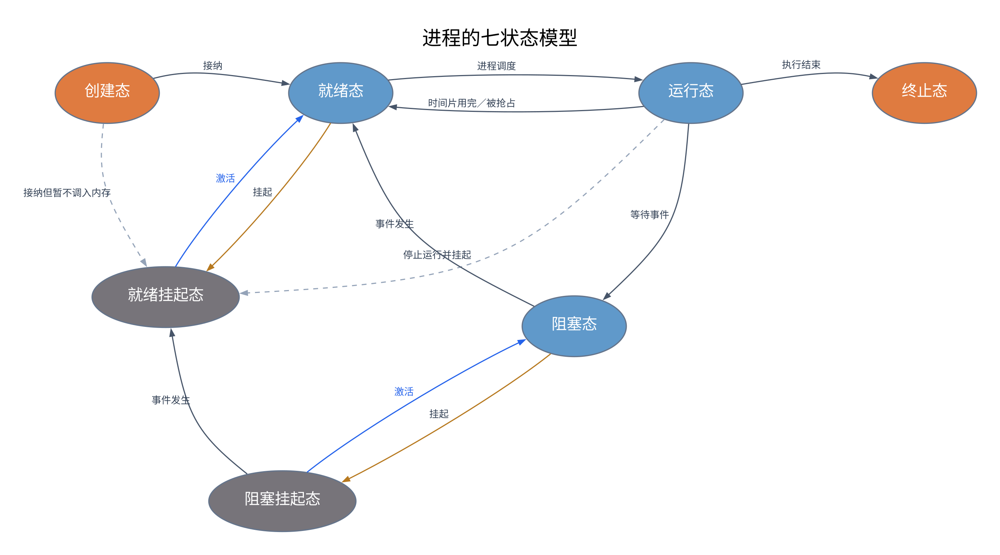

# 2.2 CPU 调度

## 2.2.1 调度的概念

当有一堆任务要处理，但由于资源有限，这些任务无法同时处理时，就需要确定某种规则，决定处理这些任务的顺序。**这就是调度研究的问题。**

调度分为三个层次：**高级调度、中级调度和低级调度**。

### 一、高级调度（作业调度）

#### 1. 作业的概念

作业是用户提交给操作系统的一项任务，包含程序、数据及相关的作业说明。

用户向系统提交一个作业，可以粗略理解为：**用户让操作系统运行一个程序，处理某项具体任务。** 作业和进程不是同一个概念，一个作业在执行过程中可能涉及多个进程。

#### 2. 高级调度的作用

**内存空间有限，有时无法将用户提交的作业全部放入内存，因此需要高级调度。**

高级调度按照一定的原则，从**外存的作业后备队列**中挑选作业，将其调入内存，并创建相应的进程，使进程获得竞争处理机的资格。

> 外存中的后备作业 → 调入内存、创建进程 → 进入就绪队列。

对应的进程状态变化可以概括为：**无 → 创建态 → 就绪态**。“无”表示尚未创建相应进程，不是一种进程状态。

#### 3. 特点

- 每个作业只调入一次、调出一次。
- 作业调入、创建相应进程时，建立 **PCB（进程控制块）**。
- 作业完成、相应进程撤销时，才撤销 PCB。
- 这里的“调出”指作业完成后退出系统，不是暂时换出内存。
- 在三个调度层次中，**高级调度的发生频率最低**。

### 二、低级调度（进程调度、处理机调度）

**按照某种策略，从就绪队列中选取一个进程，将处理机分配给它。**

对应的状态转换为：**就绪态 → 运行态**。

- 进程调度是操作系统中**最基本的一种调度**，一般的操作系统都必须配置进程调度。
- 发生频率很高，是三个调度层次中**频率最高**的。
- 教材中通常描述为**几十毫秒一次**，实际频率取决于系统和工作负载。
- 一个进程在结束前，可能多次被选中获得处理机。
- 调度已有进程时，不会重新创建或撤销 PCB。

### 三、中级调度（内存调度）

#### 1. 挂起的概念

内存不够时，可以将某些进程的程序和数据暂时调到外存，等内存条件允许、进程需要运行时，再重新调入内存。

**暂时调到外存等待的进程处于挂起状态。**

- 被挂起进程的 **PCB 仍保留在内存中**，以便操作系统管理这些进程。
- 被挂起进程的 PCB 会被组织成**挂起队列**。
- 挂起不会撤销进程，重新调入内存时也不需要重新创建进程。

#### 2. 中级调度的作用

**按照某种策略，决定将哪个处于挂起状态的进程重新调入内存。**

对应的状态转换为：

- **就绪挂起态 → 就绪态**。
- **阻塞挂起态 → 阻塞态**：进程调入内存，但等待的事件仍未发生。

中级调度的发生频率通常介于高级调度和低级调度之间。

### 四、加入挂起状态：七状态模型

之前的五状态模型包含：**创建态、就绪态、运行态、阻塞态、终止态**。

加入挂起状态后，挂起态进一步分为**就绪挂起态**和**阻塞挂起态**，形成七状态模型。

| 状态       | 含义                                           |
| ---------- | ---------------------------------------------- |
| 就绪态     | 进程在内存中，已具备运行条件，只等待处理机     |
| 阻塞态     | 进程在内存中，正在等待某个事件                 |
| 就绪挂起态 | 进程在外存中，除尚未调入内存外，已具备运行条件 |
| 阻塞挂起态 | 进程在外存中，而且仍在等待某个事件             |

#### 1. 状态转换图



蓝色箭头表示激活（中级调度）；灰色节点表示挂起状态，进程在外存中，PCB 仍保留在内存。阻塞挂起进程激活后，若事件仍未发生，则进入阻塞态。

图中虚线表示部分系统或模型中的转换。**创建态直接进入就绪态是正常转换，原来的五状态模型中就有。**

#### 2. 与挂起有关的转换

| 状态转换                | 原因                                       |
| ----------------------- | ------------------------------------------ |
| 就绪态 → 就绪挂起态     | 内存不足等原因导致就绪进程被换出           |
| 就绪挂起态 → 就绪态     | 内存条件允许，进程被激活、重新调入内存     |
| 阻塞态 → 阻塞挂起态     | 正在等待事件的进程被换出                   |
| 阻塞挂起态 → 阻塞态     | 进程被激活、调入内存，但等待的事件尚未发生 |
| 阻塞挂起态 → 就绪挂起态 | 等待的事件发生，进程解除阻塞，但仍在外存   |
| 运行态 → 就绪挂起态     | 某些系统允许停止运行进程，并将其换出       |

**阻塞与挂起的区别：**阻塞关注的是进程是否在等待事件；挂起关注的是进程是否被暂时换出内存。一个进程可以同时处于阻塞和挂起状态。

**“阻塞挂起 → 就绪挂起”是解除阻塞，不是激活，也不是中级调度。** 激活表示将挂起进程重新调入内存。

### 五、三级调度的联系与比较

#### 1. 三级调度的联系

三级调度共同完成从接纳作业、安排进程驻留内存，到分配处理机的过程。

- **高级调度**：从外存的后备队列中选择作业，调入内存并创建进程，为进程调度提供候选进程。
- **中级调度**：将挂起的进程重新调入内存。就绪挂起进程激活后进入就绪队列，等待进程调度；阻塞挂起进程激活后，若事件仍未发生，则仍处于阻塞态。
- **低级调度**：从就绪队列中选择进程，真正将处理机分配给它。

**进程调度是最基本、不可或缺的调度。** 系统不一定同时配置高级调度和中级调度，但一般都必须配置进程调度。

高级调度和中级调度将作业或进程调入内存，**不等于立即获得 CPU**；只有成为就绪进程并被低级调度选中，才能进入运行态。

#### 2. 三级调度比较表

| 调度层次 | 要做什么 | 调度发生在 | 发生频率 | 对进程状态的影响 |
| -------- | -------- | ---------- | -------- | ---------------- |
| 高级调度（作业调度） | 按照某种规则，从后备队列中选择合适的作业，将其调入内存，并为其创建进程 | 外存 → 内存，面向作业 | **最低** | 无 → 创建态 → 就绪态 |
| 中级调度（内存调度） | 按照某种规则，从挂起队列中选择合适的进程，将其程序和数据调回内存 | 外存 → 内存，面向进程 | **中等** | 就绪挂起态 → 就绪态；阻塞挂起态 → 阻塞态 |
| 低级调度（进程调度） | 按照某种规则，从就绪队列中选择一个进程，为其分配处理机 | 内存 → CPU | **最高** | 就绪态 → 运行态 |

表中的“内存 → CPU”表示将处理机分配给内存中的就绪进程，不是将整个进程搬进 CPU。“无”表示进程尚未创建，不是一种进程状态。

> 记忆：高级调度管“接纳作业”，中级调度管“恢复到内存”，低级调度管“获得 CPU”。

## 2.2.2 进程调度

### 一、进程调度的时机

#### 1. 需要进行进程调度与切换的情况

**（1）当前运行的进程主动放弃处理机**

- **进程正常终止**：任务已经完成，不再需要处理机。
- **运行过程中发生异常而终止**：进程无法继续执行，需要让其他进程运行。
- **进程主动请求阻塞**：如等待 I/O、等待某种资源或某个事件，进程由运行态转为阻塞态。

这里的“主动放弃”沿用教材分类，表示当前进程因结束或阻塞而不能继续占用处理机；不意味着异常终止是进程主动选择的。

**（2）当前运行的进程被动放弃处理机**

- **分给进程的时间片用完**：需要重新选择进程运行。
- **有更紧急的事情需要处理**：如发生中断，CPU 暂停当前进程，转去处理中断。
- **有更高优先级的进程进入就绪队列**：在采用相应抢占策略时，更高优先级的进程可抢占处理机。

被抢占的进程若仍具备运行条件，通常由**运行态 → 就绪态**。

注意：**发生中断不一定引起进程切换**。中断处理完成后，可以继续运行原进程，也可以在允许调度时选择其他进程。

#### 2. 不能进行进程调度与切换的情况

按本节教材的通常表述，以下情况不能立即进行进程调度与切换：

1. **在处理中断的过程中**：应先完成中断处理，再在允许调度的时机决定运行哪个进程。
2. **进程处于操作系统内核程序临界区中**：内核临界区可能正在访问就绪队列等内核共享数据，需要保证这些操作的完整性。
3. **在原子操作过程中（原语）**：原子操作不可中断，要“一气呵成”，不能在执行过程中进行进程调度与切换。

如果此时发生了需要调度的事件，可以记录调度请求，待退出上述不允许切换的区域后，再进行调度与切换。

#### 3. 内核程序临界区与普通临界区的区别

**临界资源**：一个时间段内只允许一个进程使用的资源。各进程需要**互斥地访问临界资源**。

**临界区**：访问临界资源的那段代码。

**（1）为什么在内核程序临界区中不能进行调度与切换？**

内核程序临界区一般用于访问某种**内核数据结构**，例如进程就绪队列。

以访问就绪队列为例：

1. 访问之前，先给就绪队列上锁。
2. 在临界区中访问、修改就绪队列，退出时才解锁。
3. 如果还没退出临界区、还没解锁，就进行进程调度，那么调度程序也需要访问就绪队列。
4. 此时就绪队列仍被锁住，调度程序无法顺利访问它，进程调度也就无法顺利进行。

因此，按本节教材模型，**进程处于操作系统内核程序临界区中时，不能进行进程调度与切换**，需要先完成对相关内核数据结构的操作并解锁。

**（2）为什么在普通临界区中可以进行调度与切换？**

以互斥使用打印机为例：进程获得打印机的使用权后，在打印完成并释放资源之前，可以一直持有保护打印机的锁。

打印机是慢速设备。进程等待打印完成时，可以进入阻塞态，由操作系统将 CPU 分配给其他就绪进程。**让出 CPU，不等于释放打印机的使用权**；其他需要使用同一打印机的进程仍需等待。

如果因为进程尚未退出这个普通临界区，就一直不允许调度其他进程，那么即使有其他就绪进程，CPU 也可能在等待打印期间空闲，降低资源利用率。

普通临界区所保护的资源不会像就绪队列那样直接影响内核的调度管理工作，因此，**进程处于普通临界区时，可以进行处理机调度与切换**。

> 判断：“进程处于临界区时不能进行调度与切换。”——错误。要区分内核程序临界区与普通临界区。

### 二、进程调度的方式

#### 1. 非剥夺调度方式（非抢占方式）

非剥夺调度方式又称**非抢占方式**，只允许进程**主动放弃处理机**。在运行过程中，即使有更紧迫的任务到达，当前进程依然会继续使用处理机，直到该进程终止或主动请求进入阻塞态，才将处理机分配给其他进程。

- **优点**：实现简单，系统开销小。
- **缺点**：无法及时处理紧急任务，紧急任务可能需要等待较长时间。
- **适用系统**：早期的批处理系统。

#### 2. 剥夺调度方式（抢占方式）

剥夺调度方式又称**抢占方式**。当一个进程正在处理机上执行时，如果有更重要、更紧迫的进程需要使用处理机，且满足系统的抢占条件，则在允许调度的时机立即**暂停当前进程，将处理机分配给更重要、更紧迫的进程**。

- **可以优先处理更紧急的进程**，及时响应紧急任务。
- **可以实现各进程按时间片轮转执行**：通过时钟中断进行计时，在当前进程的时间片用完后，触发调度，将处理机分配给其他就绪进程，避免某个进程长时间独占 CPU。
- **适用系统**：分时操作系统、实时操作系统。

| 比较项目 | 非抢占方式 | 抢占方式 |
| -------- | ---------- | -------- |
| 能否强制收回处理机 | 不因其他就绪进程的竞争而强制收回 | 可以按调度原则收回 |
| 当前进程何时让出处理机 | 终止或阻塞时 | 终止、阻塞，或被抢占时 |
| 更高优先级进程到达 | 等待当前进程让出处理机 | 采用抢占式优先级策略时可抢占 |

注意：非抢占方式不等于禁止中断。CPU 仍可响应中断；中断处理后，若当前进程仍可运行，则继续执行当前进程。

### 三、调度程序（调度器）

#### 1. 调度程序的作用

**调度程序／调度器是实现 CPU 调度和分派的软件组件。** 本节将选择运行对象和分派处理机的相关工作合在一起描述。

- **就绪态 → 运行态**：调度程序选中一个就绪进程，并将处理机分配给它。
- **运行态 → 就绪态**：在采用时间片的抢占式调度中，当前进程的时间片用完，系统收回处理机，将该进程放回就绪队列，再进行调度。

调度程序需要解决两个核心问题：

| 核心问题 | 由什么决定 |
| -------- | ---------- |
| **让谁执行？** | 调度算法：按照一定规则选择就绪进程 |
| **运行多长时间？** | 对采用时间片的策略，由时间片大小限定本轮可运行的时间；进程也可能提前阻塞、退出或被抢占 |

#### 2. 调度时机：什么事件可能触发调度程序？

- **创建新进程**：新进程进入就绪队列，成为可调度的候选对象。
- **进程退出**：当前进程结束，需要选择其他进程运行。
- **运行进程阻塞**：当前进程暂时无法继续执行，需要让出处理机。
- **I/O 中断发生**：I/O 完成可能唤醒某些阻塞进程，使它们进入就绪队列。
- **时钟中断发生**：用于更新运行时间、检查时间片是否用完等，并按调度策略决定是否需要重新调度。

**这些事件是否引起重新调度、是否切换进程，取决于调度策略及当前状态。** 产生调度请求后，仍需在允许调度的时机执行，并非在中断处理的任意位置直接切换。

#### 3. 不同调度策略下的触发时机

**（1）非抢占式调度策略**

按本节的基本模型，在已有进程运行时，只有该进程**阻塞或退出**、让出处理机，才需要调度其他进程运行。

创建新进程或 I/O 完成使其他进程进入就绪队列时，不会因此抢占当前仍可继续运行的进程。若 CPU 原本空闲，则有进程就绪时即可调度它运行。

**（2）抢占式调度策略**

除了运行进程阻塞、退出之外，新进程就绪、I/O 完成唤醒进程等事件，也可能根据优先级等规则触发抢占。

对于基于周期性时钟中断的时间片调度，可以**每个时钟中断，或每隔 k 个时钟中断**进行调度检查，其中 k 为正整数；具体间隔取决于实现和时间片设置。时间片用完时，触发重新调度。

**触发调度检查不等于一定切换进程。** 如果无需抢占，或者最终仍选中原进程，就继续执行原进程。

#### 4. 调度程序的处理对象

| 操作系统是否支持内核级线程 | 调度程序的处理对象 |
| -------------------------- | ------------------ |
| 不支持内核级线程 | **进程** |
| 支持内核级线程 | **内核级线程** |

支持内核级线程时，内核级线程是处理机分配和调度的基本单位；进程主要作为资源分配的基本单位。用户级线程由用户空间的线程库管理，内核不会直接调度它看不见的用户级线程。

#### 5. 调度器的组成

按本节教材的功能划分，调度器包含**排队器、分派器和上下文切换器**。

**（1）排队器**

将系统中所有**就绪进程**按照特定策略，组织成一个或多个就绪队列，供调度时选择。

**（2）分派器**

根据调度算法选定的进程，执行实际的 **CPU 分配操作**，主要任务包括：

1. 从就绪队列中移出目标进程。
2. 触发上下文切换，恢复目标进程的运行现场。
3. 将 CPU 控制权转交给目标进程，使其进入运行态。

**（3）上下文切换器**

负责保存原进程的运行现场、恢复新进程的运行现场。具体流程、分派中的两对上下文切换及硬件优化统一见 **2.2.4 进程切换**。

#### 6. 调度器的闲逛进程（idle）

**没有其他就绪进程时，运行闲逛进程（idle），也称空闲进程。** 可以把它记作调度程序的“备胎”。

闲逛进程的特点：

- **优先级最低**：有其他可运行进程时，应让其他进程获得处理机。
- **指令可以很简单**：教材中可用零地址指令来说明其执行，不需要显式给出操作数地址。“零地址”不是指指令存放在地址 0。
- **仍能响应中断**：在简化的指令周期模型中，一条指令占用完整的指令周期，并在指令周期末尾例行检查中断；中断可能使其他进程就绪，从而重新进行调度。
- **能耗低**：实际系统通常利用处理器的等待中断或低功耗机制，避免无意义地持续忙循环。低能耗并不是仅由“零地址指令”这一形式保证的。

> 记忆：没有其他就绪进程 → 运行 idle；出现其他可运行进程 → 让出处理机。

## 2.2.3 调度的目标

### 一、CPU 利用率

**CPU 利用率**：CPU 忙碌的时间占总时间的比例。

$$
\text{CPU 利用率} = \frac{\text{CPU 忙碌时间}}{\text{总时间}} \times 100\%
$$

其中，总时间 = CPU 忙碌时间 + CPU 空闲时间。调度的目标之一是**提高 CPU 利用率**。

### 二、系统吞吐量

**系统吞吐量**：单位时间内完成作业的数量。

$$
\text{系统吞吐量} = \frac{\text{总共完成的作业数}}{\text{总共消耗的时间}}
$$

例如，系统在 10 秒内完成 5 个作业，吞吐量为 0.5 个作业／秒。调度的目标之一是**提高系统吞吐量**。

### 三、周转时间

**周转时间**：从作业被提交给系统开始，到作业完成为止所经历的时间。

$$
\text{周转时间} = \text{作业完成时刻} - \text{作业提交时刻}
$$

按本节的作业处理模型，周转时间包含以下四个部分：

| 组成部分 | 含义 |
| -------- | ---- |
| 在外存后备队列中等待的时间 | 等待作业调度，即**高级调度** |
| 在就绪队列中等待的时间 | 等待进程调度，即**低级调度** |
| 在 CPU 上执行的时间 | 进程实际占用处理机执行的时间 |
| 等待 I/O 操作完成的时间 | 进程因等待 I/O 而处于阻塞状态的时间 |

**后三项在一个作业的整个处理过程中可能发生多次，需要分别累加。** 例如，进程运行一段时间后请求 I/O，进入阻塞态；I/O 完成后进入就绪队列，再次等待调度并获得 CPU。

因此，周转时间不只是 CPU 执行时间，还包含作业在系统中的上述等待时间。调度的目标之一是**缩短作业的周转时间**。

**平均周转时间**：各作业周转时间之和除以作业数。

$$
\text{平均周转时间} = \frac{\text{各作业周转时间之和}}{\text{作业数}}
$$

**带权周转时间**：作业的周转时间与作业实际运行时间的比值。

$$
\text{带权周转时间} = \frac{\text{作业周转时间}}{\text{作业实际运行时间}}
$$

其中，作业实际运行时间指作业实际占用 CPU 的时间，不包含等待时间。带权周转时间无单位，值越小越好。

**平均带权周转时间**：各作业带权周转时间之和除以作业数。

$$
\text{平均带权周转时间} = \frac{\text{各作业带权周转时间之和}}{\text{作业数}}
$$

### 四、等待时间

**等待时间**：作业／进程处于等待处理机状态的时间之和。等待时间越长，用户满意度越低，因此调度的目标之一是**减少等待时间**。

#### 1. 进程的等待时间

对于进程，等待时间是进程建立后，**在就绪队列中等待获得处理机的时间之和**。进程可能多次进入就绪队列，需要将各次等待时间累加。

**等待 I/O 完成的时间不计入这里的等待时间。** 在此期间，进程等待的是 I/O 服务，而不是处理机；不能把全部阻塞时间算作等待处理机的时间。

#### 2. 作业的等待时间

对于作业，除了建立进程后等待处理机的时间，还要加上**作业在外存后备队列中等待作业调度的时间**。

$$
\text{作业等待时间} = \text{在外存后备队列中的等待时间} + \text{建立进程后在就绪队列中的等待时间之和}
$$

#### 3. 等待时间与调度算法的关系

在教材调度计算的简化模型中，作业需要的 CPU 执行时间和 I/O 服务时间是给定的，**调度算法直接影响的是作业／进程的等待时间**。

不同算法决定谁先获得服务、谁继续等待，从而改变等待时间，并进一步影响周转时间、带权周转时间等指标。因此，“只影响等待时间”不意味着周转时间不会改变。

### 五、响应时间

**响应时间**：从用户提出请求，到系统首次产生响应所经历的时间。

调度的目标之一是**缩短响应时间**。响应时间关注首次响应，不要求请求已经处理完成；周转时间则关注从作业提交到作业完成的全过程。

## 2.2.4 进程切换

### 一、进程切换与上下文

**进程切换是在操作系统内核的支持下实现的**：一个进程让出处理机，由另一个进程占用处理机。进程的运行依赖内核提供的管理和服务，但不意味着进程始终在内核态执行。

将 CPU 从一个进程切换到另一个进程时，需要**保存当前进程的状态，并恢复另一个进程的状态**，这一任务称为进程的**上下文切换**。切换过程中，CPU 所执行的进程及其运行环境发生实质性变化。

进程上下文由 **PCB 及其关联的存储区域**记录和组织，主要包括：

- **CPU 现场信息**：程序计数器（PC）、通用寄存器、程序状态字、栈指针等。
- **进程状态信息**：进程状态及有关调度、管理信息。
- **内存管理信息**：页表等地址空间管理信息。

教材通常将保存现场概括为“保存到 PCB 中”。实际实现也可能将部分现场保存在内核栈等位置，由 PCB 关联管理。

### 二、进程切换的流程

内核先保存旧进程的状态，再加载经调度选中的新进程的上下文。对于尚未终止、之后还需恢复执行的进程，可以概括为以下五步：

1. **暂停当前进程，保存 CPU 上下文**：将当前进程的寄存器等现场保存到 PCB 或其关联存储区域。
2. **更新状态，移入相应队列**：仍具备运行条件的进程进入就绪队列；因等待某事件而阻塞的进程进入相应阻塞队列。
3. **选择另一个进程，更新其 PCB 信息**：由调度算法选中新的运行进程，将其从就绪队列移出，并更新状态等相关信息。
4. **恢复新进程的运行环境和 CPU 上下文**：切换地址空间环境，恢复寄存器、栈指针等现场。
5. **从新进程保存的 PC 所指向的位置继续执行**：完成控制权交接，恢复新进程的执行。

这里的“暂停当前进程”仅表示停止它在 CPU 上执行，**不等于七状态模型中将进程换出内存的挂起**。若原进程已经终止，则进行退出清理，不再放入就绪或阻塞队列等待恢复。

#### 分派过程中的两对上下文切换

按教材对分派过程的功能分解，可进一步描述为：

| 切换阶段 | 保存／移出什么 | 装入什么 |
| -------- | ------------- | -------- |
| 第一对：当前进程 → 分派程序 | 保存当前进程的上下文 | 装入分派程序的上下文，使分派程序运行 |
| 第二对：分派程序 → 新进程 | 移出分派程序的上下文 | 将新进程的 CPU 现场信息装入相应寄存器，使新进程运行 |

这与上述五步是对同一分派、切换过程的不同描述，不是额外切换两个用户进程；分派程序也不一定是拥有独立 PCB 的进程。

### 三、上下文切换的开销与优化

**上下文切换是一项开销较大的操作。** 保存和恢复现场需要执行大量 **store（存储）和 load（装入）指令**，还要更新内核管理信息、切换运行环境。这些工作占用 CPU 时间，过于频繁地调度与切换会降低系统效率。

一种硬件优化方式是提供**多个寄存器组**。当所需现场已经保存在相应寄存器组中时，可以通过改变寄存器组选择指针或选择状态，减少寄存器内容的保存与恢复。例如，分别为内核和用户程序提供寄存器组，可减少相应现场转换的开销。

**寄存器组切换不等于完整的进程切换**：进程状态、地址空间及队列等仍可能需要内核处理，不能将所有上下文切换都理解成“只改一个指针”。

### 四、上下文切换与模式切换

本节的“上下文切换”特指**进程之间的上下文切换**；“模式切换”指 **CPU 在用户态与内核态之间切换**。

| 比较项目 | 模式切换 | 进程上下文切换 |
| -------- | -------- | -------------- |
| 改变什么 | CPU 的执行权限模式 | 当前运行的进程及其运行上下文 |
| 当前进程是否改变 | 单纯的模式切换不改变当前进程 | 从一个进程切换到另一个进程 |
| 现场处理 | 也可能保存、恢复返回地址和必要寄存器等现场，但不因此切换进程 | 必须保存旧进程、恢复新进程的上下文 |
| 典型例子 | 同一进程通过系统调用进入内核，处理后返回用户态 | 时间片用完后，内核将 CPU 从进程 A 交给进程 B |

**模式切换不一定伴随进程切换。** 例如，系统调用完成后仍返回原进程，则只有模式切换；如果系统调用导致进程阻塞，内核随后可能调度并切换到另一进程。

进程上下文切换涉及 PCB 等内核数据结构的访问与修改，**由内核完成，切换操作在内核态执行**。切换完成后，新进程可根据恢复的现场继续执行内核代码，或返回用户态执行。

### 五、调度与切换的区别

**调度是决策行为，切换是执行行为。**

- **狭义的进程调度**：从就绪队列中选择一个要运行的进程，决定“让谁执行”。可以选中刚刚暂停的原进程，也可以选中另一个进程。
- **进程切换**：将处理机从原进程交给另一个进程，完成“保存旧现场、恢复新现场”。
- **广义的进程调度**：包含选择进程和进程切换两个步骤。

**发生调度不一定发生进程切换**：如果仍选中原进程，就不需要切换到另一进程；选中另一进程时，才需要进行进程切换。

## 2.2.5 CPU 调度算法

### 一、先来先服务（FCFS）算法

#### 1. 算法思想与规则

**先来先服务（First Come First Served，FCFS）**主要从**公平性**的角度考虑，按照作业／进程到达的先后顺序提供服务。

| 应用场景 | 按什么顺序选择 |
| -------- | -------------- |
| 作业调度 | 作业到达**外存后备队列**的先后顺序 |
| 进程调度 | 进程到达**就绪队列**的先后顺序 |

注意：用于进程调度时，看的是进入就绪队列的顺序，不一定是进程最初创建的顺序。进程因 I/O 阻塞后重新就绪，需要重新排队。

#### 2. 是否可抢占

FCFS 是**非抢占式算法**。进程获得 CPU 后，持续运行到终止或主动阻塞，再调度下一个就绪进程。

#### 3. 优点、缺点与饥饿问题

- **优点**：按到达顺序服务，公平，算法实现简单。
- **缺点**：排在长作业（进程）后面的短作业（进程）需要等待很长时间。短作业实际运行时间较短，等待过久会使其带权周转时间很大，用户体验不好。因此，FCFS **对长作业有利，对短作业不利**。
- **是否导致饥饿**：**不会**。在前面的作业都能于有限时间内完成或让出处理机的前提下，排队的作业最终能够获得服务，后到的作业不会不断插到它前面。

#### 4. 含 I/O 的等待时间计算

如果进程既有 CPU 计算又有 I/O 操作，按题目只包含就绪等待、CPU 执行和 I/O 阻塞这几类时间的模型：

$$
\text{等待时间} = \text{周转时间} - \text{CPU 实际运行时间} - \text{I/O 所占的阻塞时间}
$$

其中，各段 CPU 运行时间、I/O 阻塞时间都要分别累加；若题目不区分 I/O 排队与服务，最后一项通常直接写作“I/O 操作时间”。**等待 I/O 的时间不能算作等待处理机的时间。** 这一计算原则也适用于其他调度算法。

### 二、短作业优先（SJF）算法

#### 1. 算法思想

**短作业优先（Shortest Job First，SJF）**优先服务运行时间较短的作业，追求较少的**平均等待时间和平均周转时间**。

**不能笼统地说 SJF 保证平均带权周转时间最小**；带权周转时间还要除以各作业自身的运行时间，是不同的评价指标。

#### 2. 算法规则与适用范围

每次调度时，从**当前已经到达、正在等待服务的作业／进程中**，选择预计服务时间最短的一个优先服务，不考虑尚未到达的作业。

- **用于作业调度**：从后备队列中选择预计运行时间最短的作业。
- **用于进程调度**：从就绪队列中选择预计服务时间最短的进程，称为**短进程优先算法（SPF）**。

实际运行时间通常需要预估；涉及多个 CPU 执行阶段时，进程调度通常比较预计的下一段 CPU 执行时间。

#### 3. 是否可抢占与 SRTN 的调度时机

**SJF／SPF 是非抢占式算法。题目未特殊说明时，默认按非抢占式处理。** 进程获得 CPU 后，运行到终止或阻塞；即使来了更短的进程，也不立即抢占。

其抢占式版本称为**最短剩余时间优先算法（SRTN）**，始终优先运行当前剩余服务时间最短的进程。

- **有进程新进入就绪队列时**：包括新进程到达、阻塞进程被唤醒等，需要检查是否重新调度。比较就绪进程与当前运行进程的剩余服务时间；若新就绪进程的剩余时间更短，则由它抢占 CPU，原运行进程重新回到就绪队列。
- **当前进程完成或阻塞时**：需要重新调度，从就绪队列中选择剩余服务时间最短的进程运行。
- 如果没有剩余服务时间更短的就绪进程，则可以继续执行当前进程；剩余时间相同的处理方式按题目约定，通常不必仅因相等而抢占。

> 区分：非抢占式 SJF 比较服务时间；抢占式 SRTN 比较剩余服务时间。检查调度不等于一定发生进程切换。

#### 4. 平均等待时间、平均周转时间最少的条件

在**所有进程同时到达、均可运行，服务时间已知，单处理机且忽略切换开销**的模型中，SJF 可以使平均等待时间和平均周转时间最少。题目说“几乎同时到达”时，需要确认是否按同一到达时刻处理。

此时，SRTN 与 SJF 的执行顺序通常相同：最短进程开始运行后，其剩余时间只会更短，不需要被其他进程抢占。因此，不能说在这个条件下 SRTN 一定比 SJF 的平均时间更少。

**进程陆续到达时**，SRTN 可以抢占长进程，优先服务后来到达的短进程，从而可能获得比非抢占式 SJF 更少的平均等待时间和平均周转时间。一般来说，SJF 有利于降低这两个平均值，但不能不加条件地说它始终最优。

#### 5. 优缺点与饥饿问题

- **优点**：有利于短作业，通常能获得较少的平均等待时间和平均周转时间；满足上述条件时，这两个平均值最少。
- **缺点：不公平**。对短作业有利，对长作业不利。
- **缺点：服务时间难以准确获知**。作业／进程的运行时间可能由用户提供或由系统估计，不一定准确，用户也可能低报运行时间，因此不一定能做到真正的短作业优先。
- **会导致饥饿**：如果源源不断地有短作业／进程到来，长作业／进程可能长期得不到服务；若一直得不到服务，就称为“饿死”。SRTN 也存在这一问题。

### 三、高响应比优先（HRRN）算法

#### 1. 算法思想与规则

**高响应比优先（Highest Response Ratio Next，HRRN）**综合考虑作业／进程的**等待时间和要求服务时间**，兼顾先来先服务与短作业优先的特点。

每次调度时，先计算当前等待服务的各作业／进程的响应比，选择**响应比最高**的一个为其服务。

$$
\text{响应比} = \frac{\text{等待时间} + \text{要求服务时间}}{\text{要求服务时间}} = 1 + \frac{\text{等待时间}}{\text{要求服务时间}} \geq 1
$$

要求服务时间为正，等待时间从 0 开始累计。**响应比是一个比值，不是前面讲的“响应时间”。**

#### 2. 适用范围与抢占性

- 既可用于**作业调度**，也可用于**进程调度**。
- 是**非抢占式算法**。已有进程运行时，只有当前进程终止或主动阻塞、让出处理机，才需要重新选择运行对象，并计算候选作业／进程的响应比。
- 新作业／进程到达后，即使响应比更高，也不会立即抢占当前进程。CPU 原本空闲时，可直接进行调度。

#### 3. 优缺点与饥饿问题

| 比较条件 | 优先服务谁 | 体现的特点 |
| -------- | ---------- | ---------- |
| 等待时间相同且大于 0 | 要求服务时间短的作业 | 兼顾 SJF 对短作业的照顾 |
| 要求服务时间相同 | 等待时间长的作业 | 兼顾 FCFS 对先到作业的照顾 |
| 长作业等待时间不断增加 | 其响应比不断增大，逐渐获得服务机会 | 避免长作业长期被短作业压后 |

当等待时间都为 0 时，响应比均为 1，应按题目给定的平局规则选择。

- **优点**：综合考虑等待时间和要求服务时间，既照顾短作业，也考虑长作业的等待，克服 SJF 容易使长作业饥饿的缺点。
- **代价与限制**：每次调度需要计算、比较响应比，且仍需知道或估计要求服务时间。
- **是否导致饥饿**：按教材通常的分析，**不会导致饥饿**。长作业等待越久，响应比越高，最终可以获得服务。

### 四、FCFS、SJF、HRRN 的适用场景

这三种算法一般适用于**早期的批处理系统**。它们主要关注服务顺序、公平性、等待时间和周转时间，**不重点关注首次响应时间，也不按任务的紧急程度进行区分**，因此难以保证良好的交互体验，不适合直接满足分时、实时系统对响应的要求。

| 算法 | 选择依据 | 是否抢占 | 是否可能饥饿 |
| ---- | -------- | -------- | ------------ |
| FCFS | 到达队列的先后顺序 | 非抢占式 | 不会 |
| SJF／SPF | 最短的预计服务时间 | 默认非抢占式；抢占式版本为 SRTN | 会 |
| HRRN | 最高响应比 | 非抢占式 | 通常不会 |

### 五、时间片轮转（RR）调度算法

#### 1. 算法思想

**时间片轮转（Round Robin，RR）**公平地、轮流地为各个进程服务，让每个就绪进程在一定时间间隔内都能获得处理机，得到响应。

#### 2. 算法规则与适用范围

按照各进程**到达就绪队列的顺序**排队，轮流让队首进程执行一个时间片。

1. 从就绪队列队首取出一个进程，为其分配 CPU，最多执行一个时间片。
2. 若进程在时间片内**运行完成或主动阻塞**，则立即让出 CPU，调度下一个就绪进程，不必等到时间片用完。完成的进程退出；阻塞的进程进入阻塞队列，重新就绪后再进入就绪队列。
3. 若**时间片用完，进程仍未完成且未阻塞**，则剥夺其处理机使用权，将它重新放到**就绪队列队尾**排队。
4. 新到达的就绪进程也加入队尾，等待轮到自己执行。

RR 用于**进程调度**，不用于作业调度。只有作业调入内存、建立相应进程并处于就绪态后，才能参与处理机时间片的分配。

#### 3. 是否可抢占

RR 属于**抢占式算法**：即使进程还想继续运行，只要时间片用完，操作系统就可以强制收回处理机使用权。

**时钟装置发出的时钟中断**使操作系统能够计时，并在时间片耗尽时触发调度。一次时钟中断不一定就代表一个时间片结束，一个时间片可以包含多个时钟周期。

新进程到达就绪队列时，通常只加入队尾，**不会立即抢占尚有剩余时间片的当前进程**。

#### 4. 同时到达与重新入队的约定

**本节约定：时间片到时，若恰好有新进程到达，则新进程先入队，时间片用完的进程后入队。** 做题时若另有说明，以题目规则为准。

例如，P1 的时间片恰好在时刻 2 用完，此时 P2 到达，而 P3 已在就绪队列中等待，则入队后的顺序为：

```text
队首 → P3 → P2（新到达）→ P1（时间片用完）→ 队尾
```

下一次调度选择 P3。**新到达进程先于重新入队的进程，不代表先于原本已在队列中等待的进程。**

#### 5. 时间片大小的影响

| 时间片大小 | 对调度的影响 |
| ---------- | ------------ |
| **太大** | 后面的进程等待更久，响应时间可能增大；若每个进程都能在一个时间片内完成，则退化为 **FCFS** |
| **太小** | 进程切换过于频繁，保存、恢复现场等开销占比增大，用于实际执行进程的时间比例下降 |
| **适中** | 兼顾响应速度与进程切换开销，适合交互式任务 |

对于含 I/O 的进程，更准确地说：若时间片足够覆盖每次连续的 CPU 执行阶段，进程总在时间片耗尽前完成或阻塞，就不会因时间片到期被抢占，调度效果相当于 FCFS。

时间片设计可参考**让进程切换开销占比不超过 1%**的目标；这是本节采用的参考指标，不是所有操作系统的统一规定。

若每次切换耗时为 $s$，每个时间片的有效运行时间为 $q$，并假设每次都用满时间片后发生一次切换，则：

$$
\text{切换开销占比} = \frac{s}{q+s} \leq 1\%
\quad \Rightarrow \quad q \geq 99s
$$

例如，切换耗时为 0.1 ms 时，按这个简化模型，时间片至少应为 9.9 ms。

#### 6. 优缺点与饥饿问题

- **优点**：公平，响应快，适用于**分时操作系统**；各就绪进程轮流获得 CPU，避免某个进程长期独占处理机。
- **缺点**：频繁的进程切换会产生一定开销，时间片越小，这一问题通常越明显。
- **缺点**：不区分任务的紧急程度，紧急任务也要按队列顺序等待。
- **是否导致饥饿**：**不会**。在通常的有限就绪队列模型下，每个进程最多占用一个时间片，后到进程加入队尾，已经排队的进程最终能够轮到执行。

> 记忆：轮流执行一个时间片，用完未结束就回队尾；时间片太大像 FCFS，太小则切换开销大。

### 六、优先级调度算法

#### 1. 算法思想与规则

越来越多的应用场景需要根据**任务的紧急程度**来决定处理顺序。优先级调度为每个作业／进程设置相应的优先级，调度时选择**当前候选者中优先级最高**的一个提供服务。

优先级相同时，可按 FCFS 或时间片轮转等规则处理，具体以题目或系统规定为准。

**优先级高不一定表示优先数大**：有的系统用较大的数表示较高优先级，有的恰好相反，做题时应先看清约定。

#### 2. 适用范围

- **作业调度**：从后备队列中选择优先级最高的作业。
- **进程调度**：从就绪队列中选择优先级最高的进程。
- **I/O 调度**：也可以按优先级安排 I/O 请求的服务顺序。

#### 3. 非抢占式与抢占式

优先级调度既可以采用**非抢占式**，也可以采用**抢占式**。

| 类型 | 调度或检查抢占的时机 | 更高优先级的进程进入就绪队列时 |
| ---- | ------------------ | -------------------------------- |
| **非抢占式** | 当前进程终止或主动阻塞、让出处理机时，选择优先级最高的就绪进程 | 先等待，不立即抢占当前进程 |
| **抢占式** | 除上述时机外，就绪队列变化时，还需检查是否满足抢占条件 | 若其优先级高于当前运行进程，则在允许调度时抢占 CPU |

CPU 原本空闲时，两种方式都可以直接选择就绪进程运行。

对于抢占式优先级调度，**新进程到达、阻塞进程被唤醒**等事件都可能改变就绪队列，需要检查是否出现优先级更高的候选进程。如果采用动态优先级，相关进程的**优先级发生变化**时，也可能需要重新检查。

**检查不等于一定抢占**：只有满足抢占条件才需要更换运行进程；优先级相同时如何处理，按具体规则执行。

#### 4. 就绪队列的组织方式

**就绪队列未必只有一个。** 优先级调度可以采用不同的队列组织方式：

- **多个就绪队列**：按不同优先级分别组织队列，调度时优先选择最高优先级的非空队列，再按该队列内部的规则选取进程。
- **一个有序就绪队列**：将优先级高的进程排在更靠近队首的位置，调度时从队首选取进程。

若优先级发生变化，需要相应调整进程所在的队列或排队位置。

#### 5. 静态优先级与动态优先级

根据优先级能否动态改变，可分为以下两类：

| 类型 | 含义 | 特点 |
| ---- | ---- | ---- |
| **静态优先级** | 创建进程时确定，进程运行期间保持不变 | 实现简单，但难以根据进程行为和等待情况调整 |
| **动态优先级** | 创建时赋予初始优先级，运行过程中可根据情况调整 | 能结合等待时间、CPU 使用情况等因素调整服务顺序 |

采用动态优先级时，可以根据进程的等待情况和运行行为进行调整：

| 调整依据 | 调整方式 | 目的 |
| -------- | -------- | ---- |
| 进程在**就绪队列中等待时间较长** | 适当**提高**其优先级 | 增加获得 CPU 的机会，缓解饥饿问题 |
| 进程**占用处理机运行时间较长** | 适当**降低**其优先级 | 让其他就绪进程也有机会获得服务 |
| 发现进程**频繁进行 I/O 操作** | 适当**提高**其优先级 | 让它在就绪后尽早运行、发起下一次 I/O，促进 CPU 与 I/O 设备并行工作 |

这些是可采用的调整策略，具体调整幅度和时机由系统规定。**提高 I/O 型进程的优先级，不会使正在阻塞的进程直接获得 CPU**；它仍需先恢复就绪态，才能参与调度。

**静态／动态与抢占／非抢占是两个不同的分类角度**：优先级是否变化，与是否允许强制收回 CPU 使用权，不是同一回事。

#### 6. 优先级设置的一般原则

教材中通常采用以下原则，具体系统的策略可以不同：

- **系统进程的优先级高于用户进程**：优先保障操作系统管理与服务功能的执行。
- **前台进程的优先级高于后台进程**：前台任务通常直接与用户交互，优先响应有助于改善使用体验。
- **更偏好 I/O 型进程**：让其尽早发起 I/O，提高 CPU 与 I/O 设备并行工作的机会。

**I/O 型进程与计算型进程的区别：**

| 进程类型 | 别称 | 主要特点 |
| -------- | ---- | -------- |
| **I/O 型进程** | I/O 繁忙型进程（I/O-bound） | 频繁请求 I/O，通常每次连续使用 CPU 的时间较短，较多时间处于 I/O 等待中 |
| **计算型进程** | CPU 繁忙型进程（CPU-bound） | 主要进行计算，通常每次连续使用 CPU 的时间较长 |

**为什么偏好 I/O 型进程？** CPU 与 I/O 设备可以并行工作。优先让已经就绪的 I/O 型进程运行，它往往只需执行一小段 CPU 计算，就会发出 I/O 请求并阻塞；此后，I/O 设备处理请求，CPU 则可以执行其他就绪进程。

这样更有可能让 I/O 设备尽早投入工作，减少设备空闲，**提高资源利用率和系统吞吐量**。反之，若计算型进程长时间占用 CPU，I/O 型进程迟迟无法发出请求，I/O 设备就可能闲置。

注意：优先选择的仍然是**就绪进程**。I/O 型进程正在阻塞、等待 I/O 完成时，即使优先级很高，也不能被调度到 CPU 上运行。

#### 7. 优缺点与饥饿问题

- **优点：区分紧急程度与重要程度**。通过优先级为更紧急、更重要的任务优先提供服务，适用于**实时操作系统**；抢占式优先级调度有利于及时响应紧急任务，但能否满足截止时间还取决于任务负载等条件。
- **优点：灵活调整调度偏好**。通过设置或动态调整优先级，可以灵活改变对各个作业／进程的偏好程度，适应进程行为和系统状态的变化。
- **缺点**：若源源不断地有高优先级进程到来，低优先级进程可能长期得不到服务，导致**饥饿**；优先级的设置和调整需要合理的策略。
- **是否导致饥饿**：**可能会**。若高优先级进程不断到来，低优先级进程可能长期得不到服务。
- **缓解方法**：采用**老化（aging）**机制，随等待时间增加逐步提高进程优先级。动态优先级是否能避免饥饿，取决于具体调整规则。

> 记忆：优先级决定先服务谁，抢占性决定能否立即换人；静态不变，动态可调；偏好 I/O 型进程，有利于 CPU 与设备并行工作。

### 七、多级反馈队列调度算法

#### 1. 算法思想

**多级反馈队列（Multilevel Feedback Queue，MLFQ）**是对其他调度算法的折中权衡，综合考虑公平性、响应速度和短进程的完成效率。

它根据进程实际使用 CPU 的情况，动态调整进程所在的队列，进而调整其优先级，**不必事先估计进程的运行时间**。“反馈”体现为：进程的运行行为会影响后续获得服务的顺序。

#### 2. 算法规则

**（1）设置多级就绪队列**

- 队列优先级从高到低：第 1 级最高，最后一级最低。
- 各级时间片从小到大：高优先级队列时间片短，低优先级队列时间片长。
- 各队列内部按 **FCFS 原则排队**，轮到队首进程时，为其分配本级队列对应的时间片。

例如，可设置如下三级队列，具体时间片大小以题目为准：

| 就绪队列 | 优先级 | 时间片示例 | 用完时间片仍未完成时 |
| -------- | ------ | ---------- | -------------------- |
| 第 1 级 | 最高 | $q$ | 进入第 2 级队尾 |
| 第 2 级 | 次高 | $2q$ | 进入第 3 级队尾 |
| 第 3 级 | 最低 | $4q$ | 重新进入第 3 级队尾 |

**（2）新进程进入最高级队列**

新进程到达时，先进入**第 1 级队列队尾**，按 FCFS 原则排队等待分配时间片。

**（3）用完时间片仍未完成，则降一级**

- 若进程在时间片内完成，则退出系统。
- 若用完本级时间片后仍未完成且未阻塞，则进入**下一级队列队尾**重新排队。
- 若已经处于**最低级队列**，则重新放回该队列队尾，按时间片轮转方式继续执行。

**（4）优先服务高优先级队列**

只有**第 1 至第 $k$ 级队列全部为空**时，才会为第 $k+1$ 级队列的队首进程分配时间片。

因此，每次选择进程时，都从**当前最高优先级的非空队列**中取出队首进程。不能只检查紧邻的上一级队列是否为空。

#### 3. 适用范围与抢占性

多级反馈队列用于**进程调度**，属于**抢占式算法**。

当第 $k$ 级队列的进程正在运行时，若更高优先级的队列（第 1 至第 $k-1$ 级）中出现就绪进程，则高优先级进程会抢占处理机。

**按本节约定，被抢占的原进程放回第 $k$ 级队列队尾**，等待再次调度。因高优先级进程到来而被抢占，不等于已经用完本级时间片，不能因此直接降入下一级。

被抢占后放回队首还是队尾、剩余时间片如何处理，不同实现可能有不同规则；做题时以题目约定为准。

#### 4. 优点：综合多种调度算法的特点

| 优点 | 原因及体现的特点 |
| ---- | ---------------- |
| **对各类型进程相对公平** | 同一级队列中按到达顺序排队，体现 FCFS 的特点；这种公平性不代表不同级别的进程获得相同服务机会 |
| **新到达进程可以较快得到响应** | 新进程先进入最高优先级队列，且该级时间片较短，体现 RR 注重响应速度的特点 |
| **短进程通常较快完成** | 短进程可能在前几级队列中就运行结束，体现 SPF 照顾短进程的特点 |
| **不必事先估计运行时间** | 根据实际运行表现调整队列，避免依赖用户申报的运行时间，也避免用户通过低报运行时间获取优待 |
| **可以灵活调整对各类进程的偏好** | 可通过队列数量、时间片大小、升降级规则等，调整对 CPU 密集型、I/O 密集型等进程的服务策略 |

上述响应速度和完成效率仍受系统负载影响，不表示任何负载下都能保证立即响应或按时完成。

#### 5. 拓展：对 I/O 型进程的照顾

本节采用的拓展规则是：对于**因 I/O 主动阻塞、尚未用完时间片的进程**，在 I/O 完成、进程重新就绪时，将其**重新放回原级就绪队列**，不因这次阻塞而降低其队列级别。

- **I/O 密集型进程**：每次连续使用 CPU 的时间通常较短，往往在时间片用完前就因 I/O 阻塞；重新就绪后返回原级队列，因此可以**保持较高优先级**，尽早运行并发起下一次 I/O，促进 CPU 与 I/O 设备并行工作。
- **CPU 密集型进程**：更容易用满时间片，逐步进入较低优先级队列；低级队列的时间片较长，有助于减少其运行时的切换频率。

进程因 I/O 阻塞时应进入阻塞队列，**只有 I/O 完成、恢复就绪后，才重新加入就绪队列**。

#### 6. 缺点与饥饿问题

- **缺点**：队列数量、各级时间片和升降级规则需要合理设置，调度管理相对复杂。
- **是否导致饥饿**：**可能会**。如果高优先级队列持续有进程等待，低优先级队列中的进程可能长期得不到 CPU。
- **缓解方法**：可随等待时间增加提升进程优先级，或周期性地将低级队列中的进程提升到高级队列，给予它们重新获得服务的机会。

> 记忆：新进程先进最高级，用完时间片就降级，最低级轮转；高级队列优先，可抢占低级进程；无需预估运行时间，但低级进程可能饥饿。

### 八、RR、优先级调度、多级反馈队列的适用场景

之后出现的**交互式操作系统**更注重系统的**响应时间、公平性和平衡性**等指标。时间片轮转、优先级调度和多级反馈队列这三种算法适合用于交互式系统，可根据具体需求选择或组合使用。

- **响应时间**：及时响应用户请求，减少交互等待。
- **公平性**：让各个进程获得合理的服务机会，避免某个进程长期独占 CPU。
- **平衡性**：兼顾不同类型的进程，使 CPU、I/O 设备等资源尽可能保持忙碌。

| 算法 | 对交互式系统的作用 | 需要注意的问题 |
| ---- | ------------------ | -------------- |
| **时间片轮转（RR）** | 轮流分配 CPU，兼顾公平性与响应速度 | 时间片大小影响响应速度和切换开销，不区分任务紧急程度 |
| **优先级调度** | 根据任务的重要程度、紧急程度调整服务顺序，可优先响应前台交互任务 | 抢占式更有利于及时响应；低优先级进程可能饥饿 |
| **多级反馈队列** | 综合多种算法的特点，根据运行行为调整优先级，兼顾响应速度与不同类型进程的需求 | 参数和升降级规则需要合理设计，低级队列中的进程可能饥饿 |

这里的公平性是调度追求的目标，**不表示这三种算法都能自动避免饥饿**。

### 九、多级队列调度算法

#### 1. 算法思想

**多级队列调度（Multilevel Queue，MLQ）**根据进程的类型或特性，将就绪进程分到不同队列，例如交互式队列、批处理队列等，再分别安排服务。

需要区分两个层次：**队列内部采用什么算法选择进程，以及队列之间如何分配 CPU 时间**。

#### 2. 队列内部的调度

每个队列可以独立采用适合其特性的调度算法，不要求所有队列使用同一种算法。

| 队列类型 | 常用算法 | 主要考虑 |
| -------- | -------- | -------- |
| **交互式队列** | 时间片轮转（RR） | 让进程轮流获得 CPU，改善响应性 |
| **批处理队列** | FCFS 或 SJF | 侧重处理效率、周转时间与吞吐量；FCFS 实现简单，SJF 有利于短任务较快完成 |

批处理队列可以以提高吞吐量为目标选择策略，但实际效果也取决于任务特点和切换开销，不能认为采用 FCFS 或 SJF 就一定提高吞吐量。

#### 3. 队列之间的调度

各队列可具有不同优先级，队列之间通常采用以下两种方式分配 CPU：

| 方式 | 调度规则 | 特点 |
| ---- | -------- | ---- |
| **固定优先级** | 优先服务高优先级队列，只有更高优先级队列均为空时，才服务低优先级队列 | 可优先保障重要任务，但低优先级队列可能饥饿 |
| **时间片划分** | 为各队列划分一定比例的 CPU 时间，轮到某队列时，再按其内部算法选择进程 | 让不同队列都获得服务机会，并通过时间比例体现偏好 |

例如，采用固定优先级时，可规定交互式队列高于批处理队列；若队列间采用抢占规则，交互式队列出现就绪进程时，可以抢占正在运行的批处理进程。

采用时间片划分时，可以为交互式队列分配 **80%** 的 CPU 时间，为批处理队列分配 **20%**。交互式队列内部仍可采用 RR，批处理队列内部仍可采用 FCFS 或 SJF。这里的比例仅为示例。

**队列之间划分 CPU 时间，不等于每个队列内部都必须采用 RR。** 前者决定服务哪个队列，后者决定该队列中的哪个进程运行。

#### 4. 与多级反馈队列的区别

| 比较项目 | 多级队列（MLQ） | 多级反馈队列（MLFQ） |
| -------- | -------------- | ------------------- |
| 分队依据 | 通常按进程类型、属性划分 | 根据实际运行行为等动态调整 |
| 进程能否在队列间移动 | 通常固定属于某个队列，不在队列间迁移 | 可以按规则升降级，在队列间移动 |
| 各队列内部算法 | 可以各自采用不同算法 | 本节模型中，各级按先后顺序排队并分配不同长度的时间片 |
| 核心特点 | 按类别分别调度 | 根据运行情况反馈调整服务顺序 |

> 记忆：多级队列按类型分队，队内算法可不同，队间按优先级或时间比例分配 CPU；多级反馈队列则允许进程按反馈规则在队列间移动。

## 2.2.6 多处理机调度

### 一、多处理机调度需要解决的问题

在多处理机系统中，调度不仅需要决定**让哪个就绪进程优先获得处理机**，还需要决定**将选中的进程分配到哪个处理机上运行**。

多处理机调度应兼顾以下两个目标：

| 目标 | 含义 | 作用 |
| ---- | ---- | ---- |
| **负载均衡** | 尽可能让各个 CPU 同等忙碌，避免某些 CPU 忙碌而其他 CPU 空闲 | 充分利用处理能力 |
| **处理机亲和性** | 尽量让同一个进程继续在同一个 CPU 上运行 | 充分利用该 CPU 缓存（Cache）中已有的指令和数据，减少迁移后的缓存重新加载 |

进程在某个 CPU 上运行后，其常用指令和数据可能已经进入该 CPU 的缓存。若再次调度到同一个 CPU，就更有机会直接利用这些缓存内容；若迁移到另一个 CPU，则可能出现更多缓存未命中，影响执行效率。

**负载均衡与处理机亲和性需要权衡**：迁移进程可以缓解某个 CPU 的负载，但也可能失去原有的缓存优势。

### 二、公共就绪队列

#### 1. 基本组织方式

所有 CPU **共享一个位于内核区的就绪进程队列**。各 CPU 在需要调度时运行调度程序，从公共就绪队列中选择一个进程执行。

这里运行的是**调度程序**，不一定存在一个独立的“调度进程”。

公共就绪队列属于共享的内核数据结构。**每个 CPU 访问、修改公共就绪队列时，需要通过加锁等方式确保互斥**，避免多个 CPU 同时取走同一个进程，或破坏队列结构。

#### 2. 优缺点

- **优点：天然有利于负载均衡**。需要任务的 CPU 可以直接从公共队列中选取就绪进程，避免任务只积压在某个 CPU 的私有队列中。实际均衡效果仍受进程是否可并行、CPU 绑定等条件影响。
- **缺点：处理机亲和性较差**。若不采取额外措施，同一个进程在不同次调度中可能由不同 CPU 选中，频繁迁移不利于利用原 CPU 的缓存。
- **额外开销**：多个 CPU 同时调度时可能竞争公共队列的锁，CPU 数量较多时可能影响调度效率。

### 三、提升处理机亲和性

#### 1. 软亲和

**由调度程序尽量让进程继续在原 CPU 上运行，但不作强制保证。**

当负载均衡等需求更重要时，操作系统仍可以将进程迁移到其他 CPU。

#### 2. 硬亲和

**由用户进程通过系统调用等接口，主动要求操作系统将其限制在指定 CPU 或指定 CPU 集合上运行。** 调度器需要在该允许范围内选择 CPU。

- 若只指定**一个 CPU**，就相当于将进程绑定到固定 CPU。
- 若指定**多个 CPU**，进程可以在这些 CPU 之间迁移，但不能被调度到集合之外。

硬亲和保证的是**运行 CPU 的限制**，并不保证缓存内容始终保留；限制过严也可能影响负载均衡。

| 比较项目 | 软亲和 | 硬亲和 |
| -------- | ------ | ------ |
| 如何实现 | 调度程序尽量保持原 CPU | 通过接口指定允许运行的 CPU 范围 |
| 是否强制限制 | 不强制，可以为均衡负载而迁移 | 必须遵守指定的 CPU 范围 |
| 灵活性 | 较高，便于兼顾负载均衡 | 受指定范围约束 |

> 记忆：多处理机调度既选进程，也选 CPU；负载均衡追求各 CPU 都忙，亲和性追求复用缓存；软亲和尽量保持，硬亲和限定范围。

### 四、私有就绪队列

#### 1. 基本组织方式

**每个 CPU 都有一个私有就绪队列**。CPU 空闲、需要选择进程运行时，执行调度程序，从自己的就绪队列中选取一个进程运行。

- **优点**：进程通常留在同一个 CPU 的队列中，有利于保持处理机亲和性；各 CPU 分别访问自己的队列，也能减少对单个公共队列的竞争。
- **需要解决的问题**：各队列的负载可能不均衡，出现某些 CPU 的队列中有大量进程等待，而其他 CPU 已经空闲的情况，因此需要额外的负载均衡机制。

“私有”表示队列归属于某个 CPU，不代表其他 CPU 或系统程序绝对不能访问；跨 CPU 迁移进程时，仍需对相关队列的操作进行同步保护。

#### 2. 通过推迁移（push）实现负载均衡

**推迁移**：由一个特定的系统程序周期性检查各处理机的负载；若发现负载不平衡，就从忙碌 CPU 的就绪队列中，将一些就绪进程**推送到空闲或负载较轻的 CPU 的就绪队列**。

过程可以概括为：

1. **周期性检查**各 CPU 的负载。
2. **发现不均衡**，确定负载较重的源 CPU 和空闲或负载较轻的目标 CPU。
3. **迁移部分就绪进程**，将其从源 CPU 的就绪队列移到目标 CPU 的就绪队列。
4. 目标 CPU 按自己的调度规则选择进程运行。

例如，CPU 0 的就绪队列中有多个进程等待，而 CPU 1 空闲，系统程序就可以将其中部分进程从 CPU 0 的队列推送到 CPU 1 的队列，使两个 CPU 都有任务执行。

迁移时需要遵守进程的**硬亲和限制**，并权衡负载均衡收益与缓存失效、迁移操作等开销。

> 记忆：私有队列有利于亲和性，但负载未必均衡；推迁移由系统程序检查负载，把任务从忙的一端推向闲的一端。

#### 3. 通过拉迁移（pull）实现负载均衡

**拉迁移**：各 CPU 在运行调度程序时，可周期性检查自身与其他 CPU 的负载。如果某个 CPU 的负载很低或已经空闲，就主动从其他高负载 CPU 的就绪队列中，**拉取部分就绪进程到自己的就绪队列**。

过程可以概括为：

1. **检查负载**，比较自身与其他 CPU 的忙闲程度。
2. 若自身负载很低或已经空闲，则寻找负载较高、存在可迁移就绪进程的 CPU。
3. 将部分就绪进程从对方队列移入自己的就绪队列，再按本 CPU 的调度规则选择进程运行。

拉迁移的典型触发时机是 **CPU 即将空闲时**；具体检查周期和触发条件由系统实现决定。这里执行的是调度程序，不一定是独立的“调度进程”。

与推迁移一样，拉迁移也需要遵守进程的硬亲和限制，并对相关队列的访问进行同步保护。

#### 4. 推迁移与拉迁移的比较

| 比较项目 | 推迁移（push） | 拉迁移（pull） |
| -------- | -------------- | -------------- |
| 谁发起 | 负责负载均衡的系统程序 | 空闲或负载较低的 CPU |
| 如何调整 | 将忙碌 CPU 的部分就绪进程推送给空闲或较轻负载的 CPU | 从忙碌 CPU 拉取部分就绪进程到自己的队列 |
| 共同目标 | 均衡各 CPU 的负载 | 均衡各 CPU 的负载 |

两种策略可以结合使用，并不互斥。**无论推还是拉，进程迁移的方向都是从高负载 CPU 到低负载 CPU，区别主要在于由谁发起迁移。**

> 记忆：推迁移是“把任务送过去”，拉迁移是“主动把任务取过来”。
