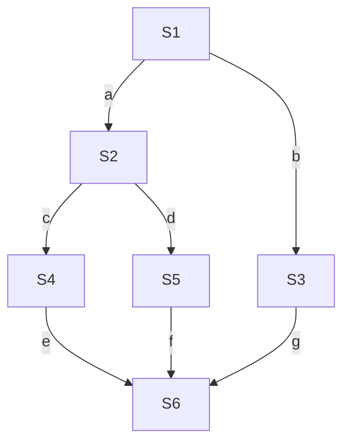

# 2.3 同步与互斥

## 2.3.1 同步与互斥

### 一、进程同步

**同步亦称直接制约关系**，是指为完成某种任务而建立的两个或多个进程，因为需要在某些位置上**协调工作次序**而产生的制约关系。

进程间的直接制约关系源于它们之间的**相互合作**。

例如，进程 A 负责产生数据，进程 B 负责处理这些数据。B 必须等 A 产生相应数据后，才能进行处理，这就需要同步。

**同步强调的是执行的先后顺序，不是让多个进程在同一时刻运行。**

### 二、临界资源与进程互斥

#### 1. 临界资源

**一个时间段内只允许一个进程使用的资源，称为临界资源。** 对临界资源的访问必须**互斥地进行**。

临界资源既可以是打印机等物理设备，也可以是需要互斥访问的共享变量、共享数据结构等。

#### 2. 进程互斥

**互斥亦称间接制约关系**。当一个进程访问某临界资源时，另一个想要访问该临界资源的进程必须等待；当前进程访问结束、释放该资源后，另一个进程才能访问。

进程间的间接制约关系源于它们对**临界资源的共享与竞争**。

| 比较项目 | 同步                           | 互斥                                   |
| -------- | ------------------------------ | -------------------------------------- |
| 别称     | 直接制约关系                   | 间接制约关系                           |
| 产生原因 | 进程之间相互合作，需要协调次序 | 进程共享、竞争临界资源                 |
| 核心要求 | 按要求的先后顺序执行           | 同一时刻只允许一个进程访问同一临界资源 |
| 示例     | 先产生数据，再处理数据         | 多个进程不能同时独占使用同一台打印机   |

同步与互斥可以同时存在：合作进程既可能需要协调工作顺序，也可能需要互斥访问共享数据。

### 三、互斥访问临界资源的四个区域

对临界资源的互斥访问，在逻辑上可分为**进入区、临界区、退出区、剩余区**。

| 区域       | 作用                                                                               |
| ---------- | ---------------------------------------------------------------------------------- |
| **进入区** | 检查是否可以进入临界区；若可以，则设置正在访问临界资源的标志，阻止其他进程同时进入 |
| **临界区** | 访问临界资源的那段代码，也称为**临界段**                                           |
| **退出区** | 解除正在访问临界资源的标志，使其他进程有机会进入                                   |
| **剩余区** | 执行与本次临界资源访问无关的其他处理                                               |

逻辑结构可以表示为：

```text
进入区：申请进入，按互斥协议检查并取得访问资格
临界区：访问临界资源
退出区：释放访问资格
剩余区：执行其他处理
```

**注意区分：**

- **临界资源是资源，临界区是访问该资源的代码段。**
- **进入区和退出区是负责实现互斥的代码段**，不能与临界区混为一谈。
- 互斥针对的是**同一个临界资源**，不是要求系统中所有进程的所有临界区都不能同时执行。
- 进入区的检查和标志设置必须通过正确的互斥协议实现，不能简单地先检查、再随意设置，否则可能出现多个进程同时通过检查的情况。

**例：5 个进程都访问同一个共享变量 A，有几个临界区？**

“临界区”指的是**每个进程中访问共享变量 A 的那段代码**。5 个进程都访问同一个 A，但每个进程各有一段自己的访问代码，因此是 **5 个临界区**。共享变量 A 是同一个资源，不能因此把临界区的数量也算成 1。

#### 代码共享与可重入代码（第 19 题）

**答案：C。解析原文：**

> 若代码可被多个进程在任意时刻共享，则要求任意一个进程在调用此段代码时都以同样的方式运行；而且进程在运行过程中被中断后再继续执行，其执行结果不受影响，这必然要求代码不能被任何进程修改，否则无法满足共享的要求。这样的代码就是可重入代码，也称纯代码，即允许多个进程同时访问的代码。

**知识点：可重入代码也称纯代码，允许多个进程同时访问；代码本身不能被进程修改，中断后继续执行不影响其执行结果。** 共享代码与访问共享变量的临界区要分别判断：代码可以共享，不代表其中对共享数据的操作可以不加互斥保护。

### 四、互斥访问应遵循的原则

为保证互斥访问的正确性和系统整体性能，应遵循以下原则：

| 原则         | 含义                                                               | 目的                     |
| ------------ | ------------------------------------------------------------------ | ------------------------ |
| **空闲让进** | 临界区空闲时，应允许一个请求进入的进程进入临界区                   | 避免资源空闲却不允许使用 |
| **忙则等待** | 已有进程进入临界区时，其他试图进入同一资源对应临界区的进程必须等待 | 保证对临界资源的互斥访问 |
| **有限等待** | 对请求访问的进程，应保证其能在有限时间内进入临界区                 | 避免进程饥饿             |
| **让权等待** | 进程不能进入临界区时，应释放处理机，让其他进程运行                 | 避免忙等待浪费 CPU 时间  |

#### 1. 忙则等待与让权等待的区别

**忙则等待**规定“此时不能进入临界区”，但并没有规定如何等待。

- **忙等待**：进程仍占用 CPU，循环检查能否进入临界区。
- **让权等待**：进程让出 CPU，通常通过阻塞等待，在条件满足后被唤醒，重新竞争访问资格。

因此，**满足忙则等待，不代表满足让权等待**。一些采用自旋方式的互斥方法可以保证互斥，但不满足让权等待。

#### 2. 有限等待与饥饿

即使每次都能保证只有一个进程进入临界区，如果某个等待进程总被其他进程抢先，仍然可能发生饥饿。**有限等待要求每个请求访问的进程最终都有机会进入，不能被无限期推迟。**

> 记忆：同步管先后，互斥管独占；进入区检查并取得资格，临界区访问资源，退出区释放资格；空闲让进、忙则等待、有限等待、让权等待。

## 2.3.2 实现临界区互斥的基本方法

### 一、软件实现方法

在**进入区设置并检查一些标志**，用以表明进程进入临界区的意愿或进入资格。若暂时不能进入，则在进入区通过**循环检查**的方式等待；当进程离开临界区时，在**退出区修改相应的标志**，以允许其他进程进入。

不同算法中，标志的含义不同：`turn` 表示轮到谁或优先让谁进入，`flag[i]` 表示进程 `Pi` 想要进入临界区，**不一定表示它已经在临界区中**。

**`turn` 变量的作用：表示轮到哪个线程进入临界区。** 在下面以进程为例的算法中，对应进程编号；单标志法用它表示轮次，Peterson 算法用它表示双方竞争时的优先进入权。

以下讨论两个进程 P0、P1，代码为教学伪代码：假设共享变量的单次读写是原子的，各操作按程序顺序执行且对彼此可见。两个进程之间可以交错执行，**不能把整个进入区看作不可分割的一步**。

#### 1. 单标志法（单标志位）

**算法思想：** 设置一个公共变量 `turn`，表示当前允许进入临界区的进程编号。进程退出临界区时，将使用权交给另一个进程，因此两个进程必须**严格交替**进入临界区。

```c
int turn = 0;                 // 初始只允许 P0 进入
```

| P0 进程                | P1 进程                |
| ---------------------- | ---------------------- |
| ① `while (turn != 0);` | ⑤ `while (turn != 1);` |
| ② `critical section;`  | ⑥ `critical section;`  |
| ③ `turn = 1;`          | ⑦ `turn = 0;`          |
| ④ `remainder section;` | ⑧ `remainder section;` |

其中，①、⑤为进入区，②、⑥为临界区，③、⑦为退出区，④、⑧为剩余区。`while (...);` 末尾的分号表示**空循环体**，条件为真时一直循环检查。

**为什么能保证互斥？**

- 初始 `turn = 0`，P0 可以通过①，P1 会停留在⑤。
- P0 在临界区期间，`turn` 仍为 0，P1 无法进入。
- 只有 P0 离开临界区、执行③将 `turn` 改为 1 后，P1 才能进入；此时 P0 若再次申请，则需要等待。

因此，同一时刻最多只有一个进程处于临界区，满足**忙则等待**。

**主要问题：违反“空闲让进”。**

例如，P0 访问结束后把 `turn` 改为 1，但 P1 一直在剩余区处理其他任务，并不想进入临界区。此时 P0 再次申请进入，即使临界区空闲，也会因 `turn != 0` 而一直等待。

**原因：进入资格只能由另一个进程在退出区交还，无法根据实际申请情况调整。**

> 记忆：单标志看轮次，必须交替；对方不来，自己也进不去。

#### 2. 双标志先检查法

**算法思想：** 设置布尔数组 `flag[2]`，记录两个进程进入临界区的意愿。进入前**先检查对方的标志，再设置自己的标志**；退出时撤销自己的标志。

```c
bool flag[2] = {false, false};   // 初始两个进程都不想进入
```

| P0 进程               | P1 进程               |
| --------------------- | --------------------- |
| ① `while (flag[1]);`  | ⑤ `while (flag[0]);`  |
| ② `flag[0] = true;`   | ⑥ `flag[1] = true;`   |
| ③ `critical section;` | ⑦ `critical section;` |
| ④ `flag[0] = false;`  | ⑧ `flag[1] = false;`  |
| `remainder section;`  | `remainder section;`  |

①②、⑤⑥为进入区；④、⑧为退出区。

**出错的交错顺序：① → ⑤ → ② → ⑥ → ③ → ⑦。**

| 步骤 | 执行情况                                                   |
| ---- | ---------------------------------------------------------- |
| ①    | P0 发现 `flag[1] == false`，通过检查，但还没设置自己的标志 |
| ⑤    | 切换到 P1，发现 `flag[0] == false`，也通过检查             |
| ②、⑥ | 两个进程分别将自己的标志设为 `true`                        |
| ③、⑦ | 两个进程都已通过检查，可以出现同时处于临界区的情况         |

**主要问题：违反“忙则等待”，不能保证互斥。**

原因是**检查对方标志和设置自身标志不是一个原子操作**，在检查之后、设置之前可能发生进程切换。双方都可能根据“对方尚未申请”的旧情况通过检查，后续又不再检查。

> 记忆：先检查，后表态；双方都看见没人，便一起进入。

#### 3. 双标志后检查法

**算法思想：** 调换上一种算法进入区的顺序，**先设置自己的标志，再检查对方的标志**。

```c
bool flag[2] = {false, false};
```

| P0 进程               | P1 进程               |
| --------------------- | --------------------- |
| ① `flag[0] = true;`   | ⑤ `flag[1] = true;`   |
| ② `while (flag[1]);`  | ⑥ `while (flag[0]);`  |
| ③ `critical section;` | ⑦ `critical section;` |
| ④ `flag[0] = false;`  | ⑧ `flag[1] = false;`  |
| `remainder section;`  | `remainder section;`  |

**为什么能保证互斥？**

进程进入临界区前已经把自己的标志置为 `true`，并且直到退出时才清除。若 P0 已进入临界区，P1 检查时会发现 `flag[0] == true`，因此不能进入；反过来也一样。

**出错的交错顺序：① → ⑤ → ② → ⑥ → 持续循环检查。**

| 步骤 | 执行情况                      |
| ---- | ----------------------------- |
| ①    | P0 将 `flag[0]` 设为 `true`   |
| ⑤    | P1 将 `flag[1]` 设为 `true`   |
| ②    | P0 发现 P1 想进入，于是等待   |
| ⑥    | P1 发现 P0 想进入，也开始等待 |

双方都无法进入临界区，自然也无法执行退出区的 `flag[i] = false`，因而会一直互相等待。

**主要问题：违反“空闲让进”和“有限等待”。** 临界区明明空闲，却谁也进不去，而且等待可能无限持续。这是一种双方互相等待造成的**死锁情形**；按本节的学习口径，也可记为进程长期无法访问临界资源、出现“饥饿”现象。

> 记忆：先表态，后检查；双方都想进，双方都等待。

#### 4. Peterson 算法

**算法思想：** 结合双标志法和单标志法，用 `flag[]` 表达进入意愿，用 `turn` 在双方竞争时决定优先让谁进入。

进入区分三步：**主动争取 → 主动谦让 → 检查是否需要等待**。

```c
bool flag[2] = {false, false};
int turn = 0;                  // 双方都想进入时，优先让谁进入
```

| P0 进程                           | P1 进程                           |
| --------------------------------- | --------------------------------- |
| ① `flag[0] = true;`               | ⑥ `flag[1] = true;`               |
| ② `turn = 1;`                     | ⑦ `turn = 0;`                     |
| ③ `while (flag[1] && turn == 1);` | ⑧ `while (flag[0] && turn == 0);` |
| ④ `critical section;`             | ⑨ `critical section;`             |
| ⑤ `flag[0] = false;`              | ⑩ `flag[1] = false;`              |
| `remainder section;`              | `remainder section;`              |

以 P0 为例，进入区的含义是：

1. `flag[0] = true`：声明“我想进入”。
2. `turn = 1`：表示“如果你也想进入，就让你先来”。
3. `while (flag[1] && turn == 1);`：**只有对方也想进入，并且当前优先让对方时，自己才等待。**

因此，P0 能通过检查的条件是 `flag[1] == false` **或** `turn == 0`。`turn` 在这里仅用于解决竞争，**不像单标志法那样强制双方交替**。

**（1）只有一个进程想进入**

若只有 P0 想进入，则 `flag[1] == false`，即使 P0 把 `turn` 设为 1，也能直接通过③。因此，对方不想进入时不会挡住自己，满足**空闲让进**。

**（2）两个进程都想进入**

例如按 **① → ⑥ → ② → ⑦ → ③ → ⑧** 执行：

| 执行后     | 共享变量或结果                                   |
| ---------- | ------------------------------------------------ |
| ①、⑥       | `flag[0]`、`flag[1]` 均为 `true`                 |
| ②          | `turn = 1`，P0 表示让 P1                         |
| ⑦          | `turn = 0`，P1 最后表示让 P0                     |
| ③          | P0 的等待条件为 `true && false`，可以进入        |
| ⑧          | P1 的等待条件为 `true && true`，必须等待         |
| P0 执行⑤后 | `flag[0] = false`，P1 的等待条件变为假，可以进入 |

如果②、⑦的先后顺序反过来，最终 `turn = 1`，就由 P1 先进入、P0 等待。**在双方都已表态并完成谦让操作时，最后修改 `turn` 的进程让对方先进入。**

**（3）一个进程已通过检查，另一个才申请**

例如按 **① → ② → ③ → ⑥ → ⑦ → ⑧** 执行：P0 在③时发现 P1 尚未申请，通过检查；随后 P1 声明意愿并设置 `turn = 0`，在⑧处发现 P0 想进入且优先权属于 P0，于是等待。即使 P0 通过③后还没来得及执行④，也不会因此让双方同时进入。

**（4）为什么满足有限等待？**

当 P0 已设置 `flag[0] = true` 并持续申请时，P1 即使先进入，退出后若再次申请，也必须执行 `turn = 0`，将优先权交给 P0。P1 无法无限次抢先进入。在进程持续获得调度、临界区能在有限时间内执行完毕的前提下，P0 能在有限等待后进入；P1 同理。

**结论：Peterson 算法满足“空闲让进、忙则等待、有限等待”，但不满足“让权等待”。**

原因是等待仍采用 `while` 空循环，进程在得到 CPU 时不断检查条件，属于**忙等待**。这里的“谦让”是让出临界区的优先进入资格，**并不等于主动让出 CPU**。

#### 5. 四种算法对比与易错点

| 算法               | 进入区的核心操作                 | 能否保证互斥 | 主要问题                                 |
| ------------------ | -------------------------------- | ------------ | ---------------------------------------- |
| **单标志法**       | 检查是否轮到自己，退出时交给对方 | 能           | 强制交替，违反空闲让进                   |
| **双标志先检查法** | 先检查对方，再声明自己想进入     | 不能         | 双方可能同时通过检查，违反忙则等待       |
| **双标志后检查法** | 先声明自己想进入，再检查对方     | 能           | 双方可能互相等待，违反空闲让进、有限等待 |
| **Peterson 算法**  | 声明意愿、让对方优先、联合检查   | 能           | 循环忙等，不满足让权等待                 |

- **四种方法都采用循环检查，均不满足让权等待**，并非只有 Peterson 算法存在忙等待。
- “先检查”“后检查”是相对于**设置自身意愿标志**而言的。
- 课件中的“上锁”“解锁”是对设置、清除标志的形象描述；单独设置 `flag[i] = true` 不代表已成功取得临界区使用权。
- **单核也可能发生互斥错误**：只要进程交错执行，双标志先检查法就可能让两个进程都进入、且均未退出临界区，不要求两条指令在物理上同时执行。
- 分析交错顺序时，必须保持**每个进程内部的程序顺序**。例如 Peterson 算法中 P0 必须按①②③执行，不能跳过②直接执行③。

> 记忆：单标志强制轮流，先检查一起进入，后检查一起等待；Peterson 先举旗、再谦让，双方竞争看 `turn`，正确互斥仍忙等。

### 二、硬件实现方法

硬件实现方法借助处理机提供的指令实现互斥，主要包括**中断屏蔽方法、TestAndSet 指令和 Swap 指令**。

#### 1. 中断屏蔽方法

**基本思想：** 利用**关中断、开中断指令**，在访问临界区期间屏蔽中断，防止因中断引起的进程切换，从而保护临界区。

```text
关中断；        // 进入区
临界区；        // 访问临界资源
开中断；        // 退出区
剩余区；
```

在单处理机环境下，当前进程执行临界区时，其他进程必须先获得处理机才能执行。若这段代码不会主动阻塞或让出处理机，屏蔽引起抢占的中断后，其他进程便无法切换进来访问临界资源。访问结束后再开中断，恢复正常的中断响应。

这与原语实现中的思路相似：**保证需要保护的一段操作执行期间不被其他相关执行流打断。**

**优点：简单、高效。**

**缺点与适用范围：**

- **不能仅靠此方法实现多处理机之间的互斥。** 一个处理机关中断，只影响本处理机，其他处理机仍可能同时访问同一临界资源。
- **只适用于操作系统内核，不能由普通用户进程直接使用。** 开、关中断是特权操作，只能在内核态执行；若允许用户任意关中断，系统可能无法正常响应中断和调度。
- **关中断时间不宜过长**，否则会影响中断响应的及时性，适合保护短小的内核临界区。

> 注意：“关中断后不会切换”是本节简化模型下的说法，前提是临界区代码不主动阻塞或调度。关中断通常屏蔽的是可屏蔽中断，并不意味着一切异常和不可屏蔽中断都消失。实际内核代码通常保存并恢复原来的中断状态，避免破坏外层代码的状态。

#### 2. TestAndSet 指令

**TestAndSet** 简称 **TS 指令**，也称 **TestAndSetLock（TSL）指令**。

**基本思想：将“读取锁的旧值”和“将锁置为已加锁”合为一个原子操作。** 指令由硬件实现，对其他竞争者而言不可分割，即使在多处理机环境中，也不能让两个进程同时取得同一把空闲锁。

设置一个所有竞争进程共享的布尔变量：

```c
bool lock = false;       // false：未加锁；true：已加锁
```

下面用 C 风格伪代码描述指令的逻辑，**整个过程应由硬件原子地完成，不是普通 C 函数天然具有原子性**：

```c
bool TestAndSet(bool *lock) {
    bool old = *lock;    // 保存锁原来的值
    *lock = true;        // 无论原值如何，都将锁设为 true
    return old;          // 返回旧值，而不是修改后的值
}
```

每个进程使用同一个 `lock`，按照以下协议访问临界区：

```c
while (TestAndSet(&lock));   // 进入区：反复尝试取得锁
critical section;           // 临界区
lock = false;               // 退出区：释放锁
remainder section;          // 剩余区
```

**如何判断是否取得锁？**

| 执行前的 `lock` | 返回的旧值 `old` | 执行后的 `lock` | 结果                               |
| --------------- | ---------------- | --------------- | ---------------------------------- |
| `false`         | `false`          | `true`          | 原来无人持锁，本次取得锁，跳出循环 |
| `true`          | `true`           | `true`          | 原来已有进程持锁，继续循环等待     |

**为什么能保证互斥？**

假设 P0、P1 都尝试取得初始为 `false` 的锁：

1. 若 P0 先执行原子的 TestAndSet，它读取到 `false`，同时把锁设为 `true`，因此可以进入临界区。
2. P1 随后执行时只能读取到 `true`，于是继续等待。
3. P0 退出时执行 `lock = false`，等待者才有机会在下一次尝试中取得锁。

与双标志先检查法不同，**其他进程无法插入“读到未加锁”与“设置为已加锁”之间的空隙**。

**优点：** 实现简单，适用于单处理机和多处理机环境，也可用于多个进程竞争同一临界资源。

**缺点：**

- **不满足让权等待。** 未取得锁的进程会占用 CPU，循环执行 TestAndSet，属于忙等待。
- **这个简单版本不保证有限等待。** 解锁后没有规定谁先取得锁，某个进程可能反复竞争失败，产生饥饿。

> 记忆：TS 读旧值、置真、返回旧值；返回假，拿到锁；返回真，继续等。

#### 3. Swap 指令

**Swap 指令**也称 **Exchange 指令**，或简称 **XCHG 指令**，作用是**原子地交换两个变量的值**。

下面同样只是用 C 风格伪代码描述硬件指令的逻辑，交换过程必须是原子的：

```c
void Swap(bool *a, bool *b) {
    bool temp = *a;
    *a = *b;
    *b = temp;
}
```

使用一个共享锁变量，以及每个进程各自持有的局部变量 `old`：

```c
bool lock = false;           // 共享变量：初始未加锁
```

每个进程的访问协议如下：

```c
bool old = true;             // 局部变量：每次申请进入前重新置为 true
while (old == true) {        // 进入区
    Swap(&lock, &old);
}
critical section;           // 临界区
lock = false;               // 退出区：释放锁
remainder section;          // 剩余区
```

**交换时会发生什么？**

进入每次交换时，本进程的 `old` 都是 `true`：

| 交换前 `lock` | 交换前 `old` | 交换后 `lock` | 交换后 `old` | 结果                         |
| ------------- | ------------ | ------------- | ------------ | ---------------------------- |
| `false`       | `true`       | `true`        | `false`      | 取得锁，下一次判断时退出循环 |
| `true`        | `true`       | `true`        | `true`       | 未取得锁，继续交换并检查     |

因此，Swap 在此协议中的效果与 TestAndSet 相同：**把共享锁设为 `true`，同时将锁的旧值交给当前进程判断**。交换的原子性保证只有一个竞争者能取得空闲锁。

**优点：** 实现简单，适用于单处理机和多处理机环境，也支持多个进程竞争。

**缺点：** 与上述 TestAndSet 实现相同，采用忙等待，**不满足让权等待，也不保证有限等待**。

**易错点：**

- `lock` 是各进程共享的锁，`old` 是**每个进程自己的局部变量**。
- **每次重新申请进入临界区之前，都要执行 `old = true`**。若保留上次成功后的 `false`，就会直接跳过循环，未取得锁便进入临界区。
- `while` 的循环体是 `Swap(&lock, &old)`，不能在 `while (old == true)` 后误加分号，否则会成为不再更新 `old` 的空循环。

#### 4. 硬件方法对比与总结

| 方法           | 核心机制                           | 多处理机环境             | 主要限制                             |
| -------------- | ---------------------------------- | ------------------------ | ------------------------------------ |
| **中断屏蔽**   | 临界区前关中断，结束后恢复中断     | 不能单独保证跨处理机互斥 | 只能在内核态使用，关中断时间不宜过长 |
| **TestAndSet** | 原子地读取旧锁值并将锁置为 `true`  | 适用                     | 简单循环实现会忙等，且不保证有限等待 |
| **Swap**       | 原子地交换共享锁与本进程的局部变量 | 适用                     | 简单循环实现会忙等，且不保证有限等待 |

**需要区分的三个概念：**

- **原子操作**保证一次取锁操作不可分割，不等于整个临界区都不可被调度打断。
- **保证互斥**表示不会有两个进程同时进入同一临界资源对应的临界区，不代表等待顺序公平。
- **硬件指令能实现互斥**，不代表采用它的循环等待算法就满足让权等待。这里的 TS、Swap 实现本质上都是自旋等待。

以上代码用于说明算法；实际实现还需使用平台提供的原子操作和适当的内存顺序，不能直接用普通共享布尔变量代替硬件原子指令。

> 记忆：屏蔽中断防本机切换，内核短段才适合；TS 与 Swap 原子取锁，多核可用但仍忙等，互斥保证不等于公平保证。

## 2.3.3 互斥锁

### 一、互斥锁的基本思想

**互斥锁（mutex lock）用于保护临界区，保证同一时刻最多只有一个进程进入由同一把锁保护的临界区。** 进程进入临界区前先取得锁，离开时释放锁。

锁通常提供两个操作：

- `acquire()`：申请取得锁；若锁已被占用，则需要等待。
- `release()`：释放锁，使其他等待者有机会取得锁。

```c
acquire();               // 进入区：取得锁
critical section;        // 临界区：访问共享资源
release();               // 退出区：释放锁
remainder section;       // 剩余区
```

所有访问**同一临界资源**的进程必须遵守同一套加锁协议，使用同一把锁。只给其中一个进程加锁，不能保证互斥。

### 二、加锁、解锁与原子性

可以用布尔变量 `available` 表示锁是否可用。下面是描述逻辑的教学伪代码：

```c
bool available = true;    // true：锁空闲；false：锁已被占用

acquire() {
    while (!available);  // 锁不可用时循环等待
    available = false;   // 取得锁
}

release() {
    available = true;    // 释放锁
}
```

**关键要求：成功发现锁可用并将其设置为不可用，必须是不可分割的操作；释放锁也必须按原子操作的要求实现。** 不能直接把上述普通变量的检查、赋值当作正确的并发实现，否则两个进程可能同时发现 `available == true`，随后都进入临界区。

实际可借助上一节的 TestAndSet、Swap 等原子指令实现。**原子性保护的是锁状态的检查与修改，并不意味着持锁期间整个临界区都禁止进程切换。**

### 三、自旋锁与忙等待

上述通过循环反复检查锁的实现称为**自旋锁（spin lock）**。

| 特点     | 说明                                                           |
| -------- | -------------------------------------------------------------- |
| 等待方式 | 申请者未取得锁时，循环检查或反复尝试取锁                       |
| CPU 使用 | 等待者获得 CPU 后仍执行等待循环，属于忙等待                    |
| 让权等待 | **不满足**，不会因为取锁失败而主动阻塞                         |
| 开销特点 | 短时间等待可以避免阻塞、唤醒及上下文切换的开销                 |
| 适用情况 | 多处理机环境中，持锁者可在另一处理机上运行，且预计持锁时间很短 |
| 主要问题 | 长时间自旋浪费 CPU；简单抢锁实现不保证有限等待                 |

单处理机上，等待者自旋期间持锁者不能同时运行，通常需要等调度切换后持锁者才能继续执行，所以长时间自旋尤其低效。

**互斥锁不一定采用自旋实现**：也可以在竞争失败时阻塞等待。这里“不满足让权等待”针对的是上面的自旋版本，不能推广到所有互斥锁。

> 记忆：进入先取锁，退出再解锁；检查与上锁必须原子化；自旋一直查，忙等不让权。

## 2.3.4 信号量

### 一、信号量与 P、V 原语

**信号量是用于协调并发进程的变量**，可以是整数，也可以是包含数值和等待队列的记录型数据结构。用户进程通过操作系统提供的一对原语操作信号量，实现**进程互斥、进程同步**。

用于管理资源时，信号量的初值表示该类资源初始可用的数量。例如，系统只有一台可用打印机，就可以将相应信号量初始化为 1。用于表示先后关系时，也可以把信号量理解为某种“完成通知”或“执行许可”的数量。

| 操作        | 别名       | 基本含义                                             |
| ----------- | ---------- | ---------------------------------------------------- |
| 初始化      | 设置初值   | 根据资源数量或同步条件确定初始状态                   |
| `wait(S)`   | **`P(S)`** | 申请一个单位的资源或许可；不能满足时等待             |
| `signal(S)` | **`V(S)`** | 归还一个单位的资源，或产生一个许可；必要时唤醒等待者 |

与普通整数不同，**信号量初始化后，只能通过规定的 P、V 操作修改其状态**，不能在业务代码中随意对其赋值、加减。

**原语是一段具有原子性的操作**，其关键状态更新对其他相关操作而言不可分割。P、V 的原子性防止多个进程在检查、修改同一个信号量时产生竞态。

**速记：P 阻塞，V 唤醒；P、V、阻塞和唤醒操作都是原语。** 对记录型信号量，更准确地说：P 减 1 后若小于 0，调用阻塞原语 `block()`；V 加 1 后若小于等于 0，调用唤醒原语 `wakeup()`。不是每次 P 都会阻塞，也不是每次 V 都会唤醒进程。

课件用“关中断、开中断”解释原语的实现，这是单处理机下的一种实现思路；多处理机上仅关闭本机中断并不能阻止其他处理机访问共享变量，还需要相应的原子指令或内核互斥机制。

> 下文均为教学伪代码。`P(S)`、`V(S)` 操作的是**同一个共享信号量本体**，不是参数副本。需要展示函数定义时使用指针形式；`block`、`wakeup`、队列操作由操作系统提供。

### 二、整型信号量

整型信号量使用一个整数表示**当前可用资源数**。其特点是：**先检查，有资源才减 1；没有资源则循环等待。**

```c
int S = 1;                    // 初始有一台可用打印机

void wait(int *S) {           // P 操作的逻辑描述
    while (*S <= 0);          // 资源不足时忙等待
    (*S)--;                  // 取得一个资源
}

void signal(int *S) {         // V 操作的逻辑描述
    (*S)++;                  // 归还一个资源
}
```

**这里成功检查 `*S > 0` 与执行 `(*S)--` 必须原子地完成**，上述代码只描述逻辑，普通 C 语句本身不提供这种保证。等待期间必须允许其他进程执行 V 操作，不能理解为“关中断后一直循环，直到别人释放资源”。

使用打印机的进程执行：

```c
P(S);                        // 进入区：申请打印机
使用打印机;                   // 临界区
V(S);                        // 退出区：释放打印机
```

**主要缺陷：不满足“让权等待”，会发生忙等待。** 资源不足时，进程仍在 CPU 上不断检查 `S`，没有主动进入阻塞态。

### 三、记录型信号量

#### 1. 数据结构与操作代码

为避免进程在资源不足时一直忙等，记录型信号量除了保存数值，还保存一个**等待队列**。

```c
typedef struct {
    int value;                // 可用资源或等待请求的计数，含义见下表
    struct process *L;        // 等待队列，初始为空
} semaphore;

void wait(semaphore *S) {     // P 操作
    S->value--;
    if (S->value < 0) {
        add the process to S->L;       // 将当前进程加入 S 的等待队列
        block();                       // 当前进程：运行态 → 阻塞态，让出 CPU
    }
}

void signal(semaphore *S) {   // V 操作
    S->value++;
    if (S->value <= 0) {
        remove a process p from S->L;  // 从 S 的等待队列取出一个进程 p
        wakeup(p);                     // 进程 p：阻塞态 → 就绪态
    }
}
```

其中，`add the process to S->L` 和 `remove a process p from S->L` 是**英文伪代码语句**，明确表示入队、出队，不是可直接编译的 C 语法。若采用先进先出队列，出队时取队首进程。

**计数修改、条件判断与对应的入队阻塞或出队唤醒必须由原语协调，不能出现丢失唤醒的空隙。** 例如，不能让进程尚未完成入队，另一个进程就执行 V 并错过唤醒它。

原子性不意味着阻塞期间霸占处理机：进程登记好等待请求并阻塞后，会让出 CPU，其他进程可以继续执行，包括执行 V 操作。

#### 2. `value` 的含义

按上述记录型信号量的定义，在一次原语完成状态更新后：

| `S.value` | 含义                                                             |
| --------- | ---------------------------------------------------------------- |
| `> 0`     | 有 `S.value` 个尚可分配的资源或许可，没有因该信号量阻塞的进程    |
| `= 0`     | 没有可直接分配的资源或许可，也没有仍在该信号量队列中等待的进程   |
| `< 0`     | 没有可直接分配的资源；有 `-S.value` 个进程在该信号量的等待队列中 |

**负数不是“负的物理资源”，而是记录尚未得到满足的申请。** 因此，记录型信号量的 `value` 不能始终简单理解为物理资源剩余数。

即使 `S.value == 0`，也可能有进程已经取得资源、正在使用资源，或者刚被唤醒、尚未运行。它不表示“系统里没有相关进程”。

**第 47 题（2010 统考真题）**

设与某资源关联的信号量初值为 3，当前值为 1。若 M 表示该资源的可用个数，N 表示等待该资源的进程数，则 M、N 分别是（ ）。

| 选项 | M | N |
| ---- | - | - |
| A | 0 | 1 |
| B | 1 | 0 |
| C | 1 | 2 |
| D | 2 | 0 |

**答案：B，即 M = 1，N = 0。解析原文：**

> 信号量表示相关资源的当前可用数量。当信号量 K > 0 时，表示还有 K 个相关资源可用，所以该资源的可用个数是 1。而当信号量 K < 0 时，表示有 |K| 个进程在等待该资源。因为资源有剩余，可见没有其他进程等待使用该资源，所以进程数为 0。

**做题看当前值，而不是只看初值。** 本题当前值为正，说明还有 1 个资源可用、没有等待者；初值 3 与当前值 1 的差值 2 不能当作等待进程数。

#### 3. 为什么 P 判断 `< 0`，V 判断 `<= 0`？

**P 操作先减 1，再判断本次申请是否需要等待。**

- 减后 `>= 0`：本次申请得到了资源，可以继续执行。
- 减后 `< 0`：资源不够，本次申请需要入队并阻塞。

例如，原来 `value = 1`，P 后变成 0，说明**最后一个可用资源刚好被本进程取得**，所以不应阻塞。

**V 操作先加 1，再判断释放前是否有等待者。**

- 加后 `> 0`：释放前没有等待者，资源变为可用。
- 加后 `<= 0`：释放前至少有一个等待者，应唤醒其中一个，将本次释放的资源交给它。

特别是，原来 `value = -1`，V 后变成 0，说明释放前恰有一个等待者，**仍需唤醒它**。这就是 V 不能只判断 `< 0` 的原因。

#### 4. 执行示例：一台打印机，三个进程

初始 `S.value = 1`，等待队列为空，假设按先进先出顺序唤醒。

| 步骤 | 操作                       | 操作后的 `value` | 等待队列 | 结果                                     |
| ---- | -------------------------- | ---------------- | -------- | ---------------------------------------- |
| 1    | A 执行 P                   | 0                | 空       | A 取得打印机                             |
| 2    | B 执行 P                   | -1               | B        | B 阻塞                                   |
| 3    | C 执行 P                   | -2               | B、C     | C 阻塞                                   |
| 4    | A 执行 V                   | -1               | C        | B 出队并变为就绪态，打印机使用资格交给 B |
| 5    | B 获得调度、使用完后执行 V | 0                | 空       | C 出队并变为就绪态，使用资格交给 C       |
| 6    | C 获得调度、使用完后执行 V | 1                | 空       | 打印机重新空闲                           |

**被唤醒不等于立即运行**：`wakeup` 使进程从阻塞态变为就绪态，之后还需要调度。按本节的 P/V 定义，被唤醒的进程恢复原来的 P 调用，**不再为同一次申请重新减 1**。

#### 5. 整型与记录型信号量对比

| 比较项目       | 整型信号量                 | 记录型信号量                       |
| -------------- | -------------------------- | ---------------------------------- |
| 数据结构       | 一个整数                   | 整数 `value` 加等待队列 `L`        |
| P 操作         | 先等待资源可用，再减 1     | 先减 1，若为负则入队并阻塞         |
| 资源不足       | 循环检查，忙等待           | 阻塞并让出 CPU                     |
| 是否让权等待   | 否                         | 是                                 |
| 数值是否可为负 | 在非负初值、合法操作下不会 | 可以，绝对值表示等待队列中的进程数 |

> 记忆：记录型 P 先减，负了排队；V 先加，非正唤醒。阻塞让出 CPU，唤醒只到就绪态。

### 四、用信号量实现进程互斥

**互斥信号量 `mutex` 表示进入某个临界区的名额，初值为 1。**

实现步骤：

1. 找出共享的临界资源，划定访问该资源的临界区。
2. 设置所有相关进程共享的互斥信号量 `mutex = 1`。
3. 在进入区执行 `P(mutex)`，申请进入名额。
4. 在退出区执行 `V(mutex)`，归还进入名额。

```c
semaphore mutex = 1;          // 简写：value = 1，等待队列为空

P1() {
    P(mutex);
    临界区代码;
    V(mutex);
}

P2() {
    P(mutex);
    临界区代码;
    V(mutex);
}
```

**注意：**

- 同一临界资源必须由同一个互斥信号量保护。例如，两个使用打印机的进程都操作 `mutex1`，两个使用摄像头的进程都操作 `mutex2`。
- 对于可以独立访问的不同临界资源，通常分别设置互斥信号量，避免不必要地限制并发。
- 实现互斥时，**同一进程的一次临界区访问前后应有配对的 P、V**；所有退出路径都应正确释放。
- 缺少 P，无法保证互斥；缺少 V，会使名额无法归还，后续申请者可能永久等待。
- 使用记录型信号量时，`mutex.value` 可以为负，表示存在等待者；**初值为 1 不等于运行中只能取 0、1**。

### 五、用信号量实现进程同步

同步要求两个操作按指定顺序执行。例如，必须先执行 P1 中的“代码2”，再执行 P2 中的“代码4”。

**设置同步信号量 `S = 0`，在前操作之后执行 V，在后操作之前执行 P。** 口诀是：**前 V 后 P**。

```c
semaphore S = 0;

P1() {
    代码1;
    代码2;                   // 前操作
    V(S);                    // 发布“代码2已完成”的许可
    代码3;
}

P2() {
    P(S);                    // 等待许可
    代码4;                   // 后操作
    代码5;
    代码6;
}
```

| 执行情况    | 信号量变化                                        | 结果                                 |
| ----------- | ------------------------------------------------- | ------------------------------------ |
| P1 先执行 V | `0 → 1`；P2 随后执行 P，`1 → 0`                   | P2 不阻塞，可执行代码4               |
| P2 先执行 P | `0 → -1`，P2 阻塞；P1 完成代码2后执行 V，`-1 → 0` | 唤醒 P2，待其获得调度后继续执行代码4 |

无论哪种情况，**代码4都只能在代码2完成后执行**。但这里并未规定代码3与代码4的先后次序，它们可以交错执行。

| 对比        | 互斥                   | 本例的一次先后同步     |
| ----------- | ---------------------- | ---------------------- |
| 初值        | 1，初始有一个进入名额  | 0，前操作尚未提供许可  |
| P 的位置    | 临界区之前             | 后操作之前             |
| V 的位置    | 临界区之后             | 前操作之后             |
| P、V 的对应 | 同一进程申请、释放名额 | 前驱进程 V，后继进程 P |

**“同步信号量初值为 0”针对的是初始条件尚未满足的这类先后同步。** 其他同步问题的初值应按可用许可数确定，例如后文生产者—消费者中的 `empty` 初值为 `n`。

### 六、用信号量实现前驱关系

每一条前驱关系都是一个同步约束。通用做法是：**每条前驱边设置一个初值为 0 的信号量，边的起点操作完成后 V，终点操作开始前 P。**

例如，课件中的前驱关系为：



对应代码如下，其中 `S1`～`S6` 表示六个操作，`a`～`g` 表示七个信号量：

```c
semaphore a = 0, b = 0, c = 0, d = 0;
semaphore e = 0, f = 0, g = 0;

P1() {
    S1;
    V(a);
    V(b);
}

P2() {
    P(a);
    S2;
    V(c);
    V(d);
}

P3() {
    P(b);
    S3;
    V(g);
}

P4() {
    P(c);
    S4;
    V(e);
}

P5() {
    P(d);
    S5;
    V(f);
}

P6() {
    P(e);
    P(f);
    P(g);
    S6;
}
```

**分析要点：**

- 一个操作有多条出边，就在完成后对每条出边对应的信号量执行 V。
- 一个操作有多条入边，就在开始前对每条入边对应的信号量执行 P，确保**所有直接前驱都已完成**。
- 本例中 `P(e)`、`P(f)`、`P(g)` 可以交换顺序，但都必须位于 `S6` 之前。
- `S4`、`S5` 之间没有先后约束；`S3` 与 `S2`、`S4`、`S5` 之间也没有额外的先后约束。
- 一次 V 只提供一个许可，**不能用一次 V 同时放行多个后继进程**。

> 记忆：一条边配一个信号量，初值为零；前驱做完发许可，后继集齐再执行。

## 2.3.5 经典同步问题

### 一、生产者—消费者问题

#### 1. 问题与关系分析

一组生产者和一组消费者共享一个**初始为空、容量为 `n` 的缓冲区**。生产者每次放入一个产品，消费者每次取出一个产品。这里的产品可以理解为某种数据。

需要满足三个约束：

| 约束                           | 关系           | 实现方法                  |
| ------------------------------ | -------------- | ------------------------- |
| 缓冲区没满，生产者才能放入产品 | 同步：等待空位 | `empty` 记录空位许可      |
| 缓冲区非空，消费者才能取出产品 | 同步：等待产品 | `full` 记录产品许可       |
| 各进程不能同时修改共享缓冲区   | 互斥           | 用 `mutex` 保护缓冲区操作 |

“生产产品”和“把产品放入缓冲区”是两个步骤；同样，“取出产品”和“使用产品”也是两个步骤。需要保护的临界区主要是**向共享缓冲区放入、从共享缓冲区取出产品的操作**。

#### 2. 信号量设置与完整代码

```c
semaphore mutex = 1;         // 互斥：访问缓冲区的名额
semaphore empty = n;         // 同步：初始有 n 个空位
semaphore full = 0;          // 同步：初始没有产品

producer() {
    while (1) {
        生产一个产品;
        P(empty);            // 申请一个空位，没有空位则阻塞
        P(mutex);            // 申请互斥访问缓冲区
        把产品放入缓冲区;
        V(mutex);            // 释放对缓冲区的互斥访问权
        V(full);             // 增加一个产品许可，必要时唤醒消费者
    }
}

consumer() {
    while (1) {
        P(full);             // 申请一个产品，没有产品则阻塞
        P(mutex);            // 申请互斥访问缓冲区
        从缓冲区取出一个产品;
        V(mutex);            // 释放对缓冲区的互斥访问权
        V(empty);            // 增加一个空位许可，必要时唤醒生产者
        使用产品;
    }
}
```

**三个信号量分别解决三个问题，不能互相替代。** 即使取得了一个空位或产品许可，也不代表已经取得缓冲区的互斥访问权，所以仍需 `P(mutex)`。

把生产、使用产品放在临界区外，可以缩短持锁时间，使其他进程继续访问缓冲区。

#### 3. P、V 如何对应？

| 信号量  | P 操作所在位置         | V 操作所在位置         | 含义                                   |
| ------- | ---------------------- | ---------------------- | -------------------------------------- |
| `mutex` | 每个进程访问缓冲区之前 | 同一进程访问缓冲区之后 | 申请、归还互斥名额                     |
| `empty` | 生产者放入之前         | 消费者取出之后         | 生产者占用空位，消费者产生空位         |
| `full`  | 消费者取出之前         | 生产者放入之后         | 消费者取得产品许可，生产者产生产品许可 |

**互斥的一对 P、V 位于同一进程中；这里的同步 P、V 分别位于合作的两个进程中。** 不应因为生产者执行了 `P(empty)`，就在其放入产品后配上 `V(empty)`，否则相当于错误地归还了刚被产品占据的空位。

#### 4. 为什么两个 P 的顺序不能交换？

正确顺序是：**先申请空位或产品许可，再申请缓冲区的互斥锁。** 如果先拿锁，再等待产品或空位，就可能持锁阻塞，使能满足条件的另一方无法进入缓冲区。

**情况一：缓冲区已满，生产者先执行 `P(mutex)`。**

假设此时没有尚未完成的预约操作，`empty = 0`、`full = n`、`mutex = 1`：

1. 生产者执行 `P(mutex)`，取得锁，`mutex` 变为 0。
2. 生产者执行 `P(empty)`，`empty` 变为 -1，因为没有空位而阻塞，**但没有释放 `mutex`**。
3. 消费者想取出产品，却无法通过 `P(mutex)`，也被阻塞。
4. 生产者等待消费者取出产品、释放空位；消费者等待生产者释放锁，形成**死锁**。

即使消费者保持正确顺序、先成功执行 `P(full)`，之后也会卡在 `P(mutex)`，因此**只把生产者的两个 P 交换，也可能死锁**。

**情况二：缓冲区为空，消费者先执行 `P(mutex)`。**

1. 消费者取得锁，再执行 `P(full)`，因没有产品而阻塞。
2. 生产者即使取得空位许可，也无法取得消费者占有的锁，不能放入产品。
3. 消费者等待产品，生产者等待锁，同样形成死锁。

所以，在本题中应遵循：**实现同步的 P 在前，实现互斥的 P 在后。** 这条规则的关键是避免持有对方所需的锁时，等待必须由对方提供的条件。

#### 5. 两个 V 的顺序能否交换？

**在本题给出的代码中，同一进程退出临界区后的两个相邻 V 可以交换，不会破坏正确性。** 例如，生产者可先 `V(full)`，再 `V(mutex)`。

- V 操作不会因资源不足而阻塞调用者，生产者能够继续释放锁。
- 如果消费者因 `V(full)` 被唤醒并先得到调度，它可能暂时阻塞在 `P(mutex)` 上；待生产者释放锁后就能继续。
- 通常仍采用**先释放互斥锁，再通知另一方**的写法，避免唤醒后立刻因锁未释放而再次等待。

这里可交换的是**已经完成放入或取出操作之后的两个 V**，不能把 `V(full)` 移到实际放入产品之前，也不能把 `V(empty)` 移到实际取出产品之前。更不能把“本例相邻的两个 V 可交换”推广为任意程序中的 V 都能随意移动。

#### 6. 信号量数值的易错点

`empty`、`full` 表示空位、产品的许可计数，但在并发执行中，不一定时刻等于缓冲区中可直接观察到的物理数量：

- 生产者执行 `P(empty)` 后，可能尚未将产品放入，空位许可已经被预约。
- 消费者执行 `P(full)` 后，可能尚未取出产品，产品许可已经被预约。
- 记录型信号量为负时，还包含等待请求的计数。

因此，**不能认为任意执行时刻都满足 `empty + full = n`**。例如初始 `empty = n`、`full = 0`，生产者刚执行完 `P(empty)`、尚未执行 `V(full)` 时，两者之和就是 `n - 1`。

物理意义上的“空槽数 + 已占用槽数 = n”始终成立，但不要将其与执行过程中的两个信号量数值直接混同。

### 二、多生产者—多消费者问题

#### 1. 问题描述

桌上有一只**初始为空、容量为 1 的盘子**，一次只能存放一个水果。有四个并发进程：

| 进程 | 角色       | 操作                   |
| ---- | ---------- | ---------------------- |
| 爸爸 | 苹果生产者 | 只向盘子中放苹果       |
| 妈妈 | 橘子生产者 | 只向盘子中放橘子       |
| 女儿 | 苹果消费者 | 只从盘子中取苹果并食用 |
| 儿子 | 橘子消费者 | 只从盘子中取橘子并食用 |

只有盘子为空时，爸爸或妈妈才能放入水果；只有盘子中存在自己需要的水果时，女儿或儿子才能取出水果。

上一题已经允许多个生产者和多个消费者，**本题增加的关键约束是产品分种类，消费者只取指定种类的产品**。因此，不能只用一个 `full` 表示“有任意水果”，而要分别表示“有苹果”“有橘子”。

#### 2. 同步、互斥关系与信号量

对盘子的放入、取出操作需要互斥。同步关系则应从**事件及其条件**出发分析：

| 前事件       | 后事件             | 信号量与初值 | V、P 的位置                        |
| ------------ | ------------------ | ------------ | ---------------------------------- |
| 爸爸放入苹果 | 女儿取苹果         | `apple = 0`  | 爸爸放入后 V，女儿取出前 P         |
| 妈妈放入橘子 | 儿子取橘子         | `orange = 0` | 妈妈放入后 V，儿子取出前 P         |
| 盘子变空     | 爸爸或妈妈放入水果 | `plate = 1`  | 任一孩子取出后 V，任一家长放入前 P |

`plate` 表示**空位许可**，初值为 1 是因为盘子最初为空；它不是“盘子这种物品的数量”。两个家长竞争同一个空位许可，某个孩子释放一个空位时，**只允许一个家长取得该许可**。

先按通用方法设置四个信号量：

```c
semaphore mutex = 1;         // 互斥访问盘子
semaphore apple = 0;         // 可取苹果的许可
semaphore orange = 0;        // 可取橘子的许可
semaphore plate = 1;         // 可放水果的空位许可
```

这里的初值及注释描述许可的含义。采用记录型信号量时，数值还可能为负，表示相应的等待请求，不能始终把它当作盘内的物理水果数量。

#### 3. 保留互斥信号量的通用写法

```c
dad() {
    while (1) {
        准备一个苹果;
        P(plate);            // 等待空位
        P(mutex);
        把苹果放入盘子;
        V(mutex);
        V(apple);            // 通知女儿可以取苹果
    }
}

mom() {
    while (1) {
        准备一个橘子;
        P(plate);            // 与爸爸竞争同一个空位
        P(mutex);
        把橘子放入盘子;
        V(mutex);
        V(orange);           // 通知儿子可以取橘子
    }
}

daughter() {
    while (1) {
        P(apple);            // 只等待苹果
        P(mutex);
        从盘子中取出苹果;
        V(mutex);
        V(plate);            // 取出后盘子已空，允许家长放水果
        吃掉苹果;
    }
}

son() {
    while (1) {
        P(orange);           // 只等待橘子
        P(mutex);
        从盘子中取出橘子;
        V(mutex);
        V(plate);
        吃掉橘子;
    }
}
```

与普通生产者—消费者问题相同，**先 P 同步信号量，再 P 互斥信号量**，避免拿着盘子的锁等待水果或空位而导致死锁。

准备水果、吃水果都放在临界区外。孩子**取出水果后就可以 `V(plate)`**，不必等吃完；吃水果期间，家长可以继续向盘子中放入下一个水果。

#### 4. 容量为 1 时，为什么可以省略 `mutex`？

**本题的三个同步信号量已经保证盘子的访问依次进行，所以可以删除 `mutex` 及其所有 P、V 操作。** 简化代码为：

```c
semaphore apple = 0;
semaphore orange = 0;
semaphore plate = 1;

dad() {
    while (1) {
        准备一个苹果;
        P(plate);
        把苹果放入盘子;
        V(apple);
    }
}

mom() {
    while (1) {
        准备一个橘子;
        P(plate);
        把橘子放入盘子;
        V(orange);
    }
}

daughter() {
    while (1) {
        P(apple);
        从盘子中取出苹果;
        V(plate);
        吃掉苹果;
    }
}

son() {
    while (1) {
        P(orange);
        从盘子中取出橘子;
        V(plate);
        吃掉橘子;
    }
}
```

可以把整个过程理解为**一个访问资格在家长与孩子之间传递**：

1. **盘子为空时**，只有一个空位许可。爸爸、妈妈都执行 `P(plate)`，也只有一人能够成功取得这个许可。
2. **某个家长正在放水果时**，另一家长没有空位许可；孩子也没有本次水果的许可，因为家长还未执行相应的 V。因此，没有其他进程能同时操作盘子。
3. **水果放好后**，家长执行 `V(apple)` 或 `V(orange)`，只有对应的孩子能够取得水果许可。此时还没有新的空位许可，家长不能继续放水果。
4. **孩子取水果时**，另一个孩子没有对应水果许可，家长也仍在等待空位。
5. **水果取出后**，孩子执行 `V(plate)`，才把下一次放入资格交给某个家长。

例如，爸爸先取得空位时，盘子访问顺序只能是：

```text
爸爸取得空位 → 放入苹果 → V(apple)
→ 女儿取得苹果许可 → 取出苹果 → V(plate)
→ 爸爸或妈妈取得下一个空位 → ……
```

**省略的是专门的互斥信号量，互斥要求仍然存在，只是已由同步协议保证。** 这依赖于容量为 1，以及严格在放入完成后发布水果许可、取出完成后发布空位许可。

课件中“最多只有一个信号量为 1”可以辅助理解，但不能把三个信号量当成始终只有 0、1 的普通布尔变量：记录型信号量允许负值，许可也可能已交给被唤醒但尚未运行的进程。**判断能否省略锁，应检查访问资格是否可能同时落到多个进程手中。**

#### 5. 容量变为 2 时，为什么需要 `mutex`？

若盘子允许存放两个水果，则初始 `plate = 2`。如果直接沿用无锁版本：

| 步骤 | 执行情况                                                     |
| ---- | ------------------------------------------------------------ |
| 1    | 爸爸执行 `P(plate)`，`plate` 从 2 变为 1，取得一个空位许可   |
| 2    | 妈妈执行 `P(plate)`，`plate` 从 1 变为 0，也取得一个空位许可 |
| 3    | 两人都可进入放入操作，可能同时修改盘子的共享存储结构         |

**空位许可只保证容量够用，不会自动分配互不冲突的存储位置，也不保护共享下标等数据。** 两个家长可能选中同一个位置、覆盖数据；盘子中同时有苹果和橘子时，两个孩子也可能同时修改共享结构。

因此，按本题将盘子视为需要互斥访问的共享缓冲区的模型，应恢复第 3 小节的通用代码，并改为：

```c
semaphore mutex = 1;
semaphore apple = 0;
semaphore orange = 0;
semaphore plate = 2;          // 容量为 n 时初始化为 n
```

此时 `P(plate)` 表示“至少有一个可用空位”，不再要求整个盘子完全为空。孩子在互斥保护下取出指定类型的水果；具体位置管理也应包含在受保护的操作中。

**容量大于 1 时，不能仅靠这三个同步信号量推导出互斥。** 若采用其他能安全分配槽位的专门并发算法，则需要另行证明，不能直接套用容量为 1 的省锁结论。

#### 6. 从“事件”而不是人物配对分析同步

如果只看人物之间的关系，容易把下面四种情况分别设置为四个信号量：

- 女儿取走苹果后，爸爸可以放水果。
- 女儿取走苹果后，妈妈可以放水果。
- 儿子取走橘子后，爸爸可以放水果。
- 儿子取走橘子后，妈妈可以放水果。

实际上，它们共享同一个条件：**盘子出现空位 → 某个家长可以放入水果**。

“产生空位”既可以由儿子完成，也可以由女儿完成；“使用空位”既可以由爸爸完成，也可以由妈妈完成。因此只需一个共享信号量 `plate`，由两个孩子执行 V、两个家长执行 P。

这里是**任一孩子取出即可产生一个空位，任一家长可竞争该空位**，不要求两个孩子都取过水果，也不允许两个家长同时使用同一个空位。不能在一次取出后分别向爸爸、妈妈各发一个空位许可，否则一个空位会被重复分配。

相比之下，“出现苹果”和“出现橘子”是不同条件，使用许可的消费者也不同，必须分别使用 `apple`、`orange`。如果合并成一个 `full`，盘中只有苹果时，儿子也可能取得这个许可，却无法按要求取出橘子。

前驱图中“每条边设置一个信号量”是表达各项独立前驱约束的通用方法；本题多个进程产生、竞争的是**同一种可替代的空位许可**，不必机械地按人物组合拆分。

> 记忆：苹果给女儿，橘子给儿子；空位两家长共争，取完任一水果便归还。单槽同步可兼互斥，多槽仍需保护盘子；分析先后看事件，同类许可共用信号量。

### 三、读者—写者问题

#### 1. 问题描述与访问规则

读者、写者两组并发进程共享一个文件。**读者只读取数据，不改变或取走数据；写者会修改共享数据。** 因此，读者不同于生产者—消费者问题中的消费者：读完后数据仍然存在，其他读者可以继续读取。

| 同时访问的进程 | 是否允许   | 原因                                 |
| -------------- | ---------- | ------------------------------------ |
| 读者与读者     | **允许**   | 只读取、不修改数据，不会互相破坏数据 |
| 读者与写者     | **不允许** | 可能读到写入过程中的不一致数据       |
| 写者与写者     | **不允许** | 可能互相覆盖数据，造成更新错误       |

基本要求是：允许多个读者同时读；同一时刻最多一个写者写；写者开始写之前，已有的文件访问者必须退出；写者写入期间，其他读者、写者均不能访问文件。

**“已有访问者退出后才能写”规定的是互斥条件，不代表自动采用写者优先策略。** 等待期间是否允许新读者进入，需要由具体算法决定。

#### 2. 核心思想：第一位读者申请，最后一位读者释放

如果每个读者都执行 `P(rw) → 读文件 → V(rw)`，虽然能保证安全，但读者之间也被强制串行，无法满足允许并发读的要求。

正确思路是把一批正在访问文件的读者视为一个整体，与写者竞争文件访问权：

- **第一个读者进入时执行 `P(rw)`**，代表读者群体取得文件访问权，阻止写者进入。
- 后续读者加入这批读者，**不重复执行 `P(rw)`**，可以并发读取。
- 每个读者退出时减少读者计数。
- **最后一个读者退出时执行 `V(rw)`**，代表读者群体释放文件访问权。

为识别第一位、最后一位读者，需要共享计数器 `count`，并用另一个互斥信号量保护计数过程。

| 变量    | 初值 | 作用                                          |
| ------- | ---- | --------------------------------------------- |
| `rw`    | 1    | 控制文件访问权，实现读写互斥、写写互斥        |
| `count` | 0    | 记录已登记进入、尚未登记退出的读者数          |
| `mutex` | 1    | 保护读者对 `count` 的检查、修改及相关首尾处理 |

`count` 是普通共享整数，**不是信号量**。它统计的是已加入读者群体的进程，不是正在 CPU 上执行读指令的进程数，也不包括尚未成功登记进入的等待者。

#### 3. 为什么必须保护 `count`？

下面的片段缺少互斥保护，不能直接作为正确实现：

```c
// 错误示意：多个读者可能交错执行
if (count == 0)
    P(rw);
count++;

读文件;

count--;
if (count == 0)
    V(rw);
```

例如，初始 `count = 0`：

1. 读者 R1 判断 `count == 0` 成立，尚未增加 `count`。
2. 读者 R2 也判断 `count == 0` 成立。
3. 两个读者都执行 `P(rw)`，只有一个能取得文件访问权，另一个被阻塞。

这样便把本可并发执行的读者错误地挡住了。更严重的是，普通 `count++`、`count--` 也不是天然的原子操作，并发修改可能丢失更新，导致错误地判断“最后一个读者”，提前释放或无法释放 `rw`。

**需要保护的是整段“检查是否第一位并申请、增加计数”和“减少计数、检查是否最后一位并释放”的操作，不能只给 `count++` 或 `count--` 单独加锁。**

#### 4. 读者优先算法

```c
semaphore rw = 1;            // 文件访问权：一位写者或一批读者
int count = 0;               // 已登记且尚未退出的读者数
semaphore mutex = 1;         // 保护 count 及第一位、最后一位的判断

writer() {
    while (1) {
        P(rw);
        写文件;
        V(rw);
    }
}

reader() {
    while (1) {
        P(mutex);
        if (count == 0) {
            P(rw);           // 第一位读者为整个读者群体申请文件访问权
        }
        count++;
        V(mutex);

        读文件;              // 不持有 mutex，允许其他读者加入和并发读取

        P(mutex);
        count--;
        if (count == 0) {
            V(rw);           // 最后一位读者释放文件访问权
        }
        V(mutex);
    }
}
```

**两个信号量保护的对象不同：`rw` 控制文件访问权，`mutex` 保护读者计数协议。** `mutex` 只包围读者进入、退出时的短小管理操作，不包围整个读文件过程。

第一位读者执行 `P(rw)` 时如果因写者正在写而阻塞，它会暂时持有 `mutex`。这不会形成循环等待：此时 `count == 0`，没有已登记的读者需要退出；写者退出只需 `V(rw)`，并不需要 `mutex`。因此不能把上一题的“不能持锁等待资源”机械地理解为任何嵌套 P 都必然死锁。

**`P(rw)` 与 `V(rw)` 可能由不同读者执行。** 例如 R1 首先进入、R2 最后退出，则由 R1 申请、R2 释放。这里的 `rw` 是信号量，不能直接替换为要求“加锁者本人解锁”的互斥锁。

#### 5. 执行过程与写者饥饿

假设 R1、R2 为读者，W 为写者：

| 步骤 | 操作与结果                                                            |
| ---- | --------------------------------------------------------------------- |
| 1    | R1 发现 `count == 0`，取得 `rw`，将 `count` 增为 1，开始读            |
| 2    | R2 进入时发现 `count > 0`，不再申请 `rw`，将 `count` 增为 2，也开始读 |
| 3    | W 执行 `P(rw)`，因读者群体占有文件访问权而阻塞                        |
| 4    | R1 退出，`count` 从 2 变为 1，不释放 `rw`                             |
| 5    | R2 退出，`count` 从 1 变为 0，执行 `V(rw)`，W 才有机会写              |

问题在于：如果第 5 步之前又有 R3 进入，它看到 `count > 0`，无需等待 W，就可以加入当前读者群体。

**只要新读者持续到来，使 `count` 始终大于 0，读者群体就始终不释放 `rw`，写者可能长期等待甚至饥饿。** 这就是“读者优先”的含义：已有读者在读时，新读者可以越过等待中的写者加入，而不是说读者能抢占正在写的写者。

这是饥饿现象，不是死锁：读者仍然可以不断完成工作，只是某个写者一直得不到机会。

#### 6. 增加入口信号量 `w`：读写公平方案

为防止后来的读者不断加入、推迟写者，可以让所有读者和写者先经过同一个入口 `w`。

**写者取得 `w` 后，在等待已有读者退出及写文件期间都保持入口关闭；读者只在登记进入期间持有 `w`，登记完成后便释放。**

```c
semaphore rw = 1;
int count = 0;
semaphore mutex = 1;
semaphore w = 1;             // 读者、写者共同经过的入口

writer() {
    while (1) {
        P(w);                // 关闭入口，阻止新读者加入
        P(rw);               // 等待已有读者全部退出，或前一写者释放文件
        写文件;
        V(rw);
        V(w);                // 写完后开放入口
    }
}

reader() {
    while (1) {
        P(w);                // 先通过共同入口
        P(mutex);
        if (count == 0) {
            P(rw);
        }
        count++;
        V(mutex);
        V(w);                // 完成登记后立即开放入口，允许后续读者加入

        读文件;

        P(mutex);            // 退出不经过 w，保证入口关闭后已有读者仍能退出
        count--;
        if (count == 0) {
            V(rw);
        }
        V(mutex);
    }
}
```

**为什么新读者不能继续插队？**

1. R1 已进入读文件阶段，读者群体持有 `rw`，但 R1 已释放 `w`。
2. W 取得 `w`，随后阻塞在 `P(rw)`，等待已有读者离开。
3. 后来的 R2 必须先执行 `P(w)`，因此被挡在入口，不能增加 `count`。
4. 已有读者退出时不需要取得 `w`，能正常减少 `count`，最后一位释放 `rw`。
5. W 获得文件访问权并写入，写完释放 `rw`、`w`，后续请求才继续进入。

**读者仍然可以并发读**：R1 登记完就释放 `w`，若下一位是 R2，R2 也能完成登记，之后 R1、R2 的读文件过程可以重叠。入口的串行不等于读文件过程的串行。

#### 7. 典型到达顺序分析

以下按各进程对 `w` 的申请顺序分析，并假设 `w` 按先进先出顺序服务等待者、进程能正常获得调度且访问过程有限。

| 对 `w` 的申请顺序 | 文件访问效果                                                  |
| ----------------- | ------------------------------------------------------------- |
| R1 → R2           | R1 登记后放开入口，R2 可以加入，二者可并发读                  |
| W1 → W2           | W1 写完并放开入口后，W2 才能写，写写互斥                      |
| W1 → R1           | W1 写完后，R1 才能取得文件访问权                              |
| R1 → W1 → R2      | W1 关闭入口等 R1 退出，R2 被挡住；R1 退出后 W1 写，随后 R2 读 |
| W1 → R1 → W2      | W1 写完后先放行 R1；随后 W2 取得入口并等 R1 退出，再写        |

最后一种顺序说明：**W2 不会仅因它是写者，就越过排在前面的 R1。** 连续到达的读者可以形成一批并发读，但不能越过已经排在前面的写者。

#### 8. “写优先”与“读写公平”如何区分？

课件先把 `w` 标为实现“写优先”，随后进一步指出：**这段代码更准确地属于通过共同入口实现的读写公平方案，并非严格的写者优先。**

| 策略               | 新读者与等待写者的关系                                 | 主要特点                                                 |
| ------------------ | ------------------------------------------------------ | -------------------------------------------------------- |
| 读者优先           | 当前有读者时，新读者可以加入并推迟等待中的写者         | 写者可能饥饿                                             |
| 本节的共同入口方案 | 大体按共同入口的排队次序进入，连续读者可并发           | 在公平排队及正常调度前提下避免持续插队造成的饥饿         |
| 严格写者优先       | 有写者等待时，后续读者不得进入，调度规则倾向先服务写者 | 与共同入口先来先服务不是同一规则；连续写者可能使读者饥饿 |

**公平性需要前提。** 仅写出 `semaphore w = 1` 并不能自动保证 FIFO：若信号量允许任意选择等待者或被新请求反复抢先，某个请求仍可能长期得不到 `w`。本算法直接保证的是“写者一旦取得 `w`，后续读者就无法继续加入”；“先来先服务、无饥饿”的结论还需要公平的信号量排队和调度条件。

#### 9. 易错点与核心方法

- **读读可并发，读写、写写互斥**，不能把文件的所有访问都串行化。
- `rw` 保护文件访问模式，`mutex` 保护计数协议，`w` 管理进入次序，三者作用不同。
- 第一位读者申请 `rw`，最后一位读者释放；不是每个读者各申请、释放一次 `rw`。
- 进入时先判断 `count == 0` 再增加计数，退出时先减少计数再判断 `count == 0`，两段判断和修改都要受保护。
- 不要持有 `mutex` 读完整个文件，否则会让读者串行；公平方案中的读者也要在读文件前释放 `w`。
- **已有读者退出时不能再申请 `w`**，否则写者可能持有 `w` 等待 `rw`，而读者等待 `w` 才能释放 `rw`，形成死锁。
- 共同入口方案中，读者应先申请 `w` 再申请 `mutex`；不能让新读者持有计数锁等待入口，妨碍已有读者退出。
- 用共享计数器识别“一批同类进程中的第一位、最后一位”，是处理这类群体互斥问题的通用思路；计数器本身也要保护。

> 记忆：读读共享，写则独占；首读申请，末读释放；计数另加锁，读时不持计数锁。读者优先可能饿写者，共同入口挡插队，公平还需排队规则。

### 四、哲学家进餐问题

#### 1. 问题描述与关系分析

一张圆桌旁坐着 5 名哲学家，每两名相邻哲学家之间放一根筷子，桌子中间是一碗米饭。哲学家交替进行思考和进餐：思考时不占用筷子；饥饿时尝试一根一根地拿起左右两根筷子，若筷子已被他人占用，则等待；**同时持有左右两根筷子后才能进餐**，吃完后放下两根筷子，继续思考。

系统中有 5 个哲学家进程、5 根作为临界资源的筷子。**相邻哲学家对中间那根筷子的访问是互斥关系**，题目没有要求哲学家按固定先后顺序进餐。难点是每个进程需要同时持有两个临界资源，资源申请方式不当可能造成死锁。

将哲学家和筷子都按 `0～4` 编号，约定哲学家 `i` 左边的筷子为 `i`，右边的筷子为 `(i + 1) % 5`。

| 哲学家 | 左筷子 | 右筷子 |
| ------ | ------ | ------ |
| 0      | 0      | 1      |
| 1      | 1      | 2      |
| 2      | 2      | 3      |
| 3      | 3      | 4      |
| 4      | 4      | 0      |

定义互斥信号量数组，每个元素对应一根筷子：

```c
semaphore chopstick[5] = {1, 1, 1, 1, 1};
```

`P(chopstick[k])` 表示申请第 `k` 根筷子，`V(chopstick[k])` 表示释放它。以下均为教学伪代码，`Pi()` 表示编号为 `i` 的哲学家进程，三种方案分别独立使用。

#### 2. 为什么所有人都先左后右可能死锁？

如果没有其他限制，每个人都依次执行：

```c
P(chopstick[i]);             // 先拿左筷子
P(chopstick[(i + 1) % 5]);   // 再拿右筷子
```

可能出现 5 人都先拿到左筷子的情况。此时每个人的右筷子都在邻居手中，形成循环等待：

```text
P0 等 P1 的筷子 1 → P1 等 P2 的筷子 2 → P2 等 P3 的筷子 3
→ P3 等 P4 的筷子 4 → P4 等 P0 的筷子 0 → P0
```

所有人都无法取得第二根筷子，因此都不能进餐，也无法走到吃完后释放筷子的步骤，发生**死锁**。

**每根筷子有互斥保护，只能保证不会被两人同时使用，不能自动保证整个资源申请过程不会死锁。**

#### 3. 方案一：奇偶号采用不同的拿筷子顺序

**奇数号先左后右，偶数号先右后左**，打破所有人沿同一方向申请筷子的方式。

```c
semaphore chopstick[5] = {1, 1, 1, 1, 1};

Pi() {
    while (1) {
        if (i % 2 == 1) {              // 奇数号
            P(chopstick[i]);           // 先左
            P(chopstick[(i + 1) % 5]); // 后右
        }
        else {                         // 偶数号
            P(chopstick[(i + 1) % 5]); // 先右
            P(chopstick[i]);           // 后左
        }

        进餐;

        V(chopstick[i]);
        V(chopstick[(i + 1) % 5]);

        思考;
    }
}
```

各哲学家的申请顺序为：

| 哲学家    | 第一根 → 第二根 |
| --------- | --------------- |
| 0（偶数） | 1 → 0           |
| 1（奇数） | 1 → 2           |
| 2（偶数） | 3 → 2           |
| 3（奇数） | 3 → 4           |
| 4（偶数） | 0 → 4           |

例如，0 号与 1 号首先竞争筷子 1，只有一个能拿到，另一个会在尚未持有筷子时等待；2 号与 3 号首先竞争筷子 3。因此不可能出现五人各持一根、沿整张桌子循环等待的状态。

也可以用资源顺序检验：上述所有申请都符合统一的筷子顺序 **`1 → 3 → 0 → 2 → 4`**，每人都先申请顺序靠前的筷子，再申请靠后的筷子，无法形成循环等待。

**这种方法仍允许拿着第一根筷子等待第二根**，只是不会形成死锁。也不要记成“任意相邻两人都会先抢同一根筷子”：例如 4 号与 0 号都是偶数，需按具体编号分析。

#### 4. 方案二：用 `mutex` 使拿筷子的过程互斥

增加一个全局互斥信号量，使每次只有一名哲学家可以执行“两次申请筷子”的过程，拿齐后立即释放 `mutex`。

```c
semaphore chopstick[5] = {1, 1, 1, 1, 1};
semaphore mutex = 1;         // 互斥执行拿筷子的过程

Pi() {
    while (1) {
        P(mutex);

        P(chopstick[i]);
        P(chopstick[(i + 1) % 5]);

        V(mutex);

        进餐;

        V(chopstick[i]);
        V(chopstick[(i + 1) % 5]);

        思考;
    }
}
```

**`mutex` 保护的是整个拿筷子过程，`chopstick[]` 保护的是每根筷子的独占使用。**

如果当前哲学家拿到一根筷子后，因另一根不可用而阻塞，他仍持有 `mutex`，其他尚未开始拿筷子的哲学家只能等待 `mutex`。先前已拿齐两根筷子的哲学家则可以继续进餐，并在结束后释放筷子。

**为什么持有 `mutex` 等待筷子不会死锁？** 已通过拿筷子阶段的哲学家不再申请其他筷子，并且释放筷子不需要取得 `mutex`。因此，他们可以吃完并释放当前申请者所需的资源，不会出现大家各持一根继续相互等待的环。

**与“两根都可用才允许拿”的区别：**

假设 0 号正在进餐，持有筷子 0、1；4 号取得 `mutex` 后，可以先拿到空闲的左筷子 4，再阻塞在右筷子 0 上。此时 4 号已经拿着一根筷子，所以这段代码**并未实现两根筷子的原子分配**。0 号吃完释放筷子 0 后，4 号才能拿齐、释放 `mutex` 并进餐。

课件中“只有左右两根筷子都可用时，才允许拿起筷子”描述的是更严格的整体分配策略：应在受保护的状态检查中确认两根都空闲，并一次性登记占有；否则等待且不占任何一根。**不能仅靠这里的 `mutex` 加两次 P，就认为已经实现这种策略。**

注意，`V(mutex)` 在进餐之前，因此**拿筷子过程串行不等于进餐串行**，不相邻的哲学家仍可能同时进餐。不过，某人持有 `mutex` 等待筷子时，也会挡住其他本可拿齐筷子的哲学家，降低并发机会。

#### 5. 方案三：最多允许 4 人进入拿筷子区域

增加计数信号量 `count = 4`，哲学家必须先取得一个名额，才可开始拿筷子；**吃完并放下两根筷子后才归还名额**。

```c
semaphore chopstick[5] = {1, 1, 1, 1, 1};
semaphore count = 4;         // 最多 4 人进入拿筷子区域，直到放完筷子才离开

Pi() {
    while (1) {
        P(count);

        P(chopstick[i]);             // 拿左筷子
        P(chopstick[(i + 1) % 5]);   // 拿右筷子

        进餐;

        V(chopstick[i]);
        V(chopstick[(i + 1) % 5]);

        V(count);

        思考;
    }
}
```

**为什么能避免死锁？** 至少有一名哲学家被挡在拿筷子区域外，且没有占用筷子，因此无法形成五人各持左筷子的完整等待环。

例如，0、1、2、3 号各取得名额并拿到左筷子 0、1、2、3，4 号在 `P(count)` 处等待，没有占用筷子 4。此时 3 号可以拿到右筷子 4，进餐后释放筷子，使其他等待者继续推进。若筷子 4 已被 3 号拿到，则 3 号已具备进餐条件，同样不会让所有人陷入死锁。

**课件中“最多允许四个哲学家同时进餐”应准确理解为“最多四人同时进入从申请筷子到放下筷子的流程”。** 五根筷子实际上最多支持两人同时进餐；只限制真正进餐的人数，无法阻止五人先各拿一根筷子。

`V(count)` 不能提前放到拿齐两根筷子之前，否则后来者可能进入，重新出现五人各持一根的局面。本方案将名额覆盖整个持有筷子的过程，放完筷子后再归还。

#### 6. 三种方案对比与易错点

| 方案           | 核心限制                               | 能否拿着一根等待另一根 | 是否允许不相邻者同时进餐 |
| -------------- | -------------------------------------- | ---------------------- | ------------------------ |
| 奇偶号顺序不同 | 改变筷子申请顺序，破坏循环等待         | 能                     | 允许                     |
| `mutex = 1`    | 同一时刻只有一人处于拿筷子过程         | 能                     | 允许                     |
| `count = 4`    | 最多四人进入申请、持有和释放筷子的流程 | 能                     | 允许                     |

- **同时持有两根才能进餐，不等于必须在同一瞬间拿起两根。** 上述三种方案均逐根申请。
- 三种方案都防止死锁，但**仅凭这些代码不能断言每位哲学家都不会饥饿**，还要考虑信号量的排队规则及进程调度的公平性。
- `mutex` 必须包围两次 P；若拿第一根后就释放 `mutex`，仍可能让所有人各拿一根而死锁。
- 已在进餐的哲学家释放筷子时不能再申请这里的 `mutex`，否则可能与持有 `mutex` 等待筷子的人相互等待。
- 在正常调度且进餐会结束的前提下，应检查是否总有人能够拿齐筷子或释放资源，不能只检查单根筷子的互斥性。

> 记忆：五人各拿左，成环就死锁；奇偶换顺序，拿筷加互斥，或让四人入。拿齐才能吃，吃完放两根；防死锁不等于防饥饿。

### 五、PV 题目的分析步骤与速记

1. **找进程、找操作**：明确每个进程做什么，哪些步骤访问共享数据。
2. **找互斥关系**：同一临界资源的访问用同一个 `mutex` 保护，初值通常为 1。
3. **找同步关系**：明确“谁必须等谁”，条件由谁产生、由谁使用。
4. **定义信号量及初值**：初值取决于最初有多少可用资源或许可，不能一律填 0。
5. **安排 P、V 位置**：等待条件前 P，产生条件后 V；访问临界资源前 P，访问后 V。
6. **检查极端状态**：缓冲区全空、全满、某进程先运行时，是否会越界访问、丢失通知或持锁阻塞。

> 记忆：互斥初值一，P、V 夹临界区；先后同步初值零，前 V 后 P；生产者先等空，消费者先等满，再拿互斥锁。P 减后负则阻塞，V 加后非正则唤醒。

## 2.3.6 管程

### 一、为什么引入管程？

使用信号量时，程序员需要在各个进程中正确安排 P、V 操作。如果漏写、错写或颠倒顺序，就可能破坏互斥或造成死锁。进程较多时，分散的同步代码也不便于检查。

**管程将共享数据及其访问操作封装在一起，并由语言或运行时机制保证管程内操作的互斥执行**，使程序员能集中描述共享资源的管理规则。

课件用生产者—消费者问题说明 P 操作写错顺序的风险：

| 步骤 | 错误操作          | 结果（假设缓冲区已满）               |
| ---- | ----------------- | ------------------------------------ |
| ①    | 生产者 `P(mutex)` | 取得缓冲区互斥权                     |
| ②    | 生产者 `P(empty)` | 没有空位，阻塞，但仍持有 `mutex`     |
| ③    | 消费者 `P(mutex)` | 无法取得互斥权，不能取出产品产生空位 |

生产者等消费者腾出空位，消费者等生产者释放互斥权，形成死锁。**这里“按①②③执行会死锁”的前提是缓冲区已满**；若缓冲区为空，则消费者先取得 `mutex`、再等待 `full` 也会产生类似问题。正确的信号量写法应先等待资源许可，再申请互斥权。

引入管程的目的，就是通过一种**高级同步机制**更方便地实现互斥和同步，减少程序员手动安排复杂 P、V 操作的负担。课件将其历史背景概括为：1973 年，Brinch Hansen 在程序设计语言（Pascal）中引入管程成分。

### 二、管程的定义与组成

**管程是由一组共享数据结构，以及对这组数据结构进行操作的一组过程组成的软件模块。** 管程定义对这些共享数据的保护和访问方式，用于实现进程互斥与同步。

管程通常包含以下部分：

| 组成                         | 作用                                     |
| ---------------------------- | ---------------------------------------- |
| 管程名称                     | 标识该管程                               |
| 局部于管程的共享数据结构     | 保存受保护的共享状态，如缓冲区、计数器   |
| 对共享数据进行操作的一组过程 | 提供外部进程调用的访问接口，如放入、取出 |
| 初始化语句                   | 设置共享数据的初始状态                   |

基本特征是：

- **共享数据只能通过管程内的过程访问**，外部进程不能绕过接口随意修改。
- 进程通过调用管程中的过程进入管程。
- **同一时刻最多只有一个进程在管程内执行。** 其他申请进入的进程需要等待。

管程是一种同步机制，**本身不是进程**。调用者进入管程执行操作，结束后返回自身的后续代码；不是另外创建一个进程替调用者完成操作。

**“过程”可以理解为函数，“入口”就是允许外部调用的函数接口。** 例如 `insert()` 用于放入产品，`remove()` 用于取出产品；共享缓冲区和计数器定义在管程内部，外部只能通过这些接口访问。

课件中“每次只能开放一个入口”是一种比喻，准确含义是：**同一个管程的所有入口共同受互斥控制**。不仅两个进程不能同时执行 `insert()`，两个进程也不能分别同时执行 `insert()` 和 `remove()`；不是给每个函数各配一把互不相关的锁。

在语言直接支持管程的模型中，这种互斥由编译器及运行时机制负责实现。程序员负责定义共享数据、访问接口以及等待条件，调用者通过接口使用，不必在每次调用前后另写 P、V。

### 三、条件变量与等待、唤醒

互斥只能保证共享状态不被同时修改，不能保证执行操作的条件已经满足。例如，生产者进入管程后可能发现缓冲区已满，消费者进入后也可能发现缓冲区为空。

因此需要**条件变量**：当某个条件不满足时，让调用者等待；其他进程改变共享状态后，再通知等待者。

```text
condition notFull, notEmpty;
```

`notFull`、`notEmpty` 分别关联等待“缓冲区未满”“缓冲区非空”的队列。**条件变量本身不是布尔条件，也不记录剩余资源数**，是否满足条件要通过缓冲区计数等共享状态判断。

| 操作         | 含义                                                                          |
| ------------ | ----------------------------------------------------------------------------- |
| `x.wait()`   | 当前进程在条件变量 `x` 上阻塞，进入相应等待队列，并释放管程的互斥使用权       |
| `x.signal()` | 若 `x` 上有等待者，则唤醒一个；若没有等待者，本次通知不产生可供以后使用的许可 |

**等待必须释放管程使用权。** 例如，消费者发现缓冲区为空后，如果仍占着管程等待，生产者就无法进入管程放入产品，条件永远无法满足。

**`x` 是管程内的条件变量，所以 `x.wait()` 的作用是：**

1. 让当前进程阻塞，进入 `x` 的等待队列。
2. 同时释放管程的占用权，让别的进程能进入管程、改变条件。
3. 等别的进程执行 `x.signal()` 后，它才有机会继续。

这里的“有机会继续”不等于“一定立即执行”：恢复执行前还需重新取得管程的使用权，具体交接方式见下一节。

检查共享状态与调用 `wait()` 都应在管程保护下进行；`wait()` 的释放互斥权与进入等待队列必须由机制正确协调，不能简单地自行“先解锁，再阻塞”，否则可能错过通知。等待者恢复执行管程内代码前，必须重新取得管程的互斥使用权。

### 四、`signal` 后由谁继续执行？

不同管程语义对执行权的交接规定不同，不能一概认为“唤醒后立即执行”。

| 语义       | 执行权安排                                               | 对等待者的影响                         |
| ---------- | -------------------------------------------------------- | -------------------------------------- |
| Hoare 语义 | 发出通知的进程暂时让出管程，被唤醒者立即在管程内继续执行 | 通知时建立的条件可直接交给等待者使用   |
| Mesa 语义  | 发出通知的进程继续执行，被唤醒者稍后重新竞争管程使用权   | 重新进入时条件可能已变化，需要再次检查 |

本节示例采用 **Mesa 风格**，因此等待条件统一写成：

```c
while (条件不满足) {
    x.wait();
}
```

例如，一个消费者收到“非空”通知后，可能尚未取得管程使用权，产品就已被另一消费者取走。因此，**被唤醒表示可以重新检查条件，不代表条件一定仍满足**。这里的 `while` 会在条件不满足时调用 `wait()` 阻塞，不是持续占用 CPU 的忙等待。

### 五、用管程解决生产者—消费者问题

以下为管程教学伪代码，缓冲区容量 `N > 0`。**进入、离开管程时的互斥控制由管程机制完成**，不再由调用者手动编写 `P(mutex)`、`V(mutex)`。

```c
monitor BoundedBuffer {
    Item buffer[N];
    int in = 0, out = 0;
    int count = 0;
    condition notFull, notEmpty;

    void put(Item item) {
        while (count == N) {
            notFull.wait();        // 满：阻塞并释放管程使用权
        }

        buffer[in] = item;
        in = (in + 1) % N;
        count++;
        notEmpty.signal();         // 放入后，通知等待产品的消费者
    }

    Item get() {
        while (count == 0) {
            notEmpty.wait();       // 空：阻塞并释放管程使用权
        }

        Item item = buffer[out];
        out = (out + 1) % N;
        count--;
        notFull.signal();          // 取出后，通知等待空位的生产者
        return item;
    }
}

producer() {
    while (1) {
        Item item = 生产一个产品;
        BoundedBuffer.put(item);
    }
}

consumer() {
    while (1) {
        Item item = BoundedBuffer.get();
        消费该产品;
    }
}
```

生产和消费放在管程外，只有操作共享缓冲区的过程放在管程内，避免不必要地延长互斥执行的时间。

以缓冲区初始为空为例：

1. 消费者进入 `get()`，发现 `count == 0`，执行 `notEmpty.wait()`，阻塞并释放管程使用权。
2. 生产者进入 `put()`，放入产品、增加 `count`，执行 `notEmpty.signal()`。
3. 生产者离开后，被唤醒的消费者重新取得管程使用权，再次检查 `count`。
4. 若缓冲区仍非空，则取出产品并通知生产者；若产品已被其他消费者取走，则继续等待。

#### 课件代码的名称与写法对照

课件使用 `monitor ProducerConsumer ... end monitor` 定义管程，其 `insert()`、`remove()` 分别对应本节的 `put()`、`get()`。`wait(x)` 与 `x.wait()`、`signal(x)` 与 `x.signal()` 在这里是两种伪代码记法。

| 课件名称         | 谁在此等待                   | 本节对应名称 | 谁负责通知       |
| ---------------- | ---------------------------- | ------------ | ---------------- |
| 条件变量 `full`  | 缓冲区已满、无法放入的生产者 | `notFull`    | 消费者取出产品后 |
| 条件变量 `empty` | 缓冲区为空、无法取出的消费者 | `notEmpty`   | 生产者放入产品后 |

课件按**阻塞原因**命名，本节按**等待满足的条件**命名。两者含义对应，但不要与信号量版本混淆：信号量 `full` 表示产品许可，由消费者 P；课件条件变量 `full` 则供生产者等待。

课件在 `count == 1` 时通知消费者，表示缓冲区刚从空变为非空；在 `count == N - 1` 时通知生产者，表示刚从满变为未满。它还使用 `if` 判断后等待，阅读时需要明确其执行权交接假设。**不能把这种写法直接照搬到 Mesa 风格实现中**：等待者未立即运行时，其他进程可能再次改变条件。

本节采用 `while` 重新检查条件，并在每次成功放入、取出后通知相应等待者，适合多个生产者、消费者竞争的示例。若有两个消费者都因缓冲区为空而等待，放入一个产品只唤醒一个消费者；另一个继续等待后续产品。两个生产者同时调用放入接口时，也必须依次取得同一个管程的使用权。

### 六、条件变量与信号量的区别

| 比较项       | 条件变量                                | 信号量                                  |
| ------------ | --------------------------------------- | --------------------------------------- |
| 状态含义     | 关联某个条件的等待队列，不保存资源许可  | 用整数状态记录资源许可或等待请求        |
| 等待操作     | `wait()` 使调用者阻塞，并释放管程使用权 | P 在取得许可时直接通过，无许可时才阻塞  |
| 通知操作     | `signal()` 无等待者时不积累通知         | V 可以增加许可，供以后执行 P 的进程使用 |
| 与互斥的关系 | 配合管程或相应互斥锁使用                | 可用于互斥，也可用于同步                |

例如，对初值为 0 的信号量先执行一次 V，随后执行一次 P，可以取得这份许可；对没有等待者的条件变量执行一次 `signal()`，之后调用 `wait()` 的进程并不能使用先前的通知。

因此，**条件变量的 `wait`、`signal` 不能机械地等同于信号量的 P、V**。管程依靠共享状态判断条件，条件变量负责在条件不满足时等待及在状态改变后通知。

**第 29 题：答案 C。解析原文：**

> 管程的 signal 操作与信号量机制中的 V 操作不同，信号量机制中的 V 操作一定会改变信号量的值 S = S + 1。而管程中的 signal 操作是针对某个条件变量的，若不存在因该条件而阻塞的进程，则 signal 不会产生任何影响。

**知识点：V 一定将信号量的值加 1；条件变量的 `signal` 只在有等待者时唤醒一个，没有等待者时不起作用，也不会把通知保存到以后。** 条件变量没有信号量那样的资源计数，不能对 `x.signal()` 套用 `S = S + 1`。

### 七、Java 中类似于管程的机制

Java 可以通过 **`synchronized`、对象的 `wait()` 和 `notify()`／`notifyAll()`** 实现类似管程的互斥与同步。

课件用 `public synchronized void insert(Item item)` 展示互斥入口。更准确地说，**实例同步方法锁住的是当前对象 `this`**，互斥范围取决于是否使用同一把对象锁，而不是只看函数名。

| 调用情况                                                  | 是否互斥                                |
| --------------------------------------------------------- | --------------------------------------- |
| 两个线程调用同一对象的 `synchronized insert()`            | 互斥                                    |
| 两个线程分别调用同一对象的同步方法 `insert()`、`remove()` | 互斥，共用该对象的锁                    |
| 两个线程调用不同对象的实例同步方法                        | 不因这两个实例锁而互斥                  |
| `static synchronized` 方法                                | 锁住所属类的 `Class` 对象，与实例锁不同 |

课件中的 `static class monitor` 表示静态嵌套类，**不代表其中的实例同步方法自动使用类锁**。是否使用类锁，应看方法本身是否为 `static synchronized`。

下面以容量为 1 的缓冲区展示完整写法：

```java
class SingleSlotBuffer<T> {
    private T item;
    private boolean occupied = false;

    public synchronized void insert(T value) throws InterruptedException {
        while (occupied) {
            wait();              // 在 this 上等待，同时释放 this 的锁
        }
        item = value;
        occupied = true;
        notifyAll();             // 通知状态已改变；此时仍持有锁
    }

    public synchronized T remove() throws InterruptedException {
        while (!occupied) {
            wait();
        }
        T value = item;
        item = null;
        occupied = false;
        notifyAll();
        return value;
    }
}
```

生产者、消费者必须共享**同一个缓冲区对象**。其字段为 `private`，所有访问经由同步方法完成，才能让数据封装与互斥规则共同起作用。

- `wait()` 必须在持有对应对象监视器锁时调用，它释放该对象的锁；被唤醒后需重新取得锁才能继续。
- `notify()` 唤醒一个等待者，`notifyAll()` 唤醒所有等待者，但**不会立即释放锁**；被唤醒者仍需竞争锁，并用 `while` 重新检查条件。
- 本例的生产者和消费者共用该对象的一个等待集合，采用 `notifyAll()`，避免只通知到条件仍不满足的同类线程而遗漏需要推进的另一类线程。
- `synchronized` 不保证线程按到达顺序取得锁；课件中的“排队等待”不能直接理解为严格先进先出。

### 八、易错点与速记

#### 1. 课件总结

| 主线             | 核心内容                                                                       |
| ---------------- | ------------------------------------------------------------------------------ |
| **为什么引入**   | 解决信号量机制编程麻烦、容易出错的问题，更方便地实现互斥与同步                 |
| **组成**         | 管程名称、共享数据结构、初始化语句、操作共享数据的一组过程（函数）             |
| **访问方式**     | 外部进程或线程只能通过管程提供的特定入口访问内部共享数据                       |
| **互斥特征**     | 同一时刻仅允许一个进程或线程在同一个管程内执行内部过程，所有入口共同受互斥控制 |
| **互斥由谁实现** | 在语言支持的管程模型中，由编译器及运行时机制实现，不必由调用者手写互斥 P、V    |
| **同步如何实现** | 设置条件变量，配合共享状态检查及等待、唤醒操作；等待时释放管程使用权           |

**答题抓住两条基本特征：只能通过入口访问共享数据；同一管程内的过程必须互斥执行。** 组成中的“过程”是函数，不是进程。

#### 2. 易错点

- **互斥由管程机制保证，同步通过条件变量及共享状态判断实现。**
- “同一时刻只有一个进程在管程内执行”不代表只能有一个调用者；可以有多个进程分别等待进入或等待不同条件。
- 进程调用 `wait()` 后释放管程使用权，让其他进程有机会改变条件。
- `signal()` 不会替调用者修改共享状态，应先完成相应的状态修改，再通知等待者。
- Mesa 语义下应使用 `while` 检查等待条件，不能仅因收到通知就直接执行操作。
- 管程可以减少手写 P、V 的错误，但不自动保证无死锁、无饥饿，仍需正确设计等待条件和资源访问关系。

> 记忆：共享数据加过程，封装起来成管程；进入自动保互斥，条件不满足就等待。wait 阻塞让管程，signal 唤醒不存票；醒来重新查条件，循环检查用 while。
