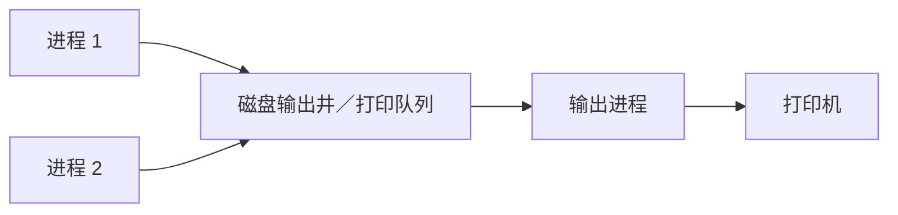
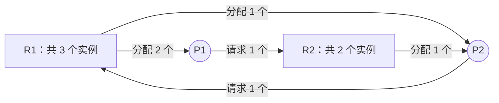

# 2.4 死锁

## 2.4.1 死锁的概念

### 一、什么是死锁？

**在并发环境下，一组进程因竞争资源而相互等待对方持有的资源，导致这些进程都无法继续向前推进的现象，称为死锁。** 若没有外力干预，这些进程无法自行解除这种等待。

例如，资源 R1、R2 各只有一个实例，且必须互斥使用：

| 步骤 | P1                              | P2                              |
| ---- | ------------------------------- | ------------------------------- |
| 1    | 取得 R1                         | 取得 R2                         |
| 2    | 申请 R2，但 R2 被 P2 占用，等待 | 申请 R1，但 R1 被 P1 占用，等待 |
| 3    | 等 P2 释放 R2，自己不释放 R1    | 等 P1 释放 R1，自己不释放 R2    |


**普通等待不等于死锁。** 如果资源持有者能继续运行并释放资源，等待者就可能继续推进；死锁的关键是形成了无法自行解除的相互等待。

发生死锁的可以只是系统中的一部分进程，**不意味着整个系统中的所有进程都停止运行**。哲学家进餐问题中，五人各持左筷子、等待右筷子，就是典型的资源死锁。

### 二、死锁、饥饿、死循环的区别

#### 1. 三者的含义

- **死锁**：一组进程相互等待对方掌握的资源，谁也无法继续推进。
- **饥饿**：某个进程长期得不到所需资源或服务，导致其无法向前推进，其他进程仍可能正常执行。
- **死循环**：进程执行时一直无法退出某个循环。可能是程序逻辑错误，也可能是有意设计的持续服务循环。

例如，在短进程优先（SPF）调度中，如果短进程源源不断地到来，长进程可能一直得不到处理机，发生饥饿；它不一定与其他进程构成相互等待。

#### 2. 对比

下表按课件的**多进程竞争资源、采用阻塞等待**的典型模型比较：

| 比较项           | 死锁                                                 | 饥饿                             | 死循环                                              |
| ---------------- | ---------------------------------------------------- | -------------------------------- | --------------------------------------------------- |
| 核心原因         | 相互等待资源，形成无法自行解除的依赖                 | 资源分配或调度长期不利于某个进程 | 循环无法退出                                        |
| 涉及进程数       | 典型情形至少涉及两个进程                             | 可以只有一个进程饥饿             | 可以只有一个进程陷入循环                            |
| 进程状态         | 在阻塞等待模型中处于阻塞态                           | 可以是阻塞态，也可以是就绪态     | 可以获得 CPU 并处于运行态，也可能被抢占而处于就绪态 |
| 其他进程能否推进 | 死锁集合中的进程不能自行推进，集合外的进程仍可能运行 | 其他进程通常仍可推进             | 其他进程可能仍可运行                                |
| 典型例子         | P1 持有 R1 等 R2，P2 持有 R2 等 R1                   | 长进程一直被短进程抢先           | 循环条件始终为真且没有有效退出路径                  |

三者都可能表现为任务无法按预期完成，但**有意设计且持续处理任务的无限循环不属于程序故障**。前面伪代码中的 `while (1)` 用于表示进程反复工作，不能仅凭它判断发生了死锁或错误。

**课件表述的适用范围：**

- “死锁至少有两个进程”针对本节的多进程资源竞争模型；实际编程中，单线程重复申请自己持有的非递归锁，也可能造成自死锁。
- “死锁进程一定阻塞”针对阻塞式等待；若采用自旋等待，逻辑上的死锁也可能持续占用 CPU。
- 课件用“死锁、饥饿是管理者的问题，死循环是被管理者的问题”区分资源管理与程序控制逻辑。实际中，**应用程序错误的加锁顺序也会导致死锁**，不能把死锁和饥饿都归咎于操作系统。

### 三、死锁产生的四个必要条件

**在本节的资源死锁模型中，发生死锁必须同时满足以下四个条件。只要破坏其中任意一个，就能预防此类死锁。**

| 必要条件           | 含义                                                                   | 哲学家进餐中的对应情况         |
| ------------------ | ---------------------------------------------------------------------- | ------------------------------ |
| **互斥条件**       | 至少存在必须独占使用的资源，一次只能由一个进程占用                     | 一根筷子不能同时被两个人使用   |
| **不剥夺条件**     | 资源未使用完时，不能被强行夺走，只能由持有者释放                       | 不能强行拿走邻居手中的筷子     |
| **请求和保持条件** | 已持有至少一个资源，又请求其他资源；请求未满足而等待时，仍保持已有资源 | 拿着左筷子不放，等待右筷子     |
| **循环等待条件**   | 存在资源等待环，每个进程都等待环中另一个进程持有的资源                 | 五人各等右邻居的筷子，首尾相接 |

**区分“不剥夺”和“请求和保持”：** 前者强调别人能否强行收回资源；后者强调自己等待新资源时是否仍持有旧资源。

互斥针对的是**具体资源及其使用方式**。不能简单地说“内存永远不会导致死锁”：只读共享数据可同时访问，但有限的可分配内存空间、受锁保护的共享数据仍可能涉及资源等待。

#### 循环等待一定意味着死锁吗？

**死锁一定存在循环等待；资源分配图中存在环，一般不一定已经死锁。** 是否能从环推出死锁，要看资源实例数及分配情况。

| 资源情况               | 资源分配图中存在环的含义                                     |
| ---------------------- | ------------------------------------------------------------ |
| 每类资源都只有一个实例 | 在本节不可剥夺的资源分配模型下，有环即可判定死锁             |
| 某些资源类有多个实例   | 有环只是必要条件，仍需判断是否有其他实例或环外进程可释放资源 |

例如，A 类资源有两个实例，B 类资源有一个实例：

1. P1 持有一个 A，申请 B。
2. P2 持有 B，申请一个 A。
3. P3 持有另一个 A，但它不再等待其他资源，可以完成并释放 A。

虽然资源分配图中存在 `P1 → B → P2 → A → P1` 的环，但 P3 释放 A 后，P2 可以取得 A 并完成，继而释放 B，让 P1 继续运行，因此**存在环却没有死锁**。

### 四、什么时候可能发生死锁？

#### 1. 对不可剥夺资源的竞争

打印机等资源不能在使用到一半时随意转交给另一进程，对这类资源的分配不当可能形成死锁。

CPU 可以通过保存上下文实现抢占。**单纯竞争可抢占的处理机通常不会形成这里的资源死锁**，但调度不公平可能导致饥饿。

#### 2. 进程推进顺序不当

P1、P2 分别按 `R1 → R2`、`R2 → R1` 申请资源，就可能在交错执行时各持一个资源、再等待对方的资源。

这里的“推进顺序非法”指请求、释放资源的顺序不当，**并不意味着执行了非法指令**。同样的程序在某些执行顺序下可能正常结束，在另一些交错顺序下可能死锁。

#### 3. 信号量使用不当

生产者—消费者问题中，如果先 `P(mutex)`，再执行可能阻塞的 `P(empty)` 或 `P(full)`，就可能持有缓冲区互斥权等待条件，而负责产生条件的另一方却无法进入缓冲区。

例如，缓冲区已满时：生产者持有 `mutex` 等空位，消费者等待 `mutex` 才能取出产品、产生空位，于是死锁。信号量及其许可也可以作为抽象资源进行分析。

**资源竞争只是背景，资源分配和请求顺序不当才可能使等待闭合成环。** 并不是有竞争、有阻塞或执行嵌套 P 就一定死锁。

### 五、死锁的处理策略

| 策略               | 核心思路                                         | 典型方法                               |
| ------------------ | ------------------------------------------------ | -------------------------------------- |
| **死锁预防**       | 事先规定资源申请规则，破坏一个或多个必要条件     | 一次申请全部资源、按统一顺序申请资源   |
| **死锁避免**       | 每次分配前判断分配后是否安全，避免进入不安全状态 | 银行家算法                             |
| **死锁检测与解除** | 允许死锁发生，通过检测发现，再采取措施解除       | 检测资源依赖，撤销进程、剥夺资源或回退 |

**预防和避免都在死锁发生之前采取措施，但依据不同：预防靠限制规则，避免靠动态判断安全性。** 检测与解除则允许系统先发生死锁。

“不安全状态”不等于“已经死锁”：不安全表示无法保证所有进程都能顺利完成，之后存在发生死锁的可能；具体安全性判断见 2.4.3。

## 2.4.2 死锁预防

**死锁预防的思路：通过限制资源的申请、使用或分配方式，破坏四个必要条件中的至少一个。** 不必同时破坏全部条件，但通常会付出资源利用率、并发性或实现复杂度方面的代价。

### 一、破坏互斥条件

#### 1. 方法：将独占资源在逻辑上改造为共享资源

如果某种资源不再要求进程独占持有，就可以消除由争用该独占资源形成的死锁因素。典型例子是 **SPOOLing（假脱机）技术**。

普通打印方式下，进程直接申请并占用打印机；其他进程只能等待。采用 SPOOLing 后，进程先将打印任务提交到磁盘上的输出井或打印队列，再由输出进程依次驱动打印机完成任务。



**多个用户进程可以提交打印请求，不必各自直接持有物理打印机。** 打印机在逻辑上表现为可共享的设备，但物理打印过程仍按顺序进行，并不是同一台打印机同时打印多个任务。

课件中的“请求立即被接收、不再阻塞等待”以输出井等缓冲空间可用为前提，表示不必等待物理打印机空闲后才能提交；不表示打印立即完成，也不保证队列满时仍无需等待。

#### 2. 缺点与适用范围

- **不是所有资源都能改造成共享资源。** 需要保持一致性的临界数据等仍必须互斥访问。
- 不能为了消除死锁而直接去掉必要的互斥保护，否则会产生并发访问错误。
- SPOOLing 消除的是用户进程直接独占打印机造成的等待因素，**不能由此断言整个系统不会再发生任何死锁**。

### 二、破坏不剥夺条件

#### 1. 两种方案

| 方案                       | 做法                                                                                               |
| -------------------------- | -------------------------------------------------------------------------------------------------- |
| **申请失败时释放已有资源** | 某进程请求新资源得不到满足时，要求它释放已经持有的所有相关资源，之后再重新申请                     |
| **由系统协助剥夺资源**     | 请求的资源被其他进程占有时，系统在能够保存和恢复状态等条件下收回资源，再重新分配，可结合优先级决定 |

第一种方案虽然由进程执行释放，但释放发生在**资源尚未使用完时，并由协议强制要求**，不再允许进程一直保持资源直到原工作完成。它同时也消除了“带着旧资源等待新资源”的情形，与破坏请求和保持条件存在交叉。

第二种方案不能理解为任意抢走资源。例如，CPU 可以保存寄存器等上下文后转交给其他进程；打印到一半的设备输出通常难以用同样的方式保存并恢复。

#### 2. 缺点

1. **实现复杂**：需要记录资源状态，处理保存、恢复或回退。
2. **可能使已有工作失效**：释放资源后，之前完成的部分操作可能需要重做，因此更适合容易保存和恢复状态的资源。
3. **增加系统开销**：反复申请、释放、保存和恢复，可能降低吞吐量。
4. **可能造成饥饿**：某进程若不断申请失败、释放已有资源再重试，就可能长期无法完成。

### 三、破坏请求和保持条件

#### 1. 方法：静态分配，一次申请全部资源

**进程运行前一次性申请所需的全部资源；只有全部满足才投入运行，否则等待且不占有其中任何资源。** 取得全部资源后，运行期间不再申请新的资源。

这样，进程要么尚未持有资源、等待整批分配，要么已经拿齐全部资源、不必再等待其他资源，从而消除“持有一部分，同时等待另一部分”的情形。

**“一次申请全部资源”必须落实为全有或全无的分配协议。** 不能只是连续写出多个 P，然后在其中某个 P 上阻塞；那样仍可能已经持有前面取得的资源。

#### 2. 缺点

- **资源利用率低**：某资源可能只在运行末尾短暂使用，却从一开始就被占有，其他进程不能使用。
- **降低并发程度**：一个进程等待整批资源凑齐时，部分空闲资源也无法先分配给它使用。
- **可能导致饥饿**：需要多种资源的进程可能一直等不到它们同时可用。

例如，A 类进程只需要 R1，B 类进程只需要 R2，C 类进程需要同时取得 R1、R2。如果调度和分配总让 A、B 类进程交错占用资源，C 类进程就可能一直等不到两种资源同时空闲。

> 注意：C 长期等待不等于系统死锁，因为 A、B 类进程仍可持续完成工作。这体现了“预防死锁不等于保证无饥饿”。

### 四、破坏循环等待条件

#### 1. 方法：顺序资源分配法

对资源建立一个**所有进程共同遵守的编号顺序**，规定进程只能按编号递增的方向申请资源；若同类资源具有相同编号，则该类所需实例应一次申请完。

**持有资源时，新申请的资源编号必须大于当前持有资源的编号。** 若需要反向申请较小编号的资源，应先释放违反顺序的已持有资源，再按规则重新申请。

例如，规定 `R1 < R2`，则所有同时需要两者的进程都必须先申请 R1，再申请 R2：

```text
P1：申请 R1 → 申请 R2 → 使用 → 释放
P2：申请 R1 → 申请 R2 → 使用 → 释放
```

如果 P1 先取得 R1，P2 会在申请 R1 时等待，不会先占有 R2，再反过来等待 P1 的 R1。

**不要求每个进程从 1 号资源开始，也不要求申请所有中间编号的资源。** 只需要 R3、R7 的进程可以直接按 `R3 → R7` 申请。课件中“拥有小编号才有资格申请大编号”应理解为顺序限制，而不是要求必须先持有不需要的资源。

#### 2. 为什么不会形成循环等待？

假设存在等待环，每个进程都持有前一进程所等待的资源，并继续申请更大编号的资源。那么沿环的资源编号必须满足：

```text
r1 < r2 < … < rn < r1
```

这与严格递增的顺序矛盾，因此不能形成循环等待。

**关键是全系统采用同一个顺序。** 若 P1 认为先 R1 后 R2，P2 却认为先 R2 后 R1，即使各自“有顺序”，仍可能死锁。

#### 3. 缺点

1. **增加新设备或资源类型不方便**：需要把它纳入已有全局顺序，可能需要调整编号及相关程序。
2. **可能浪费资源**：实际使用次序可能与编号次序不一致，必须提前申请尚未使用的资源。
3. **增加编程负担**：程序员必须持续遵守全局申请顺序，尤其在多个模块组合时。

### 五、四种预防方法对比

| 破坏的条件     | 核心办法                                    | 主要代价或局限                                 |
| -------------- | ------------------------------------------- | ---------------------------------------------- |
| **互斥**       | 将独占资源逻辑上改造成共享资源，如 SPOOLing | 很多资源必须保持互斥，适用范围有限             |
| **不剥夺**     | 申请失败则释放已有资源，或由系统协助剥夺    | 保存、恢复复杂，可能重做工作，开销大，可能饥饿 |
| **请求和保持** | 运行前一次取得全部资源，否则不占资源地等待  | 资源利用率低，可能饥饿                         |
| **循环等待**   | 按统一编号递增申请资源，同类资源一次申请完  | 扩展不便，可能提前占用资源，编程麻烦           |

## 2.4.3 死锁避免

**死锁避免的核心：在每次分配资源前，判断分配后的系统是否仍处于安全状态；只有安全，才正式分配。** 银行家算法是典型的死锁避免算法。

### 一、安全序列：从银行贷款理解

#### 1. 初始状态

假设银行共有 100 亿元，向 B、A、T 三家企业贷款。企业提前声明最大需求，只有资金满足需求、完成经营后，才能归还全部贷款。这里是用于说明资源分配的简化模型。

| 企业 | 最大需求 | 已借走 | 最多还会借 |
| ---- | -------- | ------ | ---------- |
| B    | 70       | 20     | 50         |
| A    | 40       | 10     | 30         |
| T    | 50       | 30     | 20         |

银行剩余资金为 `100 − (20 + 10 + 30) = 40` 亿元。

**最大需求之和可以超过资源总量。** 不要求同时满足所有企业，只要能让它们按某个顺序完成、归还资金，再将资金借给其他企业即可。

#### 2. A 再申请 20 亿元：安全

试着借给 A 后，银行剩余 20 亿元：

| 企业 | 最大需求 | 已借走 | 最多还会借 |
| ---- | -------- | ------ | ---------- |
| B    | 70       | 20     | 50         |
| A    | 40       | 30     | 10         |
| T    | 50       | 30     | 20         |

可以找到顺序 **T → B → A**：

| 完成的企业 | 完成前银行可用资金 | 再借出 | 企业归还全部贷款 | 完成后银行可用资金 |
| ---------- | ------------------ | ------ | ---------------- | ------------------ |
| T          | 20                 | 20     | 50               | 20 − 20 + 50 = 50  |
| B          | 50                 | 50     | 70               | 50 − 50 + 70 = 70  |
| A          | 70                 | 10     | 40               | 70 − 10 + 40 = 100 |

因此，这次分配后仍能保证所有企业完成，是安全的。**安全序列不唯一**，例如这里 `A → T → B` 也可行。

#### 3. B 再申请 30 亿元：不安全

从初始状态出发，改为借给 B 30 亿元，银行只剩 10 亿元：

| 企业 | 最大需求 | 已借走 | 最多还会借 |
| ---- | -------- | ------ | ---------- |
| B    | 70       | 50     | 20         |
| A    | 40       | 10     | 30         |
| T    | 50       | 30     | 20         |

剩余 10 亿元无法满足任何一家企业的剩余最大需求，找不到能保证所有企业完成的顺序，因此分配后处于**不安全状态**。

如果此后 B、A、T 都再申请 20 亿元，并在请求满足前保持已有资金、不归还，就会陷入相互等待。银行家算法应在分配前拒绝这次试探方案，让 B 等待。

> 课件左表的“20 + 30 = 60”是笔误，应为 **20 + 30 = 50**；相应剩余需求为 `70 − 50 = 20`。

### 二、安全序列、安全状态、不安全状态与死锁

**安全序列**：一个包含所有进程的排列。在该顺序下，每个进程的剩余最大需求，都能由当前可用资源与排在它前面的进程完成后释放的资源满足，从而使所有进程依次完成。

| 概念           | 判断依据或含义                                             |
| -------------- | ---------------------------------------------------------- |
| **安全状态**   | 至少存在一个安全序列，能够保证所有进程按某种顺序完成       |
| **不安全状态** | 不存在安全序列，无法保证所有进程都能完成，但不一定已经死锁 |
| **死锁状态**   | 已有一组进程相互等待资源，无法自行继续推进                 |

在本节资源分配模型及最大需求声明有效的前提下：

- **安全状态一定不是死锁状态**；持续只接受保持安全的分配，可以避免资源死锁。
- **死锁状态一定是不安全状态**。
- **不安全状态不一定是死锁状态**，只是存在发生死锁的可能。

不安全状态下，进程实际需求可能小于声明的上限，或者提前释放部分资源，使系统仍能继续执行，甚至重新回到安全状态。银行家算法按声明的**最大需求**进行保守判断，不依赖这些有利情况。

**安全序列用于证明存在一种可完成的顺序，不要求系统实际运行时严格串行执行这一顺序。** 找到一个安全序列即可判定安全，不必枚举全部序列。

**考题判断：银行家算法用于避免死锁，不能凭“找不到安全序列”判定系统已经死锁。** 它检查的是 `Need = 最大需求量 − 已分配量`，也就是进程将来最多还可能要多少，而不是只看当前实际提出的请求。

- **有安全序列 ⇒ 安全 ⇒ 当前没有死锁。**
- **没有安全序列 ⇒ 不安全，但不一定已经死锁。**
- **已经死锁 ⇒ 一定不安全。**

### 三、银行家算法的数据结构

银行家算法由 Dijkstra 提出，用于在资源分配时避免死锁。使用它需要事先知道各进程对各类资源的最大需求，并在进程完成后收回其占用的资源。

银行例子只有一种资源；操作系统往往有多种资源，因此把单个数扩展成**向量**。设系统有 `n` 个进程、`m` 类资源：

| 名称         | 维度   | 含义                                                  |
| ------------ | ------ | ----------------------------------------------------- |
| `Max`        | n × m  | `Max[i][j]`：进程 Pi 对第 j 类资源的最大需求量        |
| `Allocation` | n × m  | `Allocation[i][j]`：当前已分配给 Pi 的第 j 类资源数量 |
| `Need`       | n × m  | `Need[i][j]`：Pi 最多还需要的第 j 类资源数量          |
| `Available`  | 长度 m | `Available[j]`：当前系统可用的第 j 类资源数量         |
| `Request_i`  | 长度 m | `Request_i[j]`：Pi 本次申请的第 j 类资源数量          |

基本关系：

```text
Need[i][j] = Max[i][j] − Allocation[i][j]
Available[j] = Total[j] − Σ Allocation[i][j]    （对所有进程 i 求和）
```

**向量比较必须逐分量进行。** `X ≤ Y` 表示每一类资源都满足 `X[j] ≤ Y[j]`，不能比较资源数量之和。例如，`(1, 2, 2)` 不小于等于 `(3, 3, 1)`，因为第三类资源不足。

#### 例：5 个进程、3 类资源

资源总量为 `(10, 5, 7)`，各向量依次表示 R0、R1、R2 的数量。

| 进程 | 最大需求 Max | 已分配 Allocation | 最多还需要 Need |
| ---- | ------------ | ----------------- | --------------- |
| P0   | (7, 5, 3)    | (0, 1, 0)         | (7, 4, 3)       |
| P1   | (3, 2, 2)    | (2, 0, 0)         | (1, 2, 2)       |
| P2   | (9, 0, 2)    | (3, 0, 2)         | (6, 0, 0)       |
| P3   | (2, 2, 2)    | (2, 1, 1)         | (0, 1, 1)       |
| P4   | (4, 3, 3)    | (0, 0, 2)         | (4, 3, 1)       |

```text
已分配总量 = (7, 2, 5)
Available = (10, 5, 7) − (7, 2, 5) = (3, 3, 2)
```

### 四、安全性算法：如何找安全序列？

安全性算法用于判断**某个给定状态是否安全**，既可以检查当前状态，也可以检查试探分配后的状态。

#### 1. 辅助数据

- `Work`：长度为 m 的工作向量，初值为 `Available`，表示模拟执行时可用的资源。
- `Finish`：长度为 n 的布尔数组，初值均为 `false`，表示各进程是否已在模拟中完成。
- `Sequence`：记录找到的安全序列。

#### 2. 检查步骤

1. 初始化 `Work = Available`，所有 `Finish[i] = false`。
2. 寻找一个尚未完成且满足 **`Need[i] ≤ Work`** 的进程 Pi。
3. 假设 Pi 获得剩余所需资源、运行完成并释放全部资源，更新 `Work = Work + Allocation[i]`，置 `Finish[i] = true`，将 Pi 加入安全序列。
4. 重复寻找。所有进程都完成则安全；若还有未完成进程，却找不到任何满足条件的进程，则不安全。

**为什么更新时只加 Allocation，不加 Max，也不再减 Need？**

```text
模拟完成后的可用资源
= Work − Need[i] + (Allocation[i] + Need[i])
= Work + Allocation[i]
```

模拟借出的 `Need[i]` 会随进程完成而归还，两者抵消，净增加量就是进程原来持有的 `Allocation[i]`。检查过程只修改辅助变量，**不会真的执行进程或释放其资源，也不修改真实的 Available**。

#### 3. 完整演算

对上表从 `Work = (3, 3, 2)` 开始，每轮从编号较小的未完成进程检查，可得到 **P1 → P3 → P0 → P2 → P4**：

| 步骤 | 选择进程 | 完成前 Work | Need      | 归还原已分配 Allocation | 完成后 Work |
| ---- | -------- | ----------- | --------- | ----------------------- | ----------- |
| 1    | P1       | (3, 3, 2)   | (1, 2, 2) | (2, 0, 0)               | (5, 3, 2)   |
| 2    | P3       | (5, 3, 2)   | (0, 1, 1) | (2, 1, 1)               | (7, 4, 3)   |
| 3    | P0       | (7, 4, 3)   | (7, 4, 3) | (0, 1, 0)               | (7, 5, 3)   |
| 4    | P2       | (7, 5, 3)   | (6, 0, 0) | (3, 0, 2)               | (10, 5, 5)  |
| 5    | P4       | (10, 5, 5)  | (4, 3, 1) | (0, 0, 2)               | (10, 5, 7)  |

所有进程均可加入安全序列，因此当前状态安全。最终 `Work` 等于系统资源总量，也可用于核对计算。

> 课件第四张图中的 `(7, 4, 3)` 是模拟 P1、P3 完成后的可用资源；初始可用资源仍为 `(3, 3, 2)`。

#### 4. 伪代码

```text
Work = copy(Available)
Finish[0...n−1] = false
Sequence = []

while length(Sequence) < n:
    找到一个 i，使 Finish[i] == false 且 Need[i] ≤ Work
    if 找不到:
        return 不安全
    Work = Work + Allocation[i]
    Finish[i] = true
    将 Pi 追加到 Sequence

return 安全, Sequence
```

某个进程暂时不满足条件时，应继续检查其他进程，不能立即判定不安全。已完成的进程不能重复加入序列或重复回收资源。

满足条件的进程可以任选一个，无须回溯：它模拟完成后只会增加或保持各类可用资源，不会使其他进程更难完成。朴素实现最多进行 n 轮扫描，每轮检查 n 个进程的 m 类资源，时间复杂度为 **O(n²m)**。

### 五、银行家算法：如何处理一次资源请求？

进程 Pi 提出请求向量 `Request_i` 后，依次进行以下检查。请求量应为非负数，所有比较均逐分量进行。

#### 1. 检查是否超过声明的剩余需求

```text
Request_i ≤ Need[i]
```

若不满足，说明加上已有分配后会超过事先声明的最大需求，应报告请求错误。**这里比较的是 Need，不是 Max。**

#### 2. 检查当前资源是否足够

```text
Request_i ≤ Available
```

若不满足，当前资源不足，让 Pi 等待，不进行试探分配。即使该请求量在声明范围内，也不能凭空分配资源。

#### 3. 试探分配

前两项都通过后，先在用于判断的状态中进行更新：

```text
Available = Available − Request_i
Allocation[i] = Allocation[i] + Request_i
Need[i] = Need[i] − Request_i
```

**试探分配只是为安全性检查准备数据，并非已经正式授予资源。** `Max` 保持不变，其他进程的 `Allocation`、`Need` 也不变。

#### 4. 执行安全性算法

- **安全**：接受此次分配，保留试探后的数据，正式授予资源。
- **不安全**：撤销试探，恢复原数据，让 Pi 等待。

若直接修改了原数据，恢复操作为：

```text
Available = Available + Request_i
Allocation[i] = Allocation[i] − Request_i
Need[i] = Need[i] + Request_i
```

**“有足够资源满足本次请求”不等于“分配后安全”。** 还必须检查分配后，是否存在使所有进程都能完成的安全序列。

#### 5. 课件中的请求判断

第五张图给出的状态中，P0 的 `Allocation = (2, 2, 1)`、`Need = (5, 3, 2)`，其他进程数据与前表相同，因此：

```text
Available = (1, 2, 1)
Request_0 = (2, 1, 1)
```

1. `(2, 1, 1) ≤ (5, 3, 2)`，没有超过 P0 的剩余需求，通过第一步。
2. 第一类资源请求 2 个，当前只有 1 个，不满足 `Request_0 ≤ Available`。
3. 因此 **P0 必须等待，不进入试探分配和安全性检查**。

注意区分请求发生前的状态：若从前面的初始表出发，P0 首次请求 `(2, 1, 1)`，前两步均可通过，试探后正好得到第五张图中的表格。此时存在安全序列 **P3 → P1 → P0 → P2 → P4**，所以首次请求可以批准；若已处于图中的状态，P0 又提出同样的请求，则应按上述步骤等待。

### 六、同类资源数量与保证无死锁的条件

#### 1. 例题与选项

某系统有 $m$ 个同类资源供 $n$ 个进程共享，若每个进程最多申请 $k$ 个资源（$k\ge 1$），采用银行家算法分配资源。为保证系统不发生死锁，则各进程的最大需求量之和应（ ）。

- A. 等于 $m$
- B. 等于 $m+n$
- C. 小于 $m+n$
- D. 大于 $m+n$

**按本题考查的“最坏分配下仍能保证无死锁”的资源数量条件，选 C。** 这里 $m$ 表示同类资源的**总个数**，不是前面银行家算法矩阵中的资源种类数。

#### 2. 推导：每个进程都只差 1 个资源

考虑最坏情况：每个进程都已经拿到了 $k-1$ 个资源，但还差 1 个才能完成。此时已经占用的资源数为：

$$
n(k-1)
$$

要让这种局面仍能继续推进，必须还剩下至少 1 个资源。把这个资源给某一个进程，它就拥有：

$$
(k-1)+1=k
$$

个资源，可以完成并释放它占用的全部资源，其他进程就能继续完成。因此，要保证最坏分配下也不会因资源不足而死锁，需要：

$$
m\ge n(k-1)+1
$$

展开、移项得：

$$
m\ge nk-n+1
$$

$$
nk\le m+n-1
$$

因为资源数量都是整数，所以等价于：

$$
\boxed{nk<m+n}
$$

所有进程的最大需求量之和就是 $nk$，因此：

$$
\boxed{\text{各进程最大需求量之和}<m+n}
$$

也可以反过来理解：如果所有进程都还未达到最大需求，每个进程最多持有 $k-1$ 个资源，合计最多持有 $n(k-1)$ 个。资源总数比这个数多至少 1 个，就不会出现“资源已经分光、所有进程却都还缺资源”的僵局。这里按进程获得所需资源后能完成并释放资源、调度能正常推进的模型讨论。

#### 3. 不要把数量条件当作银行家算法的必要条件

**题干中“采用银行家算法”与上述最坏分配推导要区分。** $nk<m+n$ 是不依赖银行家算法限制分配、仅靠资源数量就保证无死锁的条件；它不是银行家算法能够避免死锁的必要条件。

例如，$m=3$、$n=2$、$k=3$ 时，最大需求之和为 $6$，不满足 $6<3+2$，但银行家算法仍可先满足一个进程，待其完成并释放资源后再满足另一个进程，从而避免死锁。银行家算法从安全状态出发，只批准保持安全的分配，能阻止系统进入危险的分配局面。因此，**本题按资源数量保证的考查意图记 C，但不能据此认为不满足该不等式时，银行家算法就一定无法避免死锁。**

## 2.4.4 死锁检测与解除

### 一、基本思路

**死锁检测与解除允许系统先发生死锁，再通过检测发现死锁，并采取措施恢复进程的推进。** 它与预防、避免的处理时机不同。

| 策略           | 核心思路                                         | 是否允许死锁发生 |
| -------------- | ------------------------------------------------ | ---------------- |
| 死锁预防       | 用事先规定的规则破坏死锁的必要条件，属于静态策略 | 不允许           |
| 死锁避免       | 每次分配前动态检查安全性，避免进入不安全状态     | 不允许           |
| 死锁检测与解除 | 检查当前是否已经死锁，发现后再解除               | 允许发生，再处理 |

这里“静态”强调预先限制申请规则，不表示运行期间完全不需要执行或检查这些规则。

如果系统不采用预防或避免措施，可能发生死锁，需要提供两类算法：

1. **死锁检测算法**：检查资源分配与请求情况，确定是否已经发生死锁。
2. **死锁解除算法**：在检测到死锁后，通过回收资源、终止进程或回退等方式打破等待关系。

### 二、资源分配图

检测死锁需要保存**资源的请求和分配信息**。本节用资源分配图描述这些信息，再通过简化图进行检测。

#### 1. 两种结点

| 结点         | 常见画法      | 含义                                                       |
| ------------ | ------------- | ---------------------------------------------------------- |
| **进程结点** | 圆形，标记 Pi | 一个结点对应一个进程                                       |
| **资源结点** | 矩形，标记 Rj | 一个结点对应一类资源，矩形中的小圆点代表该类资源的各个实例 |

**一类资源可以有多个实例。** 例如 R1 矩形中有 3 个小圆点，表示 R1 类资源共有 3 个实例，而不是 3 类资源。

#### 2. 两种有向边

| 边         | 方向      | 含义                                              |
| ---------- | --------- | ------------------------------------------------- |
| **请求边** | `Pi → Rj` | Pi 正在申请 Rj 类资源，每条边代表申请一个实例     |
| **分配边** | `Rj → Pi` | 一个 Rj 实例已分配给 Pi，每条边代表已分配一个实例 |

可记为：**进程指向资源是“想要”；资源指向进程是“已有”。** 同类资源的空闲实例数等于该类资源总量减去已经分配的实例数。

#### 3. 课件中的初始例子

R1 有 3 个实例，R2 有 2 个实例，分配与请求如下：

| 进程 | 已分配 (R1, R2) | 当前请求 (R1, R2) |
| ---- | --------------- | ----------------- |
| P1   | (2, 0)          | (0, 1)            |
| P2   | (1, 1)          | (1, 0)            |

```text
Available = (3, 2) − (2, 0) − (1, 1) = (0, 1)
```

下图将同方向的多条边合并，用边上的数量表示实例数：



图中虽然有环 `P1 → R2 → P2 → R1 → P1`，但 R2 还有 1 个空闲实例，可满足 P1 的请求，因此**不能仅凭有环就判定死锁**。

#### 4. 环路与死锁的关系

**若每种资源都只有一个实例，且资源分配图中出现有向环路，则系统处于死锁状态。** 环上的进程各自等待下一个进程占有的资源，又没有同类的其他实例可供分配，因而无法打破等待。

| 资源分配图的情况 | 能否判定死锁 |
| ---------------- | ------------ |
| 没有有向环路 | 没有死锁 |
| 有有向环路，且每种资源只有一个实例 | 一定死锁；环上的进程陷入循环等待 |
| 有有向环路，且资源可能有多个实例 | 不一定死锁，还需通过图的简化判断 |

**速记：单实例，有环就死锁；多实例，有环未必死锁。** “系统处于死锁状态”不要求系统中的所有进程都死锁。

### 三、死锁检测：简化资源分配图

#### 1. 简化规则

在本节模型中，如果某进程的**当前请求**都能由空闲资源满足，就可以模拟它取得资源、继续执行直至完成，随后释放全部资源。

一次简化包含：

1. 找到一个**既不是孤立结点，当前请求又能全部满足**的进程 Pi。
2. 模拟 Pi 完成，消去与它相连的所有请求边和分配边，使它成为孤立结点。
3. 将 Pi 原来持有的资源计入空闲资源，再检查其他进程。
4. 重复，直到所有边都消去，或再也找不到可以简化的进程。

“请求能满足”要求**所有资源类别的请求量都不超过相应空闲量**，不能只看其中一条请求边，也不能比较资源数量的总和。没有请求边但持有资源的进程也可简化；已经孤立的结点不需要处理。

模拟中可用工作向量 `Work` 记录资源，初值为 `Available`：

```text
选择条件：CurrentRequest[i] ≤ Work
模拟完成：Work = Work + Allocation[i]
```

这里 `CurrentRequest[i]` 表示进程**当前尚未满足的请求**。与安全性算法一样，临时授予的资源随后归还，相互抵消，因此净增加量是进程原来持有的 `Allocation[i]`。

#### 2. 无死锁例子的完整简化

对上一节表格，初始 `Work = (0, 1)`：

| 步骤 | 选择进程 | 简化前 Work | 当前请求 | 能否满足 | 简化后 Work              |
| ---- | -------- | ----------- | -------- | -------- | ------------------------ |
| 1    | P1       | (0, 1)      | (0, 1)   | 能       | (0, 1) + (2, 0) = (2, 1) |
| 2    | P2       | (2, 1)      | (1, 0)   | 能       | (2, 1) + (1, 1) = (3, 2) |

先消去 P1 的所有边，再消去 P2 的所有边，最后两个进程都成为孤立结点。**所有边均可消去，资源分配图可完全简化，当前没有死锁。**

简化只是检测时的模拟，不代表检测算法真的终止了进程或收回了资源。

#### 3. 有死锁的例子

课件中的另一个图保留相同的资源总量和分配情况，但将 P1 对 R2 的请求改为 **2 个实例**，并增加一个孤立进程 P3：

| 进程 | 已分配 (R1, R2) | 当前请求 (R1, R2) |
| ---- | --------------- | ----------------- |
| P1   | (2, 0)          | (0, 2)            |
| P2   | (1, 1)          | (1, 0)            |
| P3   | (0, 0)          | (0, 0)            |

初始可用资源仍为 `(0, 1)`：

- P1 需要 2 个 R2，当前仅空闲 1 个，不能满足。
- P2 需要 1 个 R1，当前空闲 0 个，不能满足。
- P3 是孤立结点，没有资源可释放，不能改变 P1、P2 的等待情况。

因此无法继续消边，图**不可完全简化**，P1、P2 发生死锁。P3 不属于死锁进程，说明**系统发生死锁，不等于所有进程都死锁**。

#### 4. 死锁定理

**在本节资源分配与请求模型中，系统处于死锁状态，当且仅当资源分配图不可完全简化。**

| 最终结果                     | 结论         |
| ---------------------------- | ------------ |
| 所有边均可消去，图可完全简化 | 当前没有死锁 |
| 已无法继续简化，但仍有边存在 | 当前存在死锁 |

按课件的判定口径，充分简化后仍连接着边的进程，就是被死锁困住的进程；已经成为孤立结点的进程不在其中。**不能把“本轮某个进程不能简化”直接当作死锁**，应先尝试其他进程，直到再无进展。

### 四、死锁检测与安全性检查的区别

两者都可以通过“找能推进的进程 → 模拟完成 → 回收资源”来分析，但检查的数据和回答的问题不同。

| 比较项               | 安全性检查                           | 死锁检测                               |
| -------------------- | ------------------------------------ | -------------------------------------- |
| 要回答的问题         | 能否保证所有进程满足最大需求并完成？ | 按当前请求与分配，是否已经死锁？       |
| 比较的数据           | 剩余最大需求 `Need[i]`               | 当前尚未满足的请求 `CurrentRequest[i]` |
| 是否需要最大需求信息 | 需要                                 | 本节图简化方法不需要                   |
| 无法继续模拟时       | 不安全，未必已经死锁                 | 图不可完全简化，存在死锁               |
| 典型用途             | 银行家算法试探分配后的判断           | 检测已经发生的资源死锁                 |

**当前请求不一定等于剩余最大需求。** 一个进程现在只申请 1 个资源，未来可能还会申请更多；检测关注当前等待关系，安全性检查则按照最大需求进行保守判断。

课件把可完全简化类比为“能找到一个安全序列”，是为了说明逐个完成的共同思路；严格区分时，**图的简化顺序不自动等于银行家算法按 Need 得到的安全序列**。当前没有死锁，也不代表系统一定处于安全状态。

#### 判断题：银行家算法与死锁检测

| 说法 | 判断 | 原因 |
| ---- | ---- | ---- |
| Ⅰ：银行家算法会限制用户申请资源的顺序，死锁检测不会 | **错** | 银行家算法不规定申请资源种类的先后顺序，而是在每次申请时检查分配后是否仍安全。规定资源申请顺序的是死锁预防中的顺序资源分配法。 |
| Ⅱ：银行家算法需要进程运行所需的资源总量信息，死锁检测不需要 | **对** | 银行家算法需要预先知道各进程的最大需求量；检测当前死锁看的是当前占有量和实际请求量，不需要声明未来的最大需求。 |
| Ⅲ：银行家算法不会批准可能导致死锁的分配，死锁检测方法可能批准 | **对** | 避免方法在分配前做安全性检查；采用检测策略的系统允许先分配，之后再检查是否已经死锁。这里的“批准”指该策略下的分配机制，不是检测算法本身负责分配。 |

**结论：Ⅱ、Ⅲ正确，Ⅰ错误。** 银行家算法会让不安全的请求等待，但这不等于强制进程按预设的资源编号顺序申请。

### 五、死锁的解除

检测到死锁后，需要通过外部干预打破等待关系。主要方法包括资源剥夺、撤销进程和进程回退。

#### 1. 资源剥夺法

**挂起某些死锁进程，收回它们占有的部分资源，再把资源分配给其他死锁进程，使后者能够继续推进。**

- 需要考虑资源能否剥夺，以及被剥夺进程的状态如何保存、恢复，必要时结合回退。
- 不能简单地把任意资源强行转交。例如，正在打印的输出通常难以恢复到先前状态。
- **挂起本身不等于释放全部资源**，必须实际回收造成等待的相关资源才能打破死锁。
- 应避免反复选择同一进程作为剥夺对象，否则可能使它长期得不到资源，发生饥饿。

#### 2. 撤销进程法（终止进程法）

**强制撤销部分或全部死锁进程，回收它们占有的资源。**

| 方式                       | 特点                                                   |
| -------------------------- | ------------------------------------------------------ |
| 一次撤销全部死锁进程       | 处理直接，但可能丢失大量已完成的工作                   |
| 逐个撤销进程，直到死锁解除 | 有机会减少损失，但每次撤销后需要重新判断死锁是否仍存在 |

优点是实现相对简单；缺点是代价可能很大。某进程即使已接近完成，一旦被终止，之后也可能需要从头执行。

**不一定需要撤销全部死锁进程，更不需要终止系统中的全部进程。** 回收足够资源、打破死锁关系即可。

#### 3. 进程回退法

**让一个或多个死锁进程回退到足以解除死锁的先前状态，并释放回退所涉及的资源。**

这种方法要求系统事先记录进程的历史状态，设置检查点或恢复点，才能恢复到一致状态并重新执行。

与直接撤销相比，回退可以保留检查点之前的工作，但需要付出记录、保存和恢复的开销。已经发生且难以撤销的外部操作，也会限制回退的适用范围。

回退后应调整资源分配或执行安排；如果完全重复原来的请求与分配过程，仍可能再次发生死锁。

#### 4. 如何选择被剥夺、撤销或回退的进程？

应综合考虑解除死锁的效果与代价，而不是只看一个指标。

| 考虑因素             | 选择时的权衡                                   |
| -------------------- | ---------------------------------------------- |
| 进程优先级           | 通常优先保护高优先级进程                       |
| 已执行时间           | 已投入的工作越多，撤销或回退的损失可能越大     |
| 距离完成还需多久     | 接近完成的进程可能值得保留，让其完成后释放资源 |
| 已占用多少、哪些资源 | 回收资源是否足以打破死锁，资源是否适合剥夺     |
| 交互式还是批处理进程 | 考虑用户响应、业务影响及重启成本               |

为防止饥饿，还可以把一个进程过去被剥夺、撤销或回退的次数纳入选择依据，避免总让同一个进程付出代价。
