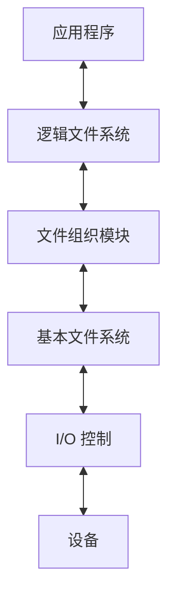

# 4.1 文件系统基础

## 4.1.1 文件的基本概念

### 一、文件与文件系统

**文件**：具有名称的一组逻辑上相关的信息集合，通常保存在硬盘、固态硬盘等持久性存储设备中，是用户进行数据存储和 I/O 操作的基本对象。

**文件系统**：操作系统中统一管理文件和目录的子系统，提供创建、读写、删除、组织、共享与保护等功能，屏蔽数据在存储设备上的具体位置和组织细节。

- 进程是资源分配与调度相关的基本概念；文件是信息存储与访问相关的基本概念。
- 文件不仅有**数据内容**，还关联名称、位置、权限等**管理信息（元数据）**。
- 文件可长期保存，并在权限控制下供多个用户或进程共享。

### 二、数据项、记录与文件

| 层次       | 含义                                           | 示例                     |
| ---------- | ---------------------------------------------- | ------------------------ |
| 基本数据项 | 描述对象某个属性的一个值，是数据的最小逻辑单位 | 学号、姓名               |
| 组合数据项 | 多个基本数据项的组合                           | 由省、市、街道组成的地址 |
| 记录       | 一组相关数据项，描述一个对象的相关属性         | 一名学生的信息           |
| 文件       | 一组相关信息的集合，可有结构或无结构           | 学生记录文件、文本文件   |

**“数据项 → 记录 → 文件”适用于记录式文件；不能认为所有文件都必须由显式记录组成。** 流式文件在系统看来是一串字节，具体含义由应用程序解释。

### 三、文件属性（元数据）

| 属性           | 作用与注意点                                             |
| -------------- | -------------------------------------------------------- |
| 名称           | 供用户识别；同一目录内不能重名，不同目录可以重名         |
| 类型           | 区分文件种类，辅助确定处理方式                           |
| 创建者、所有者 | 分别表示创建文件的用户与当前拥有文件的用户，二者可能不同 |
| 位置           | 定位文件数据在外存中的位置，如数据块地址信息             |
| 大小           | 文件当前长度，通常以字节计；不一定等于实际分配空间       |
| 保护信息       | 规定读、写、执行等访问权限                               |
| 时间信息       | 创建、最近修改、最近访问等时间，具体种类依系统而定       |

属性通常由 **FCB / inode 等结构**管理；采用 inode 的系统将**文件名放在目录项中**，并非全部属性都直接放在 inode 中。

### 四、文件的分类

| 分类依据       | 常见类型                                   |
| -------------- | ------------------------------------------ |
| 性质与用途     | 系统文件、用户文件、库文件                 |
| 数据形式       | 源文件、目标文件、可执行文件               |
| 存取控制属性   | 只读文件、读写文件、可执行文件             |
| 组织与处理方式 | 普通文件、目录文件、特殊文件（如设备文件） |

不同分类维度可以交叉；“可执行文件”不意味着它一定采用有结构的记录组织方式。

## 4.1.2 文件系统结构

文件系统需要解决两类问题：**向上提供文件、目录和操作接口；向下把文件的逻辑组织映射到物理存储。**

| 层次（由上到下） | 核心职责                                                 | 记忆重点         |
| ---------------- | -------------------------------------------------------- | ---------------- |
| 逻辑文件系统     | 管理目录、元数据、FCB 与文件保护，根据文件名定位文件信息 | 名称、属性、权限 |
| 文件组织模块     | 将文件逻辑块号转换为物理块号，管理空闲块并按需分配       | 块映射、空间分配 |
| 基本文件系统     | 发出通用的物理块读写命令，管理数据和元数据的缓冲区       | 块读写、缓冲     |
| I/O 控制         | 包括设备驱动程序与中断处理程序，将通用请求转换为设备操作 | 驱动、中断       |

**逻辑文件系统管理“文件及其描述信息”，文件组织模块解决“文件的块放在哪里”。** 上述是教材分层模型，具体系统的模块边界可以不同。

## 4.1.3 文件的逻辑结构

**逻辑结构**：用户视角下，文件内部数据的组织方式。  
**物理结构**：文件数据在外存中的实际存放方式。

二者属于不同层次：**顺序文件、索引文件等是逻辑组织；连续分配、链接分配、索引分配是物理组织。** 逻辑上有序不代表物理块必须连续。

文件按逻辑结构分为**无结构文件**和**有结构文件**两大类。有结构文件再按记录的组织方式分为顺序文件、索引文件、索引顺序文件和直接文件（散列文件）。

### 一、无结构文件（流式文件）

由连续的字节流组成，没有由文件系统规定的记录边界，通常按字节偏移和读写指针访问。文本、源程序、可执行文件等常采用这种形式。

- 优点：组织简单、解释灵活，由应用程序定义内容格式。
- 查找某条业务记录或某个关键字，通常需要应用自行解析、扫描或建立索引。
- **无结构不等于不能随机访问**：可以按字节偏移定位，但不能仅凭“记录号”直接知道业务记录的位置。

### 二、有结构文件（记录式文件）

由若干记录组成，每条记录包含若干数据项。

#### 1. 记录的长度：定长与变长

这是按**记录长度**划分；后面的顺序、索引等则按**记录组织方式**划分，属于两个不同维度。

| 记录形式 | 特点                                     | 定位方式                         |
| -------- | ---------------------------------------- | -------------------------------- |
| 定长记录 | 每条记录长度相同，数据项位置通常固定     | 可由记录号直接计算偏移           |
| 变长记录 | 记录长度不一，可能因数据项数量或长度不同 | 通常需扫描前面的记录，或借助索引 |

统一采用 **记录从 0 编号、文件内字节偏移从 0 开始** 的约定：

$$
\text{定长记录：}\quad A_i=iL
$$

$$
\text{变长记录：}\quad A_i=\sum_{j=0}^{i-1}L_j,\qquad A_0=0
$$

其中 $L$ 为定长记录长度，$L_j$ 为第 $j$ 条记录长度。若题目从 1 编号，定长公式改为 $(i-1)L$。**这里算的是文件内偏移，定位磁盘块还需要物理地址映射。**

#### 2. 顺序文件

记录按线性次序排列，可以使用定长或变长记录。

| 组织形式 | 排列依据             | 按关键字查找                         |
| -------- | -------------------- | ------------------------------------ |
| 串结构   | 记录存入的先后次序   | 通常顺序扫描                         |
| 顺序结构 | 记录按关键字有序排列 | 定长且支持按位置访问时，可用折半查找 |

- **适合批量、顺序处理**，也适合磁带等顺序存储设备。
- 紧凑排列时，插入、删除记录可能需要移动后续记录，维护代价较大。
- **按记录号直接定位**与**按关键字查找**不同：定长记录能计算偏移，不代表无序关键字可以折半查找。

#### 3. 索引文件

为每条记录建立一个索引项，记录关键字、记录位置及必要的长度等信息。索引项通常为定长，可按关键字排序。

**查找过程：查索引表 → 得到记录位置 → 访问目标记录。**

- 特别适合对变长记录进行快速定位；索引按关键字有序时可进行折半查找。
- 可围绕不同检索字段建立不同索引。
- 代价：每条记录都有索引项，占额外空间；记录增删改时还需维护索引。

#### 4. 索引顺序文件

结合顺序文件与索引文件：**记录分组，每组建立一个索引项，先查索引定位组，再在组内顺序查找。**

- 索引项保存该组的代表关键字及起始位置。
- 组间按关键字范围有序；教材模型允许组内无序。
- 相比逐记录建索引，索引表更小；记录很多时可进一步建立多级索引。

设 $N$ 条记录均匀分成 $m$ 组，每组约 $N/m$ 条。若**索引表和组内都用顺序查找**，成功查找平均次数近似为：

$$
T(m)\approx\frac m2+\frac{N}{2m}
$$

当 $m\approx\sqrt N$ 时最小，约为 $\sqrt N$ 次；普通顺序扫描约为 $N/2$ 次。

**该结论依赖“均匀分组、两阶段顺序查找”的模型；若索引采用折半查找，不能直接套用。**

#### 5. 直接文件（散列文件）

对记录关键字计算散列函数，定位相应存储位置或桶。

- 适合按关键字快速查找。
- 不同关键字可能映射到相同位置，需要处理冲突。
- 不天然支持按关键字顺序遍历或范围查询。

### 三、逻辑结构对比

下表中，流式文件属于无结构文件，其余四种均属于有结构文件。

| 类型         | 定位思路               | 主要优势               | 主要代价                   |
| ------------ | ---------------------- | ---------------------- | -------------------------- |
| 流式文件     | 字节偏移               | 简单、灵活             | 记录含义和检索由应用处理   |
| 顺序文件     | 依次扫描；定长可算偏移 | 批量处理高效           | 维护顺序及插入删除可能较慢 |
| 索引文件     | 每条记录一个索引项     | 快速定位记录           | 索引空间与维护开销         |
| 索引顺序文件 | 索引定位组，再组内查找 | 兼顾检索效率与索引规模 | 仍需组内扫描和索引维护     |
| 散列文件     | 关键字计算位置         | 等值查找快             | 冲突处理、范围查询不便     |
